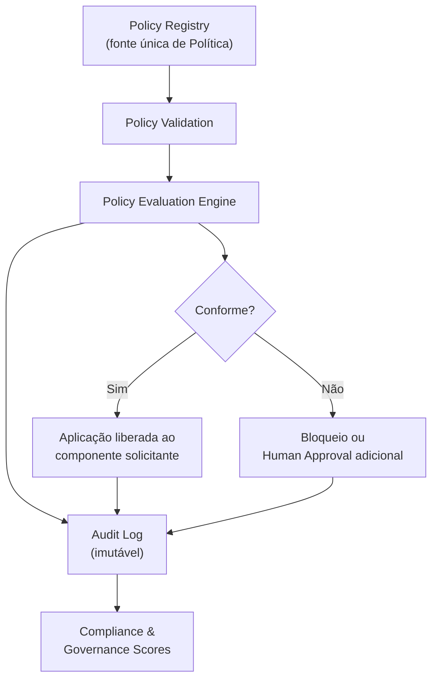
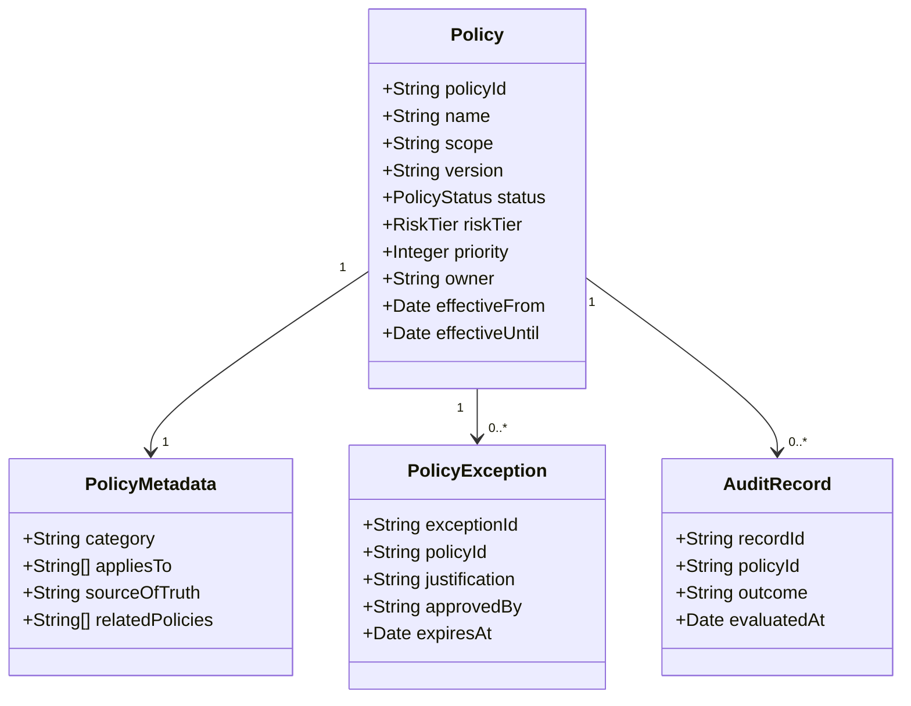
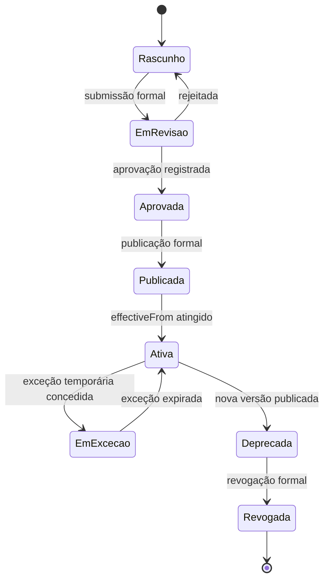
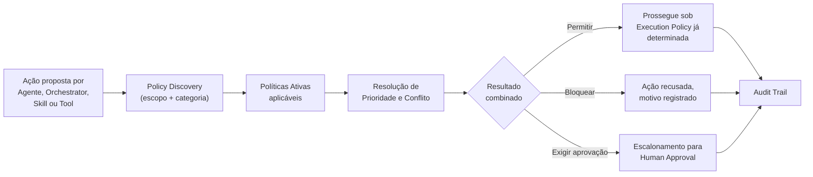
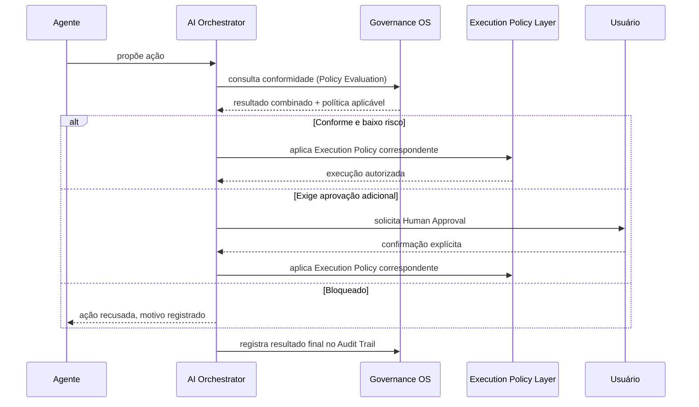
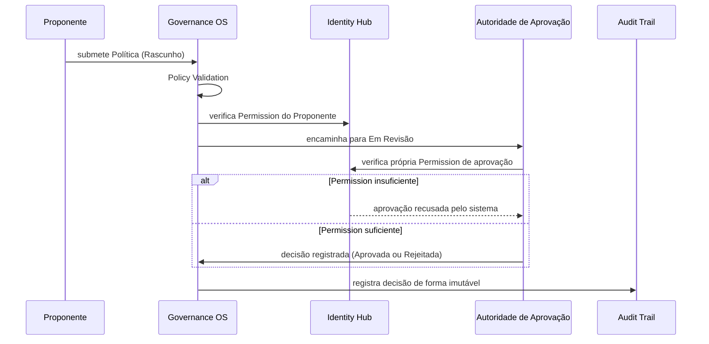

# AI Governance

**Adaptive Business Platform · AI Handbook · Documento Técnico Oficial**

---

## 1. Introdução

Este documento é a autoridade máxima e definitiva sobre a Governança da Inteligência Artificial da Adaptive Business Platform. Ele não substitui nenhum documento já publicado — não redefine a filosofia já estabelecida em `AI_MANIFESTO.md`, não redefine a estrutura de doze camadas já estabelecida em `AI_ARCHITECTURE.md`, não redefine a coordenação já detalhada em `AI_ORCHESTRATOR.md`, não redefine o framework de Agente já estabelecido em `AGENT_FRAMEWORK.md`, não redefine o Sistema Operacional de Contexto já estabelecido em `CONTEXT_FRAMEWORK.md`, não redefine a gestão de Memória já estabelecida em `MEMORY_OS.md`, não redefine o motor de raciocínio já estabelecido em `REASONING_ENGINE.md`, não redefine o motor de planejamento já estabelecido em `PLANNING_ENGINE.md`, não redefine o runtime de Skill já estabelecido em `SKILL_RUNTIME.md`, não redefine o runtime de Ferramenta já estabelecido em `TOOL_RUNTIME.md`, e não redefine a colaboração entre Agentes já estabelecida em `MULTI_AGENT_SYSTEM.md`. Também não altera nenhuma decisão arquitetural já registrada em qualquer um dos vinte e seis documentos do Architecture Handbook, cujas políticas e serviços já publicados este documento apenas consome, nunca duplica.

O que este documento adiciona é o detalhamento completo de uma responsabilidade que, até aqui, permaneceu distribuída, referenciada e prometida, mas nunca formalmente consolidada sob uma única autoridade normativa. `AI_MANIFESTO.md`, Capítulo 11, já declarou vinte regras de governança e afirmou explicitamente que elas serviriam "como verificação obrigatória para toda futura implementação de capacidade de IA, até que um documento técnico dedicado do AI Handbook as detalhe em formato de checklist equivalente". Este é esse documento.

A necessidade deste documento neste ponto específico da sequência é estrutural, não incidental. Com onze documentos já publicados, a plataforma já possui filosofia, arquitetura, coordenação, unidade de Agente, Contexto, Memória, Raciocínio, Planejamento, Skill, Ferramenta e Colaboração Multi-Agente integralmente estabelecidos — mas nenhum desses documentos define, de forma centralizada, quem aprova uma Política, como uma exceção é registrada, como um conflito entre regras é resolvido, ou como a conformidade de toda essa estrutura é auditada de maneira consistente. Sem este componente, a governança permaneceria implícita e fragmentada entre onze documentos distintos, cada um repetindo parcialmente princípios semelhantes, sem uma autoridade única que os consolide, os versione e os aplique de forma coerente.

A relação com `AI_MANIFESTO.md` permanece de subordinação direta: toda Política definida por este documento é a formalização operacional de um princípio já fixado naquele documento, nunca uma regra nova e desconectada de sua filosofia fundadora. A relação com `AI_ARCHITECTURE.md` permanece de reaproveitamento estrutural — a Execution Policy Layer, já definida em seu Capítulo 10, com suas seis políticas nomeadas (Read Only, Recommendation Only, Human Approval, Automatic Execution, Simulation e Dry Run), é o mecanismo técnico que este documento governa, nunca um mecanismo que este documento substitui ou duplica. A relação com `AI_ORCHESTRATOR.md`, `AGENT_FRAMEWORK.md`, `CONTEXT_FRAMEWORK.md`, `MEMORY_OS.md`, `REASONING_ENGINE.md`, `PLANNING_ENGINE.md`, `SKILL_RUNTIME.md`, `TOOL_RUNTIME.md` e `MULTI_AGENT_SYSTEM.md` permanece uniforme: cada um desses componentes já opera sob Permission verificada junto ao Identity Hub, já respeita Tenant Isolation de forma absoluta, e já produz Observabilidade suficiente para reconstrução de comportamento — este documento formaliza as regras que tornam esse respeito verificável, revisável e auditável de forma centralizada, sem jamais reimplementar a mecânica que cada um deles já executa por conta própria.

A relação com o Architecture Handbook permanece de subordinação total e permanente: este documento não introduz nenhuma nova autoridade de negócio, nenhum novo mecanismo de autorização paralelo ao Identity Hub, e nenhuma nova instância de armazenamento de Entidade de domínio. Toda Política aqui descrita é metadado sobre comportamento de Inteligência Artificial — nunca dado de negócio, nunca Ownership, e nunca Command.

Este é o décimo segundo documento do AI Handbook. Ele consolida, sob uma única autoridade normativa, a disciplina que todos os componentes anteriores já pressupunham, mas que nenhum deles, isoladamente, tinha o escopo de formalizar por completo.

---

## 2. Missão da Governança

A missão da Governança é estabelecer, de forma explícita, versionada e auditável, o conjunto completo de políticas, regras, controles e mecanismos de conformidade que orientam o comportamento de todo componente de Inteligência Artificial desta plataforma — sem jamais executar uma única ação em nome deles.

A Governança existe para responder, de forma centralizada e consistente, a perguntas que nenhum componente isolado tem autoridade para responder sozinho: que ação é permitida, sob qual condição, aprovada por quem, registrada onde, revisada com qual periodicidade, e revogável sob qual circunstância. Essas perguntas já eram respondidas, de forma implícita e fragmentada, por cada um dos onze documentos anteriores; este documento as torna explícitas, centraliza sua autoridade normativa, e garante que a resposta seja a mesma independentemente de qual componente a formule.

A Governança não é um sistema de permissão técnica — essa responsabilidade pertence e continua pertencendo ao Identity Hub. A Governança não é um sistema de coordenação de execução — essa responsabilidade pertence e continua pertencendo ao AI Orchestrator. A Governança não é um sistema de observação técnica — essa responsabilidade pertence e continuará pertencendo ao futuro documento dedicado a Observabilidade. A Governança é, precisamente, a camada normativa que declara as regras que todos esses sistemas devem obedecer, sem competir com nenhum deles por espaço de execução.

Três resultados concretos justificam a existência formal desta missão. Primeiro, rastreabilidade total: toda decisão de qualquer componente de IA deve ser reconstruível até a Política que a autorizou. Segundo, previsibilidade organizacional: uma Empresa cliente, um auditor externo, ou um Executivo interno deve conseguir consultar, a qualquer momento, o conjunto exato de regras vigentes sobre qualquer capacidade de IA, sem depender de conhecimento tácito distribuído entre onze documentos técnicos. Terceiro, evolução seguindo controle: nenhuma nova capacidade, nenhum novo Agente e nenhuma nova Skill entra em produção sem que sua conformidade com a Governança já vigente tenha sido formalmente verificada.

```
                    MISSÃO DA GOVERNANÇA (síntese)
   ┌───────────────────────────────────────────────────────────┐
   │  Toda decisão   ──►  rastreável até uma Política                   │
   │  Toda ação      ──►  auditável de ponta a ponta                        │
   │  Toda política  ──►  versionada e nunca implícita                          │
   │  Toda exceção   ──►  registrada, nunca silenciosa                              │
   │  Toda autorização ──► fundamentada em regra explícita                              │
   └───────────────────────────────────────────────────────────┘
```

A Governança, portanto, define regras. O Orchestrator coordena. Os Agentes executam. Nenhum desses três papéis se sobrepõe aos outros, e essa separação é o eixo estrutural de todo este documento.

A missão da Governança se estende, ainda, a um quarto resultado, menos evidente que os três já descritos, mas igualmente central: continuidade organizacional. Quando um Agente é aposentado, quando uma Skill é substituída, ou quando um Executivo responsável por uma Política deixa sua função, a regra em si — registrada, versionada e accountável — permanece íntegra e aplicável, independentemente da permanência de qualquer indivíduo específico. A Governança garante que o conhecimento normativo desta plataforma nunca resida exclusivamente na memória de uma pessoa.

---

## 3. Filosofia e Princípios Fundamentais

A Governança desta plataforma se apoia sobre um conjunto fechado de princípios nomeados, cada um deles uma extensão operacional de um princípio já fixado em `AI_MANIFESTO.md`, nunca uma filosofia nova e desconectada.

**Policy Precedes Autonomy.** Nenhuma capacidade de IA recebe autonomia adicional — nos termos de Automatic Execution já definidos em `AI_ARCHITECTURE.md`, Capítulo 10 — sem que a Política que delimita essa autonomia já exista, publicada e ativa, antes da primeira execução.

**Nothing Governs Silently.** Toda Política vigente é publicamente consultável por qualquer Usuário com Permission suficiente; nenhuma regra de governança opera como conhecimento tácito de implementação.

**No Policy Without Owner.** Toda Política registrada no Policy Registry possui um responsável formal, individual ou organizacional, accountável por sua criação, sua manutenção e sua eventual revogação.

**No Silent Override.** Reafirmação direta do princípio já fixado em `AI_MANIFESTO.md`, Capítulo 3: nenhuma exceção ou substituição de Política acontece sem registro explícito, aprovação formal e justificativa acessível.

**Restriction Wins Ties.** Quando duas Políticas aplicáveis à mesma ação entram em conflito e nenhuma prioridade explícita as distingue, prevalece sempre a Política mais restritiva, nunca a mais permissiva.

**Governance Never Executes.** A Governança nunca invoca um Command, nunca aciona um Agente, e nunca produz efeito direto sobre o estado de negócio — ela apenas determina se uma execução, já proposta por outro componente, está em conformidade.

**Trust Is Earned Incrementally.** Reafirmação do princípio já fixado em `AI_MANIFESTO.md`, Capítulo 3, e reaplicado em cada documento subsequente: toda concessão de autonomia adicional é gradual, verificável e reversível.

**Segregation Is Structural, Not Optional.** Nenhum papel único acumula, simultaneamente, autoridade de criação, aprovação e auditoria da mesma Política — essa separação é uma exigência estrutural, nunca uma prática recomendada.

**Every Exception Has an Expiration.** Toda exceção concedida a uma Política é temporária por padrão, com data de expiração explícita, nunca uma alteração permanente disfarçada de exceção.

**Audit Is Not Optional.** Toda avaliação, toda aplicação e toda exceção de Política produz registro imutável, independente de o resultado da avaliação ter sido aprovação ou bloqueio.

**Compliance Is Continuous, Not a Milestone.** Conformidade não é um estado alcançado uma única vez em uma auditoria pontual — é uma condição continuamente verificada a cada avaliação de Política.

**Risk Is Classified Before It Is Accepted.** Nenhuma ação de impacto real é processada sem que sua categoria de risco já tenha sido determinada, conforme a classificação detalhada no Capítulo 16.

**Every Policy Has a Version.** Toda Política, sem exceção, é versionada com a mesma disciplina já exigida de toda Prompt em produção, conforme `AI_MANIFESTO.md`, Capítulo 11, e `AI_HUB.md`, ADR-010.

**Delegation Is Explicit, Never Implied.** Toda autoridade de aprovação ou revisão delegada a um Usuário específico é registrada explicitamente através do Identity Hub, nunca inferida de seu cargo ou de seu histórico de uso da plataforma.

**Tenant Isolation Is Absolute.** Reafirmação do princípio já fixado em `AI_HUB.md`, ADR-008, e reforçado em cada documento subsequente: nenhuma Política, nenhuma exceção e nenhum override cruza a fronteira entre Empresas distintas.

**Human Oversight Is Preserved.** Reafirmação direta do princípio central de `AI_MANIFESTO.md`, Capítulo 3: nenhuma Política de Governança jamais remove a exigência de confirmação humana para ação de impacto real.

**Governance Consumes, It Does Not Instrument.** A Governança consome a Observabilidade já produzida por cada componente descrito nos documentos anteriores; ela nunca instrumenta diretamente código de execução nem duplica telemetria já coletada por outro componente.

**Escalation Is Proportional to Impact.** Reafirmação do princípio já fixado em `AI_MANIFESTO.md`, Capítulo 11: toda sugestão que ultrapasse um limiar de impacto exige revisão adicional, proporcional à severidade da ação proposta.

Estes dezoito princípios, tomados em conjunto com as vinte regras já fixadas em `AI_MANIFESTO.md`, Capítulo 11, formam a base filosófica completa sobre a qual todo mecanismo descrito nos capítulos seguintes é construído.

---

## 4. Responsabilidades e Limites

A Governança é responsável por definir Política, classificar risco, estabelecer controle, determinar autoridade de aprovação, manter o registro formal de exceção, e sustentar a disciplina de auditoria e conformidade de toda a camada de Inteligência Artificial. Ela não é responsável por, e nunca assume, a coordenação de solicitação, a execução de Capability, a construção de Contexto, a gestão de Memória, o raciocínio de um Agente, o planejamento de uma tarefa complexa, o runtime de uma Skill, a invocação de uma Tool, ou a comunicação entre Agentes — cada uma dessas responsabilidades pertence, de forma exclusiva e já definitiva, a um dos onze documentos anteriores.

```
                    O QUE A GOVERNANÇA FAZ, O QUE ELA NUNCA FAZ
   ┌───────────────────────────────────────────────────────────┐
   │  Faz:                                Nunca faz:                             │
   │    Define Política                     Executa Command                          │
   │    Classifica Risco                    Coordena Agente                          │
   │    Determina Autoridade                Constrói Contexto                            │
   │    Registra Exceção                    Gerencia Memória                            │
   │    Audita Conformidade                 Raciocina ou planeja                         │
   │    Versiona Regra                      Substitui confirmação humana                     │
   └───────────────────────────────────────────────────────────┘
```

O limite mais importante desta camada é negativo: a Governança nunca decide sozinha. Toda Política é uma restrição ou uma permissão condicional sobre uma decisão que outro componente formula e outro Usuário, quando exigido, confirma — a Governança nunca é a origem da decisão de negócio, apenas a moldura que determina se essa decisão pode prosseguir, sob qual condição, e com qual nível de supervisão.

Um segundo limite, igualmente absoluto, é que a Governança nunca opera com efeito retroativo silencioso. Uma nova Política, ou uma nova versão de Política existente, nunca reinterpreta uma decisão já tomada e já executada sob a versão anterior — sua vigência começa sempre a partir de sua publicação formal, conforme detalhado no Capítulo 8.

Um terceiro limite delimita a fronteira com o Architecture Handbook: a Governança de IA nunca cria uma segunda hierarquia de autorização paralela à já existente em `DOMAIN_OWNERSHIP_MATRIX.md` e ao Identity Hub — ela opera estritamente dentro do escopo de comportamento de Inteligência Artificial, nunca sobre Entidade de negócio tradicional já sob Ownership de um Business Hub.

Um quarto limite, de natureza operacional, delimita a fronteira com cada um dos onze componentes já descritos: a Governança nunca possui visibilidade de implementação interna de nenhum deles. Ela conhece a Política aplicável a uma Skill, mas nunca o código que implementa essa Skill; conhece o RiskTier de uma ação de um Agente, mas nunca o modelo de linguagem ou o provedor que sustenta o raciocínio desse Agente — essa opacidade deliberada preserva a neutralidade tecnológica já central a `AI_MANIFESTO.md`, Capítulo 9, garantindo que nenhuma Política dependa de detalhe de implementação sujeito a mudança futura.

---

## 5. Governance Operating System

O Governance Operating System, ou GOS, é o sistema arquitetural único e completo responsável por registrar, validar, avaliar, aplicar, versionar e auditar toda Política vigente sobre qualquer componente de Inteligência Artificial desta plataforma. Assim como o Context Operating System, já descrito em `CONTEXT_FRAMEWORK.md`, é a autoridade única sobre Contexto, o GOS é a autoridade única sobre Política — nenhuma capacidade de IA consulta ou aplica regra de governança fora deste sistema.



O GOS é composto por seis componentes internos, cada um com responsabilidade única e não sobreposta: o **Policy Registry**, fonte única de toda Política vigente; o **Policy Validator**, responsável por garantir que toda Política recém-criada respeite o esquema formal exigido no Capítulo 6; o **Policy Evaluation Engine**, responsável por determinar, para uma ação específica, quais Políticas se aplicam e qual resultado combinado elas produzem; o **Enforcement Gateway**, responsável por comunicar esse resultado ao componente solicitante — nunca por executá-lo; o **Exception Ledger**, responsável pelo registro formal de toda exceção e todo override; e o **Audit Trail**, responsável pelo registro imutável de toda avaliação processada, aprovada ou bloqueada.

O GOS nunca é consultado diretamente pelo Usuário final. Ele é consultado exclusivamente por componentes já definidos nos documentos anteriores — o AI Orchestrator, ao determinar qual Execution Policy se aplica a uma ação; o Agent Framework, ao verificar se um Agente específico possui autonomia suficiente para uma ação proposta; e o Skill Runtime e o Tool Runtime, ao verificar se a invocação de uma Skill ou de uma Tool específica está em conformidade com a Política vigente para aquele contexto.

```
              POSIÇÃO DO GOS NA ARQUITETURA (visão consolidada)
   ┌───────────────────────────────────────────────────────────┐
   │  AI Orchestrator, Agentes, Skills, Tools                       │
   │       │  consultam                                                 │
   │       ▼                                                         │
   │  Governance Operating System (GOS)                                     │
   │       │  aplica regra definida em                                        │
   │       ▼                                                         │
   │  Policy Registry (fonte única de Política)                                 │
   └───────────────────────────────────────────────────────────┘
```

O GOS opera como camada estritamente consultiva e de registro — ele nunca intercepta, modifica ou atrasa uma solicitação além do tempo estritamente necessário para determinar conformidade. Latência de avaliação de Política é um atributo de qualidade formal do GOS, medido e reportado conforme o Capítulo 21.

Disponibilidade do GOS é um atributo de qualidade tão crítico quanto sua latência — sua indisponibilidade nunca resulta em avaliação permissiva por padrão, conforme já antecipado no Capítulo 3 pelo princípio Safety Before Execution; toda ação que dependa de Policy Evaluation e encontre o GOS indisponível é automaticamente tratada sob a política mais restritiva conhecida para aquele escopo, nunca liberada por ausência de resposta. Esta garantia é ela própria uma Política Estrutural, não sujeita a Exceção, conforme o Capítulo 11.

---

## 6. Política — Definição Formal

Uma Política, no escopo deste documento, é uma regra formal, versionada e explícita que declara uma condição, uma restrição ou uma permissão aplicável a um comportamento específico de Inteligência Artificial desta plataforma. Toda Política possui um escopo delimitado — global, por Empresa, por módulo, por Capability, por Agente ou por Skill — e nunca se aplica além do escopo formalmente declarado em sua Metadata.



Toda Política declara, no mínimo, quatro elementos obrigatórios: o **escopo**, que delimita a quem e a que a Política se aplica; a **condição**, que descreve a circunstância sob a qual a Política é avaliada; o **efeito**, que descreve o resultado da avaliação — permitir, bloquear, exigir aprovação adicional, ou exigir registro adicional; e o **nível de risco**, que classifica a Política segundo a taxonomia formal descrita no Capítulo 16.

Uma Política nunca contém lógica de negócio. Ela nunca referencia diretamente uma Entidade de domínio, nunca invoca um Command, e nunca contém a implementação técnica do controle que impõe — ela apenas declara a regra; sua aplicação técnica é sempre delegada ao componente que a consulta, através do Enforcement Gateway já descrito no Capítulo 5.

Uma Política pode ser de quatro naturezas distintas, cada uma com tratamento formalmente diferenciado: **Política Estrutural**, aplicável de forma permanente e sem exceção concedível — como Tenant Isolation; **Política Operacional**, calibrável por Empresa através do Business Profile Engine, dentro dos limites já permitidos pela arquitetura; **Política Temporária**, com data de expiração obrigatória desde sua criação; e **Política de Exceção**, que nunca existe isoladamente, sempre vinculada a uma Política de origem que ela modifica de forma pontual, conforme detalhado no Capítulo 11.

O Policy Baseline, formalizado por este documento conforme o ADR-014, é o conjunto mínimo e obrigatório de vinte Políticas Estruturais, uma para cada regra já fixada em `AI_MANIFESTO.md`, Capítulo 11 — o checklist equivalente que aquele capítulo já prometia. Cada regra original é aqui referenciada por um identificador formal e mapeada ao mecanismo deste documento que a opera:

```
              POLICY BASELINE (checklist formal — origem AI_MANIFESTO.md, Cap. 11)
   ┌───────────────────────────────────────────────────────────┐
   │  GOV-01  IA nunca altera domínio             ──► Cap. 4, 6                │
   │  GOV-02  IA nunca ignora Ownership            ──► Cap. 4, 22                    │
   │  GOV-03  Toda decisão é rastreável            ──► Cap. 18                       │
   │  GOV-04  Toda recomendação é explicável         ──► Cap. 20                       │
   │  GOV-05  Toda ação respeita Commands           ──► Cap. 6, 10                    │
   │  GOV-06  Impacto real exige confirmação humana     ──► Cap. 16, 19                    │
   │  GOV-07  Nenhum acesso além do escopo de Permission   ──► Cap. 13, 19                    │
   │  GOV-08  Todo consumo é medido e atribuído        ──► Cap. 18                       │
   │  GOV-09  Isolamento absoluto entre Empresas       ──► Cap. 11, 19                    │
   │  GOV-10  Toda Prompt em produção é versionada      ──► Cap. 8                        │
   │  GOV-11  Comunicação externa via Provider Layer     ──► Cap. 22                       │
   │  GOV-12  Conflito resolvido a favor da Regra de       ──► Cap. 12                       │
   │        negócio                                                                 │
   │  GOV-13  Nova capacidade avaliada contra o             ──► Cap. 15                       │
   │        Architecture Handbook                                                       │
   │  GOV-14  Nova capacidade registrada antes da           ──► Cap. 7, 8                     │
   │        liberação                                                                   │
   │  GOV-15  Observabilidade suficiente para                ──► Cap. 21                       │
   │        reconstrução                                                                │
   │  GOV-16  Falha degrada graciosamente                  ──► Cap. 10                       │
   │  GOV-17  Nenhuma dependência permanente de um             ──► Cap. 4                        │
   │        único provedor                                                              │
   │  GOV-18  Impacto elevado exige revisão adicional          ──► Cap. 16, 17                    │
   │  GOV-19  Autonomia concedida apenas de forma               ──► Cap. 13                       │
   │        incremental                                                                 │
   │  GOV-20  Respeito integral aos vinte e seis                 ──► Cap. 1, 22                    │
   │        documentos do Architecture Handbook                                              │
   └───────────────────────────────────────────────────────────┘
```

Nenhuma nova capacidade de Inteligência Artificial é considerada apta à produção sem que sua conformidade contra as vinte entradas deste Policy Baseline tenha sido formalmente avaliada e registrada — a mesma exigência de checklist obrigatório já central a `IMPLEMENTATION_GUIDELINES.md`, Capítulo 15, agora aplicada especificamente a toda capacidade de IA.

---

## 7. Policy Registry, Discovery e Metadata

O Policy Registry é a fonte única e centralizada de toda Política vigente, revogada ou em rascunho desta plataforma. Nenhuma Política existe fora dele; nenhum componente aplica uma regra de governança que não esteja formalmente registrada, publicada e ativa neste repositório único.

Policy Discovery é a capacidade formal de qualquer componente autorizado — um Agente, o Orchestrator, o Skill Runtime, ou um Usuário com Permission de auditoria — consultar, em tempo de avaliação, quais Políticas se aplicam a um escopo específico, sem necessidade de conhecimento prévio de sua existência individual. Descoberta é sempre realizada por escopo e por categoria, nunca por busca textual livre sobre conteúdo de negócio.

Toda Política registrada carrega Metadata formal e obrigatória, composta por, no mínimo: **categoria** (classificação temática — segurança, privacidade, risco financeiro, conformidade regulatória, entre outras já previstas no Capítulo 16); **appliesTo** (lista explícita de escopos aos quais a Política se aplica); **sourceOfTruth** (referência ao princípio ou ADR de origem, quando aplicável — de `AI_MANIFESTO.md`, de `AI_HUB.md`, ou de outro documento do Architecture Handbook); e **relatedPolicies** (referências cruzadas a outras Políticas com sobreposição de escopo, essenciais para a resolução de conflito descrita no Capítulo 12).

```
              METADATA OBRIGATÓRIA DE TODA POLÍTICA
   ┌───────────────────────────────────────────────────────────┐
   │  policyId          identificador único e imutável                    │
   │  category          classificação temática formal                      │
   │  scope             global | Empresa | módulo | Capability | Agente | Skill  │
   │  riskTier          conforme taxonomia do Capítulo 16                          │
   │  sourceOfTruth     princípio ou ADR de origem                                 │
   │  owner             responsável formal e accountável                               │
   │  version           conforme versionamento do Capítulo 8                           │
   └───────────────────────────────────────────────────────────┘
```

Toda Metadata é, ela própria, imutável após a publicação de uma versão específica da Política — qualquer alteração de Metadata, mesmo que não altere a condição ou o efeito da Política, produz uma nova versão, nunca uma edição silenciosa da versão já publicada.

Policy Discovery nunca retorna uma Política em estágio de Rascunho ou Em Revisão a um componente consultante — apenas Políticas já Publicadas, Ativas, Em Exceção ou Deprecadas são elegíveis à descoberta, cada uma tratada de forma distinta pelo Policy Evaluation Engine já descrito no Capítulo 9. Esta restrição garante que nenhuma ação real seja avaliada contra uma regra ainda não formalmente aprovada.

---

## 8. Policy Versioning e Lifecycle

Toda Política é versionada com o mesmo rigor já exigido de toda Prompt em produção, conforme `AI_MANIFESTO.md`, Capítulo 11, e `AI_HUB.md`, ADR-010, e com o mesmo princípio de Versão Única Ativa já exigido de todo Agente em `AGENT_FRAMEWORK.md`, Capítulo 7: apenas uma versão de uma Política, dentro de um mesmo escopo, permanece ativa a qualquer momento.



O ciclo de vida formal de uma Política percorre nove estágios: **Rascunho**, quando a Política é proposta mas ainda não submetida à revisão; **Em Revisão**, quando já submetida à autoridade de aprovação correspondente, conforme o Capítulo 13; **Aprovada**, quando a revisão é concluída com resultado favorável, mas ainda não publicada; **Publicada**, quando formalmente registrada no Policy Registry, mas ainda não vigente; **Ativa**, quando sua data de vigência (`effectiveFrom`) é atingida e ela passa a ser efetivamente avaliada; **Em Exceção**, um estado temporário e reversível descrito no Capítulo 11; **Deprecada**, quando uma nova versão já foi publicada e a versão anterior aguarda desativação; e **Revogada**, seu estado terminal, quando removida de avaliação ativa, mas nunca removida do Audit Trail.

Nenhuma Política salta estágio. Uma Política nunca se torna Ativa sem antes ter sido Publicada; nenhuma exceção é concedida a uma Política que não esteja Ativa; e nenhuma Política é Revogada sem que sua substituta, quando existente, já esteja Ativa — garantindo continuidade de cobertura de governança em todo momento.

Toda transição de estágio produz um evento de Auditoria formal e imutável, incluindo o Usuário responsável pela transição, o motivo declarado, e a data exata da mudança — a mesma disciplina de rastreabilidade já central a toda esta plataforma desde `AI_MANIFESTO.md`, Capítulo 3.

---

## 9. Policy Validation e Evaluation

Policy Validation é o processo que garante que toda Política, antes de avançar de Rascunho para Em Revisão, respeite integralmente o esquema formal descrito no Capítulo 6 e a Metadata obrigatória descrita no Capítulo 7 — nenhuma Política incompleta, ambígua, ou sem `sourceOfTruth` declarado avança além deste estágio.

Policy Evaluation é o processo, executado em tempo real a cada solicitação relevante, que determina quais Políticas Ativas se aplicam a uma ação específica e qual o resultado combinado dessa aplicação — permitir, bloquear, exigir Human Approval adicional, ou exigir registro adicional de justificativa.



A avaliação de Política nunca substitui a Execution Policy Layer já definida em `AI_ARCHITECTURE.md`, Capítulo 10 — ela a precede e a informa. Uma Política de Governança pode, por exemplo, exigir que uma categoria específica de ação, mesmo já classificada como Automatic Execution pela Execution Policy Layer, seja temporariamente rebaixada a Human Approval, em resposta a uma condição de risco elevado detectada pela Gestão de Riscos descrita no Capítulo 16 — mas a Governança nunca cria uma sétima política de execução paralela às seis já estabelecidas.

Toda avaliação, independentemente de seu resultado, é registrada no Audit Trail com o conjunto completo de Políticas consideradas, a decisão de cada uma, e o resultado combinado final — garantindo que qualquer avaliação passada seja integralmente reconstruível.

Policy Validation e Policy Evaluation nunca compartilham o mesmo momento de execução — a primeira acontece uma única vez, no instante em que uma Política avança de estágio dentro de seu Lifecycle; a segunda acontece potencialmente milhares de vezes ao longo da vida de uma mesma Política Ativa, uma vez para cada ação real avaliada contra ela. Esta distinção é o que permite que a Evaluation permaneça uma operação de baixa latência, já que ela nunca revalida o esquema estrutural da Política — apenas aplica a regra já validada e publicada.

---

## 10. Policy Enforcement

Policy Enforcement é a comunicação formal do resultado de uma avaliação ao componente que a solicitou, através do Enforcement Gateway já descrito no Capítulo 5. A Governança nunca aplica esse resultado diretamente sobre o estado de negócio — essa responsabilidade permanece exclusivamente do componente solicitante, respeitando a separação já fixada no Capítulo 4.



Enforcement é sempre pré-execução, nunca pós-execução — nenhuma ação de negócio real é processada antes de o resultado da avaliação de Política ser conhecido pelo componente solicitante. Quando uma avaliação não pode ser concluída a tempo, por indisponibilidade do GOS, a ação correspondente degrada sempre para o comportamento mais restritivo disponível, nunca para execução automática por padrão — extensão direta do princípio Safety Before Execution já fixado em `AI_MANIFESTO.md`, Capítulo 3.

---

## 11. Exceções e Overrides

Uma Exceção é uma suspensão temporária, explícita e formalmente aprovada de uma Política específica, aplicável a um escopo delimitado e por uma duração limitada. Um Override é a substituição pontual do resultado de uma avaliação de Política específica, aplicada a uma única ação, nunca a uma classe de ações futuras.

Ambos os mecanismos compartilham as mesmas quatro exigências absolutas, extensão direta do princípio No Silent Override: **justificativa obrigatória**, redigida em linguagem acessível e vinculada ao contexto da solicitação; **aprovação formal**, concedida exclusivamente por autoridade com Permission suficiente, conforme o Capítulo 13; **expiração obrigatória**, nunca permanente; e **registro imutável**, produzido no Exception Ledger e refletido no Audit Trail antes de a exceção entrar em vigor.

```
              EXCEÇÃO E OVERRIDE (distinção formal)
   ┌───────────────────────────────────────────────────────────┐
   │  Exceção:                          Override:                       │
   │    suspende uma Política             substitui um resultado             │
   │    por um período delimitado         de uma avaliação específica           │
   │    aplicável a escopo definido       aplicável a uma única ação                │
   │    reversível automaticamente        não recorrente                      │
   │    ao expirar                                                                   │
   └───────────────────────────────────────────────────────────┘
```

Nenhuma Exceção e nenhum Override é concedível sobre uma Política Estrutural — Tenant Isolation, verificação de Permission junto ao Identity Hub, e a exigência de Human Approval para ação de impacto financeiro, estratégico ou de segurança relevante permanecem absolutas, sem mecanismo de suspensão formalmente disponível, conforme já fixado em `AI_MANIFESTO.md`, Capítulo 11, e `AI_HUB.md`, ADR-008.

Toda Exceção próxima de sua expiração produz alerta formal ao seu responsável, e toda Exceção expirada retorna automaticamente a Política ao seu comportamento original, sem necessidade de ação humana adicional — eliminando o risco de uma exceção temporária se tornar, por omissão, uma alteração permanente não revisada.

Uma Exceção recorrente — solicitada e aprovada repetidamente sobre o mesmo escopo e a mesma condição — nunca é tratada como sinal de que a Exceção deveria se tornar permanente. Ela é, ao contrário, um sinal formal de que a Política de origem está mal calibrada para aquele escopo específico, e dispara revisão obrigatória dessa Política, conforme o ciclo já descrito no Capítulo 13 — a Governança nunca acomoda um padrão de exceção repetida sem questionar a regra que a exceção contorna.

---

## 12. Inheritance, Priorities e Resolução de Conflitos

Policy Inheritance determina que uma Política declarada em escopo mais amplo — global, por exemplo — se aplica automaticamente a todo escopo mais específico contido nele, salvo quando uma Política de escopo mais específico a restringe ainda mais. Herança nunca flui em sentido inverso: uma Política declarada para uma única Skill nunca se propaga para o escopo global.

```
              HERANÇA DE POLÍTICA (visão consolidada)
   ┌───────────────────────────────────────────────────────────┐
   │  Global                                                            │
   │    ▼ herda, pode apenas restringir                                     │
   │  Empresa                                                           │
   │    ▼ herda, pode apenas restringir                                     │
   │  Módulo / Capability                                                    │
   │    ▼ herda, pode apenas restringir                                     │
   │  Agente / Skill / Tool                                                     │
   └───────────────────────────────────────────────────────────┘
```

Toda Política carrega uma prioridade numérica explícita em sua Metadata. Quando duas ou mais Políticas Ativas se aplicam à mesma ação e produzem resultados diferentes, a prioridade mais alta prevalece; quando a prioridade é idêntica ou não declarada, prevalece a Política mais restritiva, conforme o princípio Restriction Wins Ties já fixado no Capítulo 3 — nunca a Política mais recente, nunca a Política de escopo mais amplo, e nunca uma escolha arbitrária de implementação.

Todo conflito identificado durante uma avaliação é registrado no Audit Trail, mesmo quando resolvido automaticamente pela regra de prioridade — permitindo que a autoridade de revisão, descrita no Capítulo 13, identifique padrões recorrentes de conflito e, quando apropriado, reconcilie as Políticas envolvidas através de uma nova versão que elimine a ambiguidade na origem.

Considere um exemplo concreto de resolução: uma Política global declara que toda sugestão de IA sobre dado financeiro opera sob Recommendation Only; uma Política de escopo mais específico, declarada para uma Empresa cliente que já demonstrou confiabilidade suficiente em uma Capability de baixo impacto financeiro pontual, declara Automatic Execution para essa Capability isolada. Como a Política mais específica restringe seu próprio escopo sem contradizer a regra global fora dele, ambas permanecem simultaneamente válidas, sem conflito real — a herança aqui descrita não é violada porque a especialização é uma restrição de escopo, nunca um relaxamento da regra herdada.

---

## 13. Aprovação, Revisão e Delegação de Autoridade

Toda autoridade de aprovação — de uma nova Política, de uma nova versão, de uma Exceção ou de um Override — é verificada junto ao Identity Hub, através de Permission explícita, nunca através de um modelo de papel específico desta camada de Governança. Este documento não introduz um sistema paralelo de papéis organizacionais; ele reutiliza integralmente o modelo de Permission já central a toda a plataforma.



Delegação de Autoridade é sempre explícita e escopada — um Usuário pode delegar sua autoridade de aprovação a outro Usuário por um escopo e um período determinados, mas essa delegação é ela própria um registro formal, sujeito a auditoria, nunca uma transferência implícita de Permission herdada por cargo ou hierarquia organizacional presumida.

Revisão periódica é obrigatória para toda Política Ativa, independentemente de alteração proposta — cada Política carrega um ciclo de revisão obrigatório em sua Metadata, e nenhuma Política permanece Ativa indefinidamente sem que sua continuidade seja reconfirmada por sua autoridade de aprovação, extensão direta do princípio Trust Is Earned Incrementally aplicado agora à própria Política, não apenas ao Agente que ela regula.

Aprovação de emergência é um caminho formalmente previsto, nunca um atalho informal — reservado a Política Estrutural cuja ausência represente risco imediato de segurança já em curso, ela exige, no mínimo, dupla aprovação por autoridade distinta e produz automaticamente uma revisão retroativa obrigatória dentro de um prazo curto e fixo, garantindo que a urgência da concessão nunca substitua a disciplina normal de revisão, apenas a adie por tempo estritamente delimitado.

---

## 14. Segregação de Funções

Segregação de Funções exige que nenhum Usuário individual acumule, simultaneamente, a autoridade de propor, aprovar e auditar a mesma Política — uma exigência estrutural, não uma prática recomendada, conforme o princípio Segregation Is Structural, Not Optional já fixado no Capítulo 3.

```
              SEGREGAÇÃO DE FUNÇÕES (papéis nunca acumuláveis
              sobre a mesma Política)
   ┌───────────────────────────────────────────────────────────┐
   │  Proponente         propõe a Política ou sua alteração                │
   │  Autoridade de       aprova, condicionada a Permission                 │
   │  Aprovação          verificada junto ao Identity Hub                              │
   │  Auditor            revisa o Audit Trail, sem autoridade                    │
   │                    de aprovação sobre a mesma Política                             │
   └───────────────────────────────────────────────────────────┘
```

Esta segregação se estende à concessão de Exceção e Override: o Usuário que solicita uma Exceção nunca é o mesmo Usuário com Permission para aprová-la, mesmo quando ambos os papéis estejam, em princípio, disponíveis à mesma pessoa em outro contexto da plataforma — o GOS verifica essa distinção a cada solicitação, recusando automaticamente qualquer aprovação que viole esta regra.

Quando uma Empresa cliente, através do Business Profile Engine, não dispõe de Usuários suficientes para preencher todos os três papéis de forma distinta, a Política correspondente permanece na condição mais restritiva disponível até que a segregação mínima possa ser satisfeita — a ausência de estrutura organizacional suficiente nunca é motivo para suspensão da exigência.

---

## 15. Compliance e Conformidade

Compliance, neste documento, é o estado contínuo e continuamente reverificado de aderência de todo comportamento de Inteligência Artificial ao conjunto de Políticas Ativas aplicáveis — nunca um marco pontual alcançado uma única vez, conforme o princípio Compliance Is Continuous, Not a Milestone já fixado no Capítulo 3.

Conformidade é avaliada em duas dimensões complementares: **conformidade de execução**, verificada a cada avaliação individual de Política já descrita no Capítulo 9; e **conformidade estrutural**, verificada periodicamente sobre o conjunto completo de Políticas, Agentes, Skills e Tools registrados, identificando lacunas de cobertura — uma Capability sem Política aplicável declarada, por exemplo, é ela própria uma não conformidade estrutural, mesmo antes de qualquer execução real acontecer.

Toda não conformidade identificada, seja de execução ou estrutural, é classificada por severidade e encaminhada ao fluxo de Tratamento de Não Conformidade descrito no Capítulo 23. Nenhuma não conformidade é resolvida silenciosamente por ajuste de código sem que o registro correspondente no Audit Trail seja também atualizado, preservando a integridade histórica da investigação.

Este documento não define nenhum framework de certificação regulatória externa específico — essa correspondência entre a disciplina de Governança aqui descrita e um regime regulatório específico de uma jurisdição ou de um setor de mercado pertence a uma camada de configuração posterior, calibrável por Empresa através do Business Profile Engine, nunca a este documento.

```
              SEVERIDADE DE NÃO CONFORMIDADE
   ┌───────────────────────────────────────────────────────────┐
   │  Crítica    Política Estrutural violada ou contornada;               │
   │           escalonamento imediato, suspensão da Capability                    │
   │  Alta      Política Operacional violada em ação de Impacto                   │
   │           Financeiro, Estratégico ou de Segurança                                │
   │  Média     lacuna de cobertura estrutural identificada sem                   │
   │           execução real não conforme ainda observada                                │
   │  Baixa     desvio de Metadata ou de ciclo de revisão, sem                    │
   │           impacto sobre resultado de avaliação                                          │
   └───────────────────────────────────────────────────────────┘
```

Toda não conformidade Crítica ou Alta produz notificação imediata ao responsável formal da Política violada e à Autoridade de Aprovação correspondente, independentemente do ciclo de revisão periódica já em curso — a Governança nunca aguarda o próximo ciclo formal de revisão para tratar um desvio de severidade elevada. Não conformidade Média ou Baixa é consolidada no ciclo de revisão regular, salvo recorrência, caso em que sua severidade é automaticamente elevada.

---

## 16. Gestão de Riscos e Classificação de Riscos

Toda ação de Inteligência Artificial desta plataforma é classificada em uma de três categorias de risco, diretamente derivadas das categorias de impacto já implícitas na Execution Policy Layer desde `AI_ARCHITECTURE.md`, Capítulo 10, e em `AI_MANIFESTO.md`, Capítulo 11 — este documento não introduz uma taxonomia paralela, apenas a nomeia e a formaliza.

```
              CLASSIFICAÇÃO DE RISCO (RiskTier)
   ┌───────────────────────────────────────────────────────────┐
   │  Baixo Impacto        ação reversível, já validada,                    │
   │                      elegível a Automatic Execution                       │
   │  Impacto Financeiro     ação com efeito financeiro ou                         │
   │  ou Estratégico       estratégico mensurável, exige Human Approval                    │
   │  Impacto de Segurança   ação com efeito sobre segurança, privacidade                    │
   │                      ou integridade de dado, exige Human Approval                         │
   │                      e revisão adicional proporcional                                  │
   └───────────────────────────────────────────────────────────┘
```

A classificação de risco de uma ação específica considera, no mínimo, quatro fatores: a natureza do Command envolvido, já categorizado em `COMMAND_CATALOG.md`; a reversibilidade da ação, sendo toda ação irreversível automaticamente elevada a, no mínimo, Impacto Financeiro ou Estratégico; o histórico de confiabilidade já demonstrado pela Capability envolvida; e a Configuration explícita definida pela Empresa cliente através do Business Profile Engine, dentro dos limites já estabelecidos por esta arquitetura.

Gestão de Riscos é o processo contínuo de identificação, classificação, tratamento e revisão de todo risco associado a uma capacidade de IA — nunca uma avaliação pontual realizada apenas no momento de criação da capacidade. Toda capacidade já registrada em produção é reavaliada periodicamente, e toda mudança relevante em seu padrão de uso — volume, escopo de dado acessado, ou taxa de rejeição em Human Approval — pode elevar sua classificação de risco, disparando reforço automático de Política correspondente.

O Risk Register é a visão consolidada, derivada do Policy Registry e do Audit Trail, de todo risco já identificado, sua classificação vigente, sua Política de tratamento correspondente e a data de sua última revisão — nunca um repositório independente de risco desconectado da Política que o trata. Todo risco registrado sem Política de tratamento correspondente é, por definição, uma não conformidade estrutural de severidade Alta, conforme o Capítulo 15.

Tratamento de risco segue sempre uma de quatro respostas formais: **mitigar**, através de nova Política Preventiva ou de reforço de Controle já existente; **transferir**, quando aplicável, através de calibração de Configuration pela Empresa cliente, dentro dos limites já permitidos pela arquitetura; **aceitar**, exclusivamente mediante aprovação formal da Autoridade de Aprovação correspondente ao RiskTier envolvido, nunca por omissão; ou **eliminar**, através da suspensão da Capability que origina o risco. Nenhum risco classificado como Impacto de Segurança é elegível a aceitação sem revisão adicional proporcional, conforme já fixado em `AI_MANIFESTO.md`, Capítulo 11.

A reavaliação periódica de risco é calibrada pela própria classificação vigente — risco de Baixo Impacto é revisado no mesmo ciclo já exigido pela revisão regular de Política, descrita no Capítulo 13; risco de Impacto Financeiro, Estratégico ou de Segurança é revisado em ciclo reduzido, proporcional à severidade, nunca superior ao ciclo padrão.

---

## 17. Controles Preventivos, Detectivos e Corretivos

Controle, neste documento, é o mecanismo formal através do qual uma Política produz efeito verificável sobre o comportamento real da plataforma. Todo controle pertence a exatamente uma de três categorias.

**Controles Preventivos** atuam antes da execução, impedindo que uma ação não conforme sequer se inicie — a verificação de Permission junto ao Identity Hub, a avaliação de Policy Evaluation antes de todo Enforcement, e a exigência absoluta de Tenant Isolation são os três controles preventivos centrais desta plataforma, nenhum deles suspenso por Exceção.

**Controles Detectivos** atuam durante ou imediatamente após a execução, identificando desvio já ocorrido — o Audit Trail, a reconciliação periódica de conformidade estrutural descrita no Capítulo 15, e o monitoramento de taxa de rejeição de Human Approval por Capability são controles detectivos centrais, cuja saída alimenta diretamente a Gestão de Riscos.

**Controles Corretivos** atuam após a identificação de um desvio, restaurando conformidade — a reversão de uma ação já executada, quando tecnicamente possível através do Command correspondente, a suspensão temporária de uma Capability não conforme, e a atualização formal de uma Política insuficiente são controles corretivos centrais.

```
              CICLO DE CONTROLE (visão consolidada)
   ┌───────────────────────────────────────────────────────────┐
   │  Preventivo  ──►  impede a ação não conforme                       │
   │  Detectivo   ──►  identifica o desvio já ocorrido                          │
   │  Corretivo   ──►  restaura a conformidade                              │
   │       └──────────────────► retroalimenta nova Política                        │
   └───────────────────────────────────────────────────────────┘
```

Nenhum controle opera isoladamente. Todo controle Corretivo aplicado é, ele próprio, avaliado quanto à necessidade de uma nova Política Preventiva que elimine a recorrência do mesmo desvio — fechando o ciclo entre execução real e evolução formal da Governança.

Todo controle, independentemente de sua categoria, é ele próprio um objeto versionado e testável — a mesma disciplina de Simulation e Dry Run já definida em `AI_ARCHITECTURE.md`, Capítulo 10, é aplicável à verificação de um controle antes de sua ativação em produção, garantindo que um controle recém-criado não produza, ele próprio, um bloqueio não intencional sobre comportamento já conforme.

---

## 18. Auditoria e Accountability

O Audit Trail é o registro imutável, cronológico e completo de toda avaliação, toda aplicação, toda exceção e toda transição de estágio de Política processada por esta plataforma. Ele nunca é editável após seu registro; qualquer correção necessária é sempre um novo registro complementar, nunca uma alteração do registro original.

Accountability é a garantia formal de que toda entrada do Audit Trail é atribuível a um Usuário, um Agente ou um processo automatizado especificamente identificado — nunca um registro anônimo ou genérico. Quando uma ação é executada por um Agente sob Automatic Execution, o Audit Trail preserva tanto a identidade do Agente quanto a identidade do Usuário cuja solicitação original originou a cadeia de delegação, conforme já exigido em `AI_ORCHESTRATOR.md`, Capítulo 17.

Responsabilidade Organizacional distribui accountability em três níveis simultâneos e não substituíveis entre si: o **Proponente**, accountável pela qualidade e pela justificativa da Política proposta; a **Autoridade de Aprovação**, accountável pela decisão de aprovação e por sua adequação ao risco envolvido; e a **Empresa cliente**, accountável pela Configuration que calibra, dentro dos limites já permitidos pela arquitetura, o grau de autonomia concedido à camada de IA sobre seu próprio contexto de negócio.

Toda solicitação de auditoria externa — regulatória, contratual ou interna — é atendida exclusivamente através de consulta ao Audit Trail já existente; este documento não define nenhum processo de auditoria que exija reconstrução manual de evidência a partir de sistemas não instrumentados por esta Governança.

Retenção do Audit Trail é indefinida por padrão para todo registro relacionado a Política Estrutural, e delimitada por Configuration da Empresa cliente para registro relacionado a Política Operacional, nunca inferior ao período mínimo já exigido por `NON_FUNCTIONAL_REQUIREMENTS.md`, Capítulo 9. Nenhum registro de Audit Trail é removido por expurgo automático sem que sua retenção mínima obrigatória já tenha sido integralmente cumprida.

Consulta ao Audit Trail é sempre uma operação de leitura estrita, nunca produz efeito colateral sobre a Política ou sobre o estado de negócio consultado, e é ela própria uma operação sujeita a verificação de Permission junto ao Identity Hub — auditar o comportamento de IA de uma Empresa é, em si, uma ação que exige escopo de acesso explícito, nunca implícito à condição de Auditor.

```
              CADEIA DE ACCOUNTABILITY (visão consolidada)
   ┌───────────────────────────────────────────────────────────┐
   │  Proponente        qualidade e justificativa da Política                │
   │  Autoridade de       adequação da aprovação ao risco                          │
   │  Aprovação                                                                   │
   │  Empresa cliente      calibração de Configuration dentro dos                 │
   │                    limites já permitidos pela arquitetura                              │
   │  Agente executor      execução dentro do escopo já aprovado                        │
   │  Usuário originador     solicitação que iniciou a cadeia completa                   │
   └───────────────────────────────────────────────────────────┘
```

Nenhum desses cinco papéis dilui a responsabilidade dos demais — accountability, nesta plataforma, é sempre cumulativa e nunca transferida integralmente de um papel para outro. A responsabilidade do Proponente por uma Política mal calibrada não é anulada pela aprovação subsequente da Autoridade de Aprovação, e a responsabilidade desta não é anulada pela execução correta de um Agente sob a Política já aprovada.

---

## 19. Segurança, Privacidade e Ética

Segurança, no escopo deste documento, significa que toda Política de Governança é ela própria protegida contra alteração não autorizada — o Policy Registry herda integralmente os mesmos controles de Autenticação e Autorização já centrais ao Identity Hub, e nenhuma Política é modificável fora do fluxo formal de criação, revisão e publicação já descrito nos Capítulos 8 e 13. O próprio GOS é tratado, para efeito de segurança, com o mesmo rigor já exigido de qualquer componente que module o comportamento de execução da plataforma — sua indisponibilidade nunca resulta em avaliação permissiva por padrão, conforme já fixado no Capítulo 10.

Privacidade é preservada através da aplicação absoluta de Tenant Isolation a toda Política, toda Exceção e todo Audit Trail — nenhuma Empresa cliente acessa, mesmo de forma agregada ou anonimizada, o Audit Trail ou o conjunto de Políticas customizadas de outra Empresa, reforço direto de `AI_HUB.md`, ADR-008. Adicionalmente, toda Política que envolva classificação de dado sensível herda, sem exceção, a classificação já estabelecida pela arquitetura de dado subjacente — a Governança nunca reclassifica dado por conta própria. Toda Metadata de Política que referencie categoria de dado sensível é, ela mesma, tratada sob o mesmo nível de restrição de acesso do dado que descreve, nunca exposta de forma mais permissiva do que o dado subjacente.

Ética, nesta camada, é operacionalizada através de três garantias já fixadas em `AI_MANIFESTO.md` e reafirmadas por este documento como Política Estrutural não sujeita a Exceção: Human Oversight preservado para toda ação de impacto real; recusa formal de qualquer Política que crie tratamento diferenciado não justificável entre Usuários ou entre Empresas sob a mesma Configuration; e recusa formal de qualquer Política que, mesmo indiretamente, enfraqueça a Auditabilidade já exigida transversalmente por toda a plataforma. Toda proposta de Política que, na avaliação da Autoridade de Aprovação, aproxime-se de qualquer uma dessas três fronteiras é automaticamente elevada a revisão adicional, mesmo quando tecnicamente conforme ao esquema formal do Capítulo 6.

```
              GARANTIAS ÉTICAS ESTRUTURAIS (não sujeitas a Exceção)
   ┌───────────────────────────────────────────────────────────┐
   │  Human Oversight Is Preserved                                          │
   │  Tratamento equitativo entre Usuários e entre Empresas                        │
   │  Auditabilidade nunca enfraquecida, direta ou indiretamente                     │
   └───────────────────────────────────────────────────────────┘
```

Este documento não define nenhum comitê de ética específico, nenhum processo de revisão ética externo, e nenhuma metodologia de avaliação de viés algorítmico — esses mecanismos, quando necessários, são calibráveis pela Empresa cliente através de Política Operacional específica, registrada como qualquer outra Política, sob a mesma disciplina de versionamento e auditoria.

---

## 20. Transparência e Explicabilidade

Transparência é a garantia de que toda Política Ativa aplicável a um escopo é consultável por qualquer Usuário com Permission suficiente, em linguagem acessível, sem exigir conhecimento técnico de implementação — extensão direta do princípio Nothing Governs Silently já fixado no Capítulo 3.

Explicabilidade, nesta camada, é a garantia complementar de que todo resultado de uma avaliação de Política — permitido, bloqueado, ou escalado para Human Approval — é acompanhado de justificativa formal, referenciando exatamente qual Política, qual condição e qual prioridade produziram aquele resultado, nunca uma recusa genérica sem fundamentação rastreável. Esta garantia estende, à camada de Governança, a mesma disciplina de Explicabilidade já central a toda sugestão de IA desde `AI_MANIFESTO.md`, Capítulo 3.

```
              TRANSPARÊNCIA E EXPLICABILIDADE (síntese)
   ┌───────────────────────────────────────────────────────────┐
   │  Toda Política         ──►  consultável, nunca tácita                     │
   │  Todo resultado         ──►  justificado, referenciando a                     │
   │                            Política exata que o produziu                          │
   │  Toda Exceção          ──►  visível a quem ela afeta                              │
   │  Todo conflito          ──►  resolução rastreável, nunca                          │
   │                            arbitrária                                                  │
   └───────────────────────────────────────────────────────────┘
```

Um Usuário afetado por um bloqueio decorrente de Política pode sempre consultar, através do mesmo mecanismo de Explicabilidade já central à plataforma, exatamente qual regra produziu aquele resultado — eliminando qualquer percepção de decisão automatizada opaca ou injustificada.

Considere um Representante Comercial que solicita a um Agente o envio automático de uma proposta comercial de alto valor a um Lead. A Governança, consultada pelo Orchestrator, identifica que a ação corresponde a Impacto Financeiro conforme o Capítulo 16, aplica a Política correspondente exigindo Human Approval, e retorna ao Representante Comercial, junto à solicitação de confirmação, a referência explícita à Política que produziu essa exigência — nunca uma recusa silenciosa nem uma aprovação automática não fundamentada. Este exemplo ilustra, de ponta a ponta, a articulação entre Policy Evaluation, Enforcement e Explicabilidade já descrita nos capítulos anteriores.

---

## 21. Observabilidade e Governance Scores

A Observabilidade da camada de Governança é consumida, nunca produzida por instrumentação própria — o GOS consulta a Observabilidade já gerada por cada componente descrito nos documentos anteriores, agregando-a sob a mesma disciplina de cinco dimensões já central a toda esta série.

```
              OBSERVABILIDADE DA GOVERNANÇA (visão consolidada)
   ┌───────────────────────────────────────────────────────────┐
   │  Métricas:      volume de avaliação, taxa de bloqueio,                 │
   │               taxa de exceção concedida, latência de avaliação             │
   │  Auditoria:      Audit Trail imutável de toda avaliação e                    │
   │               toda transição de Política                                        │
   │  Tracing:        rastreamento de ponta a ponta de uma avaliação                 │
   │               até a Política e o princípio que a fundamentam                      │
   │  Decisões:       toda decisão de aprovação, exceção e override                    │
   │               registrada explicitamente, nunca inferida                              │
   │  Explicabilidade: toda regra aplicada acessível e justificável ao                 │
   │               Usuário afetado                                                          │
   └───────────────────────────────────────────────────────────┘
```

Este documento não define nenhuma interface técnica de coleta, armazenamento ou visualização de Observabilidade — essa responsabilidade pertence integralmente a um futuro documento dedicado, provavelmente denominado `AI_OBSERVABILITY.md`, décimo terceiro documento deste AI Handbook. A Governança apenas declara quais dados devem existir e sob qual disciplina, nunca como são tecnicamente coletados ou apresentados.

Governance Quality Score é o indicador formal e agregado que expressa a qualidade estrutural do conjunto de Políticas vigentes — considerando cobertura (ausência de Capability sem Política aplicável), atualidade (proporção de Políticas dentro de seu ciclo de revisão vigente), e clareza (completude de Metadata obrigatória). Governance Maturity Score é o indicador complementar que expressa a maturidade organizacional de aplicação da Governança ao longo do tempo — considerando taxa de não conformidade recorrente, tempo médio de resolução de exceção, e proporção de controle Corretivo que produziu nova Política Preventiva, conforme o ciclo já descrito no Capítulo 17.

Ambos os indicadores são recalculados periodicamente, nunca em tempo real de avaliação individual, e são expostos exclusivamente através da interface que o futuro documento de Observabilidade definirá — este documento apenas declara sua existência, sua composição conceitual, e sua finalidade.

Governance Maturity Score é expresso em cinco níveis conceituais, cada um estritamente cumulativo em relação ao anterior — nenhuma Empresa ou módulo é classificado em um nível sem satisfazer integralmente os critérios de todo nível anterior.

```
              MODELO CONCEITUAL DE MATURIDADE DE GOVERNANÇA
   ┌───────────────────────────────────────────────────────────┐
   │  Nível 1  Inicial       Política existe, mas cobertura                    │
   │                       incompleta sobre Capability ativa                          │
   │  Nível 2  Registrada     cobertura completa; Metadata obrigatória                    │
   │                       íntegra em todo o Policy Registry                              │
   │  Nível 3  Aplicada      Policy Enforcement ativo em cem por cento                    │
   │                       das avaliações relevantes                                          │
   │  Nível 4  Auditada      Audit Trail consultado em ciclo regular;                    │
   │                       não conformidade tratada dentro do prazo                            │
   │  Nível 5  Adaptativa     controle Corretivo retroalimenta Política                    │
   │                       Preventiva de forma consistente e mensurável                          │
   └───────────────────────────────────────────────────────────┘
```

Nenhum nível de maturidade é atribuído por autodeclaração — sua composição deriva exclusivamente de dado já registrado no Policy Registry e no Audit Trail, calculado pela mesma interface de Observabilidade que o futuro `AI_OBSERVABILITY.md` definirá.

---

## 22. Integrações

**Com o AI Orchestrator.** O Orchestrator consulta o GOS a cada Policy Evaluation necessária durante seu pipeline de decisão, já descrito em `AI_ORCHESTRATOR.md`, Capítulo 6, e aplica o resultado através da Execution Policy Layer que ele já coordena — a Governança nunca coordena diretamente, apenas informa a coordenação já centralizada naquele documento.

**Com o Agent Framework.** Todo Agente, ao propor uma ação, tem sua proposta avaliada contra a Política aplicável ao seu escopo antes de qualquer delegação de execução — a autonomia de cada Agente, já regida pelo princípio Trust Is Earned Incrementally em `AGENT_FRAMEWORK.md`, Capítulo 7, é formalmente calibrada pela Política vigente sobre ele.

**Com o Context OS.** A Governança nunca constrói Contexto — ela apenas declara Política sobre a sensibilidade de dado que pode compor um Contexto, respeitando integralmente o atributo Sensitivity já formalizado em `CONTEXT_FRAMEWORK.md`.

**Com o Memory OS.** Política de retenção, de escopo de compartilhamento, e de isolamento entre Empresas aplicável a toda Memória persistente e organizacional já descrita em `MEMORY_OS.md` é declarada por este documento, nunca implementada por ele.

**Com o Reasoning Engine.** Toda cadeia de raciocínio produzida por um Agente permanece sujeita à mesma exigência de Explicabilidade já formalizada no Capítulo 20 — a Governança declara essa exigência; o `REASONING_ENGINE.md` a implementa.

**Com o Planning Engine.** Todo plano decomposto em etapas executáveis, conforme já estabelecido em `PLANNING_ENGINE.md`, tem cada uma de suas etapas avaliada individualmente contra a Política aplicável, nunca apenas o plano como um todo de forma agregada.

**Com o Skill Runtime.** Nenhuma Skill é invocada sem que sua Capability correspondente já possua Política aplicável declarada — uma lacuna aqui é, por definição, uma não conformidade estrutural conforme o Capítulo 15.

**Com o Tool Runtime.** Toda Tool externa, ao ser invocada, é avaliada contra Política de segurança e de escopo de dado antes de sua execução, complementar à Provider Layer já central a `AI_HUB.md`.

**Com o Multi-Agent System.** Toda colaboração entre Agentes, sempre mediada pelo Orchestrator conforme o princípio Agents Never Coordinate Themselves, é avaliada sob a mesma disciplina de Segregação de Funções descrita no Capítulo 14, aplicada agora entre Agentes distintos, nunca apenas entre Usuários humanos.

**Com o futuro AI_OBSERVABILITY (somente interface).** A Governança declara quais métricas, quais registros e quais scores devem existir; a implementação técnica de coleta, armazenamento e apresentação pertence integralmente a esse documento futuro, sem antecipação de sua arquitetura interna.

**Com o Architecture Handbook.** A Governança consome, sem jamais duplicar, os serviços e as políticas já publicados por `AI_HUB.md`, `DOMAIN_OWNERSHIP_MATRIX.md`, `COMMAND_CATALOG.md`, `QUERY_CATALOG.md`, `EVENT_CATALOG.md`, `IMPLEMENTATION_GUIDELINES.md` e `NON_FUNCTIONAL_REQUIREMENTS.md` — nenhuma Política de Governança de IA jamais contradiz ou substitui uma decisão já registrada nesses vinte e seis documentos.

```
              MATRIZ DE INTEGRAÇÃO (o que a Governança declara
              versus o que cada componente implementa)
   ┌───────────────────────────────────────────────────────────┐
   │  Componente            A Governança declara                       │
   │  AI Orchestrator         qual Política se aplica ao pipeline           │
   │  Agent Framework         limite de autonomia por Agente                       │
   │  Context OS             sensibilidade de dado elegível a Contexto            │
   │  Memory OS              retenção e isolamento de Memória                        │
   │  Reasoning Engine         exigência de Explicabilidade                              │
   │  Planning Engine         avaliação por etapa de plano                              │
   │  Skill Runtime           cobertura obrigatória de Política por Skill              │
   │  Tool Runtime            Política de segurança por Tool externa                       │
   │  Multi-Agent System        Segregação de Funções entre Agentes                          │
   │  AI_OBSERVABILITY (futuro)   quais dados de Observabilidade devem existir                 │
   └───────────────────────────────────────────────────────────┘
```

Em nenhuma dessas integrações a Governança assume responsabilidade de implementação técnica do componente integrado — sua contribuição é sempre normativa, e a responsabilidade de execução permanece integralmente do documento e do componente que a possuem, conforme já fixado no Capítulo 4.

---

## 23. Fluxos Arquiteturais

```
   CRIAÇÃO E PUBLICAÇÃO DE POLÍTICA
   ┌───────────────────────────────────────────────────────────┐
   │  Proponente submete Rascunho ──► Policy Validation ──►             │
   │  Em Revisão ──► Autoridade de Aprovação decide ──►                     │
   │  Aprovada ──► publicação formal no Policy Registry ──►                     │
   │  Publicada ──► effectiveFrom atingido ──► Ativa                                  │
   └───────────────────────────────────────────────────────────┘
```

```
   VERSIONAMENTO DE POLÍTICA
   ┌───────────────────────────────────────────────────────────┐
   │  Nova versão submetida ──► segue o mesmo ciclo de Criação          │
   │  e Publicação ──► ao tornar-se Ativa, versão anterior                  │
   │  transita automaticamente para Deprecada ──► Revogada após             │
   │  período de retenção mínima, preservada no Audit Trail                     │
   └───────────────────────────────────────────────────────────┘
```

```
   AVALIAÇÃO E APLICAÇÃO (Evaluation + Enforcement)
   ┌───────────────────────────────────────────────────────────┐
   │  Ação proposta ──► Policy Discovery ──► Políticas Ativas               │
   │  aplicáveis ──► resolução de prioridade e conflito ──►                     │
   │  resultado combinado ──► Enforcement Gateway comunica ao                   │
   │  componente solicitante ──► Audit Trail registra                               │
   └───────────────────────────────────────────────────────────┘
```

```
   EXCEÇÃO E OVERRIDE
   ┌───────────────────────────────────────────────────────────┐
   │  Solicitação com justificativa ──► verificação de                  │
   │  Segregação de Funções ──► Autoridade de Aprovação decide ──►             │
   │  se aprovada, registro no Exception Ledger com expiração                   │
   │  obrigatória ──► ao expirar, retorno automático ao                             │
   │  comportamento original da Política                                                │
   └───────────────────────────────────────────────────────────┘
```

```
   AUDITORIA
   ┌───────────────────────────────────────────────────────────┐
   │  Toda avaliação, aplicação, exceção e transição de estágio          │
   │  ──► registro imutável no Audit Trail ──► consulta disponível              │
   │  a Auditor com Permission suficiente ──► nunca editável,                       │
   │  apenas complementável por novo registro                                           │
   └───────────────────────────────────────────────────────────┘
```

```
   REVISÃO E REVOGAÇÃO
   ┌───────────────────────────────────────────────────────────┐
   │  Ciclo de revisão obrigatório atingido ──► Autoridade de            │
   │  Aprovação reconfirma ou propõe nova versão ──► se não                     │
   │  reconfirmada, Política transita para Revogada ──► substituta,                 │
   │  quando existente, já Ativa antes da revogação efetiva                             │
   └───────────────────────────────────────────────────────────┘
```

```
   GESTÃO DE RISCOS E TRATAMENTO DE NÃO CONFORMIDADE
   ┌───────────────────────────────────────────────────────────┐
   │  Padrão de uso monitorado ──► reclassificação de RiskTier           │
   │  quando necessário ──► não conformidade identificada ──►                   │
   │  classificação por severidade ──► controle Corretivo aplicado              │
   │  ──► avaliação de necessidade de nova Política Preventiva                          │
   └───────────────────────────────────────────────────────────┘
```

---

## 24. Architecture Decision Records

**ADR-001 — Toda Política desta plataforma é formalmente registrada no Policy Registry antes de sua entrada em vigor.** Contexto: garantir que nenhuma regra de governança opere de forma implícita ou não rastreável, aplicação direta do princípio Reasoning Is Auditable já fixado em `AI_MANIFESTO.md`, Capítulo 3.

**ADR-002 — A Governança nunca executa lógica de negócio nem substitui o AI Orchestrator.** Contexto: preservar a separação de responsabilidades já estabelecida em `AI_ARCHITECTURE.md`, Capítulo 4, entre camada de coordenação e camada normativa.

**ADR-003 — Toda Política é versionada, e apenas uma versão permanece ativa por escopo.** Contexto: aplicação do mesmo princípio Single Version Active já exigido de todo Agente em `AGENT_FRAMEWORK.md`, Capítulo 7.

**ADR-004 — A Governança reutiliza integralmente a Execution Policy Layer já definida em `AI_ARCHITECTURE.md`, Capítulo 10, sem introduzir uma taxonomia paralela de políticas de execução.** Contexto: evitar duplicidade de mecanismo entre arquitetura e governança.

**ADR-005 — Toda exceção a uma Política é explícita, aprovada e registrada, nunca silenciosa.** Contexto: aplicação direta do princípio No Silent Override já fixado em `AI_MANIFESTO.md`, Capítulo 3.

**ADR-006 — Conflito entre Políticas aplicáveis é sempre resolvido pela política de maior prioridade e, em empate, pela mais restritiva.** Contexto: preservar a postura de segurança conservadora já central ao princípio Safety Before Execution.

**ADR-007 — Toda autoridade de aprovação e revisão é delegada através do Identity Hub, nunca através de um modelo de papel próprio da camada de Governança.** Contexto: preservar consistência com o modelo de Permission já estabelecido, evitando um sistema paralelo de papéis organizacionais.

**ADR-008 — A classificação de risco de toda ação de IA deriva das categorias de impacto já implícitas na Execution Policy Layer.** Contexto: baixo impacto, impacto financeiro ou estratégico, e impacto de segurança, conforme já fixado em `AI_ARCHITECTURE.md`, Capítulo 10, e `AI_MANIFESTO.md`, Capítulo 11.

**ADR-009 — Isolamento entre Empresas é um controle preventivo absoluto, sem Exceção ou Override concedível por nenhuma Política.** Contexto: reforço do princípio Tenant Isolation Is Absolute, já fixado em `AI_HUB.md`, ADR-008.

**ADR-010 — Toda Prompt utilizada em produção é registrada e versionada sob a autoridade normativa deste documento.** Contexto: formalização do dever já declarado em `AI_MANIFESTO.md`, Capítulo 11, e `AI_HUB.md`, ADR-010.

**ADR-011 — Segregação de Funções exige que nenhum papel único acumule simultaneamente autoridade de propor, aprovar e auditar a mesma Política.** Contexto: prevenir conflito de interesse estrutural na governança, aplicável também a Exceção e Override.

**ADR-012 — A Governança consome a Observabilidade já produzida por cada componente, nunca instrumenta diretamente código de execução.** Contexto: preservar a fronteira com o futuro décimo terceiro documento do AI Handbook, evitando duplicidade de telemetria.

**ADR-013 — Toda Exceção concedida a uma Política é temporária, com expiração obrigatória, e retorna automaticamente ao comportamento original ao expirar.** Contexto: aplicação contínua do princípio Every Exception Has an Expiration já fixado no Capítulo 3.

**ADR-014 — As vinte regras de Governança já fixadas em `AI_MANIFESTO.md`, Capítulo 11, tornam-se, a partir deste documento, o Policy Baseline formal e obrigatório de toda a plataforma.** Contexto: cumprimento da promessa textual já registrada naquele capítulo, de que um documento técnico dedicado as detalharia em formato de checklist equivalente.

**ADR-015 — Este documento não define nenhuma tecnologia específica de enforcement, nenhum framework de certificação regulatória externa, e nenhum Agente ou Skill responsável por sua automação.** Contexto: preservar escopo estritamente normativo, delegando implementação técnica a documentos futuros do AI Handbook e a Configuration calibrável por Empresa cliente.

---

## 25. Glossário

**Governança de IA** — a disciplina normativa completa, formalizada por este documento, responsável por definir política, classificar risco, estabelecer controle e sustentar auditoria e conformidade sobre todo comportamento de Inteligência Artificial desta plataforma, sem jamais executar ação em nome de nenhum componente.

**Governance Operating System (GOS)** — o sistema arquitetural único e completo responsável por registrar, validar, avaliar, aplicar, versionar e auditar toda Política vigente desta plataforma.

**Política (Policy)** — regra formal, versionada e explícita que declara uma condição, uma restrição ou uma permissão aplicável a um comportamento específico de Inteligência Artificial, dentro de um escopo delimitado.

**Policy Registry** — repositório único e centralizado de toda Política vigente, revogada ou em rascunho desta plataforma.

**Policy Discovery** — capacidade formal de consultar, por escopo e por categoria, quais Políticas se aplicam a um contexto específico.

**Policy Metadata** — conjunto obrigatório de atributos formais de toda Política, incluindo categoria, escopo, nível de risco, fonte de origem, responsável e versão.

**Policy Lifecycle** — o ciclo formal de nove estágios que toda Política percorre, de Rascunho a Revogada, incluindo o estágio temporário Em Exceção.

**Policy Evaluation** — o processo em tempo real que determina quais Políticas Ativas se aplicam a uma ação específica e qual o resultado combinado dessa aplicação.

**Policy Enforcement** — a comunicação formal do resultado de uma Policy Evaluation ao componente solicitante, através do Enforcement Gateway.

**Exceção (Policy Exception)** — suspensão temporária, justificada, aprovada e registrada de uma Política específica, com expiração obrigatória.

**Override** — substituição pontual e não recorrente do resultado de uma avaliação de Política específica, aplicada a uma única ação.

**Policy Inheritance** — a propagação automática de uma Política de escopo mais amplo a todo escopo mais específico contido nele, nunca em sentido inverso.

**RiskTier** — a classificação formal de risco de uma ação de IA em Baixo Impacto, Impacto Financeiro ou Estratégico, ou Impacto de Segurança.

**Controle Preventivo, Detectivo, Corretivo** — as três categorias formais de mecanismo através do qual uma Política produz efeito verificável, respectivamente antes, durante e depois da execução de uma ação.

**Audit Trail** — o registro imutável, cronológico e completo de toda avaliação, aplicação, exceção e transição de estágio de Política.

**Accountability** — a garantia formal de que todo registro do Audit Trail é atribuível a um Usuário, um Agente ou um processo especificamente identificado.

**Segregação de Funções** — a exigência estrutural de que nenhum Usuário individual acumule simultaneamente autoridade de propor, aprovar e auditar a mesma Política.

**Compliance** — o estado contínuo e continuamente reverificado de aderência de todo comportamento de Inteligência Artificial ao conjunto de Políticas Ativas aplicáveis.

**Policy Baseline** — o conjunto mínimo e obrigatório de Políticas derivadas das vinte regras de governança já fixadas em `AI_MANIFESTO.md`, Capítulo 11, aplicável a toda a plataforma sem exceção.

**Enforcement Gateway** — o componente do Governance Operating System responsável por comunicar o resultado de uma Policy Evaluation ao componente solicitante, sem jamais executá-lo diretamente.

**Exception Ledger** — o registro formal e específico de toda Exceção e todo Override concedidos, incluindo justificativa, aprovação e data de expiração.

**Risk Register** — a visão consolidada, derivada do Policy Registry e do Audit Trail, de todo risco identificado, sua classificação vigente e sua Política de tratamento correspondente.

**Governance Quality Score, Governance Maturity Score** — os dois indicadores formais e agregados que expressam, respectivamente, a qualidade estrutural do conjunto de Políticas vigentes e a maturidade organizacional de sua aplicação ao longo do tempo.

---

## 26. Conclusão

Este documento declara oficialmente que `AI_GOVERNANCE.md` torna-se a autoridade máxima sobre a disciplina de Governança da Inteligência Artificial da Adaptive Business Platform. Todo componente da camada de Inteligência Artificial — o AI Orchestrator, todo Agente já construído sob `AGENT_FRAMEWORK.md`, todo Contexto governado por `CONTEXT_FRAMEWORK.md`, toda Memória gerida por `MEMORY_OS.md`, todo raciocínio formalizado por `REASONING_ENGINE.md`, todo plano decomposto por `PLANNING_ENGINE.md`, toda Skill executada sob `SKILL_RUNTIME.md`, toda Tool invocada sob `TOOL_RUNTIME.md`, toda colaboração mediada por `MULTI_AGENT_SYSTEM.md`, e todo documento técnico futuro deste AI Handbook — deverá respeitar integralmente este framework: seu Policy Registry, seu ciclo de vida de nove estágios, sua classificação formal de risco, sua disciplina de Segregação de Funções, e seu Audit Trail imutável.

A hierarquia documental desta série permanece precisa e definitiva: `AI_MANIFESTO.md` define a filosofia — por que a Inteligência Artificial existe e quais limites ela nunca cruza. `AI_ARCHITECTURE.md` define a estrutura — como essa filosofia se organiza em doze camadas verificáveis. `AI_ORCHESTRATOR.md` define a coordenação — como o componente central dessa estrutura opera internamente. `AGENT_FRAMEWORK.md` define a unidade inteligente — o Agente, sua composição interna e seu ciclo de vida completo. `CONTEXT_FRAMEWORK.md` define o Sistema Operacional de Contexto — como toda informação relevante que fundamenta qualquer raciocínio é construída, qualificada e distribuída. `MEMORY_OS.md` define como memória efêmera, persistente, compartilhada e organizacional é formalmente gerida e isolada por Empresa. `REASONING_ENGINE.md` define como todo Agente formaliza e explica sua cadeia de raciocínio. `PLANNING_ENGINE.md` define como uma solicitação complexa é decomposta em etapas executáveis e supervisionadas. `SKILL_RUNTIME.md` define como toda Skill é registrada, versionada e executada com segurança. `TOOL_RUNTIME.md` define como toda Tool é invocada, isolada e auditada. `MULTI_AGENT_SYSTEM.md` define como múltiplos Agentes colaboram exclusivamente através do Orchestrator, nunca entre si diretamente. `AI_GOVERNANCE.md`, este documento, define a disciplina — como toda Política, toda autorização, toda exceção e toda auditoria desta camada de Inteligência Artificial é formalmente registrada, versionada, aplicada e revisada, sem jamais executar lógica de negócio ou substituir a coordenação já soberana do AI Orchestrator. E o Architecture Handbook, consolidado por vinte e seis documentos já concluídos, permanece soberano sobre toda a plataforma — nenhuma Política, por mais abrangente que se torne, jamais assume Ownership de negócio, jamais contorna a arquitetura de domínio já consolidada, e jamais substitui o raciocínio humano ou a Regra de negócio que ela apenas fundamenta e nunca decide em seu lugar.

Com a publicação deste décimo segundo documento do AI Handbook, a plataforma já dispõe de filosofia, estrutura, coordenação, unidade fundamental de raciocínio, Contexto, Memória, Raciocínio, Planejamento, Skill, Ferramenta, Colaboração Multi-Agente e Governança integralmente estabelecidos — a base normativa completa sobre a qual o próximo e décimo terceiro documento deste AI Handbook, dedicado a Observabilidade e provavelmente denominado `AI_OBSERVABILITY.md`, será construído, consumindo exatamente as métricas, os registros e os scores conceituais que este documento já declarou, sem jamais precisar redefinir a Política, o risco ou o controle que a Governança aqui descrita já consolidou de forma definitiva.
