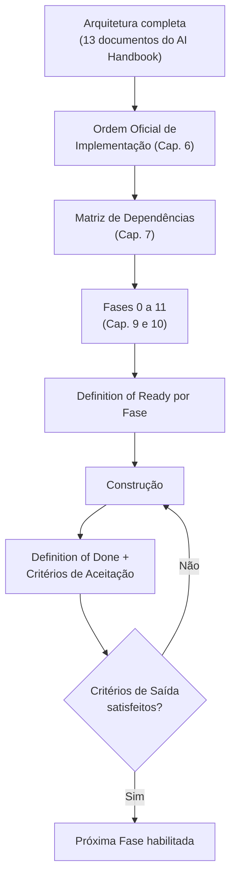
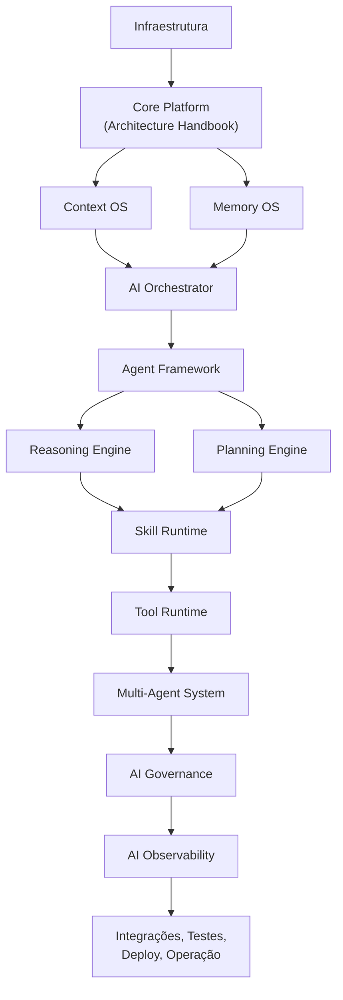
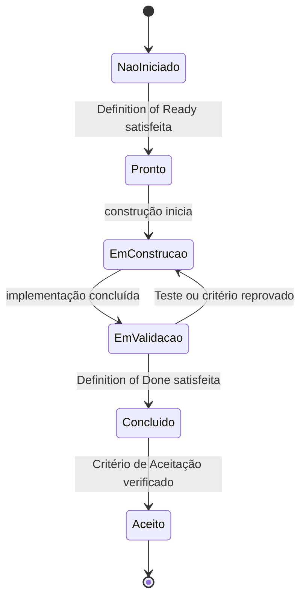
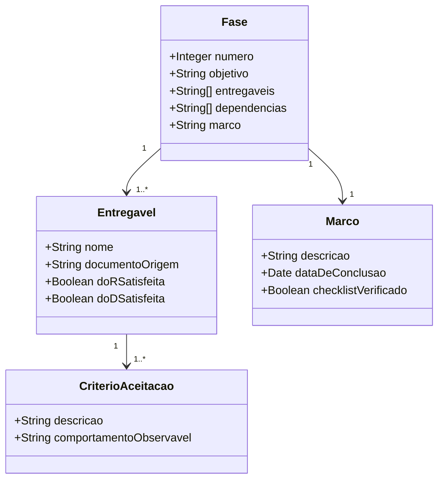
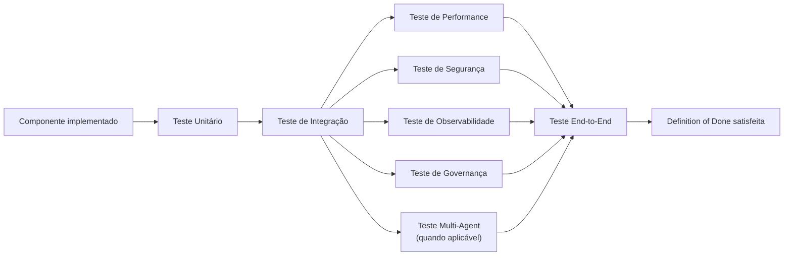
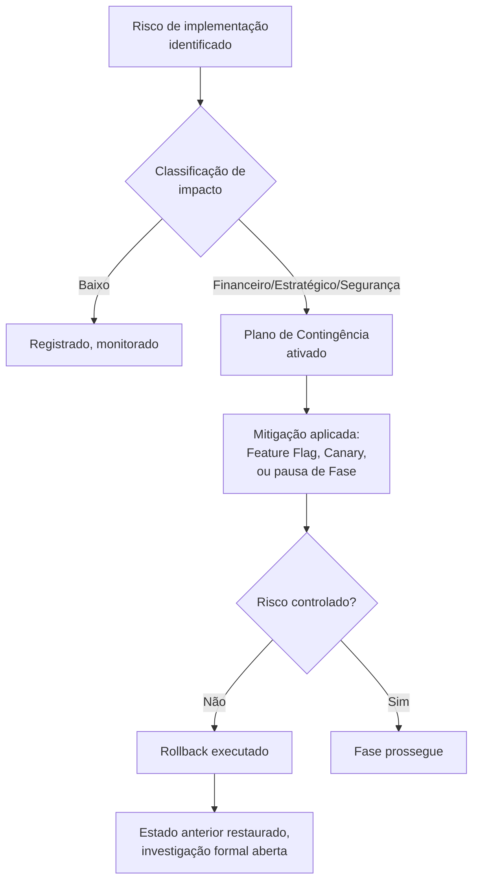
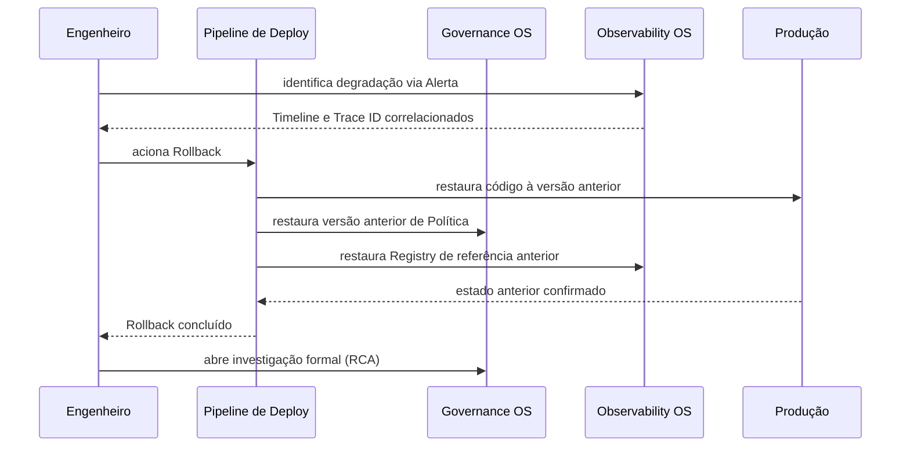
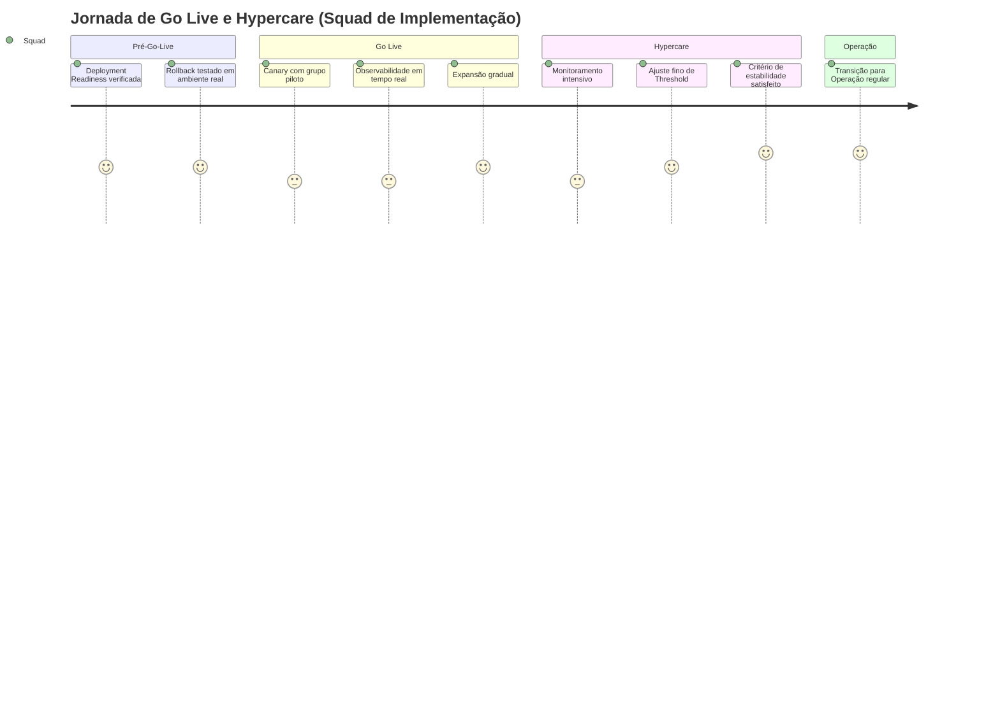
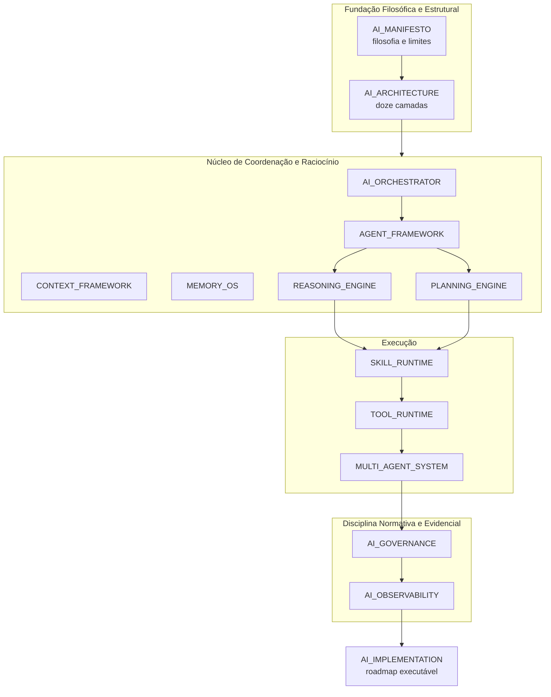

# AI Implementation

**Adaptive Business Platform · AI Handbook · Documento Técnico Oficial**

---

## 1. Introdução

Este documento é a autoridade máxima e definitiva sobre o plano de implementação da Inteligência Artificial da Adaptive Business Platform. Ele não substitui nenhum documento já publicado — não redefine a filosofia já estabelecida em `AI_MANIFESTO.md`, não redefine a estrutura de doze camadas já estabelecida em `AI_ARCHITECTURE.md`, não redefine a coordenação já detalhada em `AI_ORCHESTRATOR.md`, não redefine o framework de Agente já estabelecido em `AGENT_FRAMEWORK.md`, não redefine o Sistema Operacional de Contexto já estabelecido em `CONTEXT_FRAMEWORK.md`, não redefine a gestão de Memória já estabelecida em `MEMORY_OS.md`, não redefine o motor de raciocínio já estabelecido em `REASONING_ENGINE.md`, não redefine o motor de planejamento já estabelecido em `PLANNING_ENGINE.md`, não redefine o runtime de Skill já estabelecido em `SKILL_RUNTIME.md`, não redefine o runtime de Ferramenta já estabelecido em `TOOL_RUNTIME.md`, não redefine a colaboração entre Agentes já estabelecida em `MULTI_AGENT_SYSTEM.md`, não redefine a disciplina de Governança já estabelecida em `AI_GOVERNANCE.md`, e não redefine o sistema de Observabilidade já estabelecido em `AI_OBSERVABILITY.md`. Também não altera nenhuma decisão arquitetural já registrada em qualquer um dos vinte e seis documentos do Architecture Handbook, cujas definições e mecanismos já publicados este documento apenas consome, nunca duplica.

O que este documento adiciona é o único elemento que os treze documentos anteriores, deliberadamente, nunca produziram: um roadmap técnico único e sequenciado que transforma toda a arquitetura já especificada em um plano de construção executável. Este documento não cria nenhum novo componente arquitetural, nenhum novo serviço, nenhum novo motor, nenhum novo runtime, nenhuma nova Política e nenhuma nova regra de negócio — sua responsabilidade única é consolidar e organizar a implementação daquilo que já foi integralmente definido, respondendo à pergunta que nenhum documento anterior tinha como propósito responder: em qual ordem, sob qual critério de conclusão, e com qual estratégia de validação, esta arquitetura se torna código real em produção.

A necessidade deste documento neste ponto específico da sequência é estrutural, não incidental. Com treze documentos já publicados, a plataforma possui filosofia, arquitetura, coordenação, unidade de Agente, Contexto, Memória, Raciocínio, Planejamento, Skill, Ferramenta, Colaboração Multi-Agente, Governança e Observabilidade integralmente especificados — mas nenhuma linha de código legítima pode ser escrita a partir de uma especificação sem que exista, também, um plano formal de ordem, de dependência e de critério de aceitação. Sem esse plano, cada equipe de engenharia interpretaria a ordem de construção de forma diferente, arriscando implementar um componente antes de suas dependências estruturais estarem prontas — um Skill Runtime antes de um Agent Framework capaz de invocá-lo, ou uma Governança antes de uma Observabilidade capaz de sustentar sua auditoria.

A relação com cada um dos treze documentos anteriores é uniforme e nunca hierárquica entre eles: este documento não decide qual componente é "mais importante" — ele decide apenas qual componente deve existir antes de outro poder ser construído com segurança, uma relação de precedência técnica, nunca de valor arquitetural. A relação com o Architecture Handbook é de consumo explícito e extensão formal — `IMPLEMENTATION_GUIDELINES.md` já define, para toda a plataforma, o Checklist de Conformidade Arquitetural, a disciplina de Rolling Update, Blue/Green, Canary, Feature Flag e Rollback, e o processo de revisão arquitetural aplicável a qualquer mudança relevante; este documento reutiliza integralmente esse vocabulário e essa disciplina, estendendo-os com a sequência específica de implementação da camada de Inteligência Artificial, nunca substituindo-os por um processo paralelo e desconectado.

Este é o décimo quarto e último documento do AI Handbook. Com sua publicação, o AI Handbook se encerra oficialmente como obra de especificação arquitetural — nenhuma decisão de filosofia, de estrutura, de coordenação, de governança ou de observabilidade permanece em aberto além do que já foi integralmente fixado pelos treze documentos anteriores.

---

## 2. Missão da Implementação

A missão deste documento é transformar a arquitetura completa da Inteligência Artificial da Adaptive Business Platform — já especificada em sua totalidade pelos treze documentos anteriores — em um roadmap técnico único, sequenciado e executável, definindo ordem, dependência, critério de entrada, critério de saída e estratégia de validação para cada componente já existente.

Este documento nunca cria. Ele organiza. Toda vez que este texto parecer introduzir um comportamento novo, a leitura correta é sempre a de que esse comportamento já existe em um dos treze documentos anteriores, e este documento apenas o posiciona em sua sequência correta de construção.

```
                    MISSÃO DA IMPLEMENTAÇÃO (síntese)
   ┌───────────────────────────────────────────────────────────┐
   │  Arquitetura já especificada  ──►  roadmap executável               │
   │  Componente já definido      ──►  posicionado em ordem                  │
   │  Dependência implícita       ──►  tornada explícita                     │
   │  Critério de qualidade já      ──►  consolidado em Definition of                │
   │  existente                   Done verificável                              │
   └───────────────────────────────────────────────────────────┘
```

Três resultados concretos justificam a existência formal desta missão. Primeiro, sequenciamento seguro: nenhuma equipe de engenharia constrói um componente antes de suas dependências estruturais estarem prontas, eliminando retrabalho decorrente de ordem incorreta de construção. Segundo, critério de aceitação unificado: toda Fase de implementação compartilha a mesma disciplina formal de Definition of Ready, Definition of Done e critério de aceitação, eliminando ambiguidade sobre quando um componente está pronto para sustentar o próximo. Terceiro, transição responsável para produção: Go Live, Hypercare e Operação Assistida seguem um plano formal e testado, nunca uma decisão improvisada no momento da implantação.

A Implementação, portanto, organiza. A Arquitetura, já fixada pelos treze documentos anteriores, especifica. Nenhum desses dois papéis se sobrepõe ao outro — este documento nunca reinterpreta o que já foi decidido, apenas determina a ordem responsável de sua construção.

---

## 3. Filosofia e Princípios Fundamentais

A Implementação desta plataforma se apoia sobre um conjunto fechado de princípios nomeados, cada um deles uma extensão operacional de um princípio já fixado em documento anterior, nunca uma filosofia nova e desconectada.

**Architecture Precedes Implementation.** Nenhuma linha de código de produção é escrita sobre um componente cuja especificação arquitetural, em qualquer um dos treze documentos anteriores, ainda não esteja integralmente concluída.

**Dependency Order Is Non-Negotiable.** A Ordem Oficial de Implementação, descrita no Capítulo 6, deriva exclusivamente da dependência estrutural real entre componentes, nunca de preferência de equipe, de conveniência de cronograma, ou de pressão comercial.

**Nothing Is Invented Here.** Reafirmação central deste documento: toda responsabilidade, todo componente, toda regra e toda Política mencionados neste texto já foram formalmente definidos por um documento anterior — este documento nunca é a fonte normativa original de nenhum comportamento.

**Governance and Observability Are Prerequisites, Not Afterthoughts.** Nenhuma Fase de implementação que introduza comportamento real de IA em produção avança sem que a Fase de Governança e a Fase de Observabilidade já estejam ativas para o escopo correspondente, extensão direta da relação de complementaridade já fixada entre `AI_GOVERNANCE.md` e `AI_OBSERVABILITY.md`.

**Every Deliverable Has a Definition of Done.** Nenhum componente é considerado concluído por julgamento informal — sua conclusão é sempre verificável contra critério formal e explícito, detalhado no Capítulo 11.

**Testing Is Proportional to Risk.** A profundidade de Teste exigida de um componente é proporcional ao seu RiskTier, já formalizado em `AI_GOVERNANCE.md`, Capítulo 16 — um componente de Impacto de Segurança exige validação mais rigorosa que um componente de Baixo Impacto.

**Rollback Is Always Available.** Reafirmação direta de `IMPLEMENTATION_GUIDELINES.md`, IG-044: nenhuma Fase de implementação avança para produção sem que sua capacidade de reversão já esteja testada e disponível como ação imediata.

**Migration Is Gradual, Never Atomic.** Reafirmação direta de `IMPLEMENTATION_GUIDELINES.md`, IG-048: nenhuma migração de dado ou de comportamento de IA é executada de forma atômica sobre a totalidade da base de Empresas simultaneamente.

**Hypercare Is Temporary by Design.** O período de Operação Assistida após Go Live, detalhado no Capítulo 18, é formalmente delimitado e nunca se torna um estado permanente que substitua a Operação regular.

**No Phase Skips Its Exit Criteria.** Nenhuma Fase de implementação é considerada concluída, e nenhuma Fase subsequente inicia, sem que os Critérios de Saída formais da Fase anterior, descritos no Capítulo 11, tenham sido integralmente satisfeitos.

**Technology Neutrality Is Preserved.** Reafirmação do princípio já fixado em `AI_MANIFESTO.md`, Capítulo 9: este documento nunca impõe linguagem de programação, framework ou tecnologia específica como exigência arquitetural formal.

**Success Is Measured, Never Assumed.** Todo Indicador de Sucesso desta implementação deriva de Métrica já formalizada por `AI_OBSERVABILITY.md`, nunca de uma percepção subjetiva não fundamentada em dado observável.

Estes doze princípios, tomados em conjunto com toda a filosofia já fixada pelos treze documentos anteriores, formam a base sobre a qual todo roadmap descrito nos capítulos seguintes é construído.

---

## 4. Responsabilidades e Limites

Este documento é responsável por definir a ordem de implementação, o mapa de dependências, as Fases, os Marcos, os critérios de entrada e saída, a estratégia de testes, o plano de validação arquitetural, a estratégia de migração, a gestão de risco de implementação, e a transição formal para operação em produção. Ele não é responsável por, e nunca assume, a definição de nenhum comportamento, nenhuma regra, nenhuma Política ou nenhum componente cuja especificação já pertence a um dos treze documentos anteriores.

```
                    O QUE A IMPLEMENTAÇÃO FAZ, O QUE ELA NUNCA FAZ
   ┌───────────────────────────────────────────────────────────┐
   │  Faz:                                Nunca faz:                             │
   │    Define ordem de construção            Cria novo componente                        │
   │    Mapeia dependência                  Redefine comportamento já                     │
   │                                     especificado                                       │
   │    Estabelece critério de aceitação        Introduz nova Política                          │
   │    Planeja Teste e Validação             Decide arquitetura de negócio                    │
   │    Planeja Deploy e Rollback             Substitui julgamento humano em                    │
   │                                     Go Live                                                │
   └───────────────────────────────────────────────────────────┘
```

O limite mais importante deste documento é negativo e absoluto: nenhuma afirmação aqui contida é válida se contradizer qualquer um dos treze documentos anteriores. Em caso de divergência aparente entre este documento e qualquer um deles, prevalece sempre o documento mais antigo, conforme já estabelecido como regra editorial de toda esta série.

Um segundo limite delimita a fronteira com o Architecture Handbook: este documento nunca substitui o Checklist de Conformidade Arquitetural já central a `IMPLEMENTATION_GUIDELINES.md`, Capítulo 15, nem o processo de revisão arquitetural já central a seu Capítulo 14 — ele os estende com a sequência específica da camada de Inteligência Artificial, sempre operando como uma camada adicional de disciplina, nunca como um processo concorrente.

Um terceiro limite, explícito por instrução deste próprio documento, é temporal: nenhuma implementação de código é iniciada por força deste texto. Este documento encerra exclusivamente a fase de arquitetura da Adaptive Business Platform — a fase de construção de código, por mais que este roadmap a prepare integralmente, começa formalmente apenas após sua validação e aprovação organizacional.

Um quarto limite delimita a fronteira com toda decisão de negócio real tomada durante a construção: quando uma equipe de implementação encontra uma ambiguidade não resolvida por nenhum dos treze documentos anteriores, este documento nunca a resolve por conta própria — a ambiguidade é formalmente escalada ao processo de revisão arquitetural já central a `IMPLEMENTATION_GUIDELINES.md`, Capítulo 14, produzindo, quando necessário, um ADR no documento de origem correspondente antes de qualquer código ser escrito, nunca uma interpretação silenciosa resolvida apenas neste roadmap.

---

## 5. Estratégia de Implementação

A estratégia de implementação desta plataforma segue três diretrizes formais e simultâneas: **implementação incremental**, na qual cada Fase entrega um subconjunto funcional e testável da arquitetura, nunca uma entrega monolítica única ao final de todo o roadmap; **implementação orientada a dependência**, na qual a ordem de construção deriva exclusivamente da Matriz de Dependências descrita no Capítulo 7, nunca de preferência organizacional; e **implementação verificável a cada etapa**, na qual toda Fase produz evidência objetiva de conclusão antes de autorizar o início da Fase seguinte.



Nenhuma Fase é implementada de forma isolada de sua Observabilidade e de sua Governança correspondentes — reafirmação direta do princípio Governance and Observability Are Prerequisites, Not Afterthoughts já fixado no Capítulo 3. Um componente que processa uma primeira solicitação real em produção sem que sua Telemetria mínima obrigatória, já formalizada em `AI_OBSERVABILITY.md`, Capítulo 6, esteja ativa, é, por definição, uma implementação incompleta, independentemente de sua funcionalidade de negócio já estar tecnicamente operante.

A estratégia de implementação distingue formalmente três tipos de esforço, cada um com ritmo e critério de risco distintos: **Fundação** (Fases 0 e 1), que estabelece infraestrutura e plataforma core sem nenhum comportamento de Inteligência Artificial ainda ativo; **Capacidade de IA** (Fases 2 a 7), que introduz progressivamente Orchestrator, Agentes, Skill, Tool, Multi-Agent, Governança e Observabilidade, sempre na ordem de dependência formal; e **Consolidação** (Fases 8 a 11), que integra, testa, implanta e opera o conjunto completo já construído.

---

## 6. Ordem Oficial de Implementação e Mapa de Dependências

A Ordem Oficial de Implementação deriva de uma regra única e objetiva: um componente A precede um componente B sempre que B, em sua especificação já publicada, pressupõe a existência funcional de A para operar corretamente. Esta regra é aplicada de forma mecânica sobre os treze documentos anteriores, produzindo a sequência abaixo.



```
              MAPA DE DEPENDÊNCIAS (leitura textual)
   ┌───────────────────────────────────────────────────────────┐
   │  Infraestrutura         nenhuma dependência                        │
   │  Core Platform          depende de Infraestrutura                          │
   │  Context OS, Memory OS    dependem de Core Platform                            │
   │  AI Orchestrator         depende de Context OS e Memory OS                        │
   │  Agent Framework         depende de AI Orchestrator                               │
   │  Reasoning, Planning       dependem de Agent Framework                                │
   │  Skill Runtime          depende de Reasoning e Planning                               │
   │  Tool Runtime           depende de Skill Runtime                                   │
   │  Multi-Agent System       depende de Tool Runtime                                      │
   │  AI Governance          depende de Multi-Agent System                                 │
   │  AI Observability        depende de AI Governance                                    │
   └───────────────────────────────────────────────────────────┘
```

Esta ordem reflete diretamente a ordem de publicação dos próprios documentos do AI Handbook — não por coincidência, mas porque cada documento, desde `AI_MANIFESTO.md`, foi deliberadamente escrito respeitando a mesma disciplina de precedência conceitual que agora se torna precedência de implementação. `AI_GOVERNANCE.md` só pôde ser escrito depois de `MULTI_AGENT_SYSTEM.md` porque a Governança pressupõe a existência de toda ação de IA que ela governa; pela mesma razão, sua implementação em código só pode iniciar depois que toda ação de IA já governada por ela exista tecnicamente.

Nenhuma dependência aqui descrita é absoluta a ponto de proibir paralelismo dentro de uma mesma camada de precedência — Context OS e Memory OS, por exemplo, não dependem um do outro, e podem ser implementados por equipes distintas em paralelo, desde que ambos estejam concluídos antes do início do AI Orchestrator. O paralelismo permitido é detalhado, Fase a Fase, no Capítulo 9.

---

## 7. Matriz de Dependências entre Documentos e Componentes

A Matriz de Dependências consolida, para cada um dos treze documentos do AI Handbook, o componente que ele especifica, sua dependência direta, e sua posição na Ordem Oficial de Implementação já descrita no Capítulo 6.

```
              MATRIZ DE DEPENDÊNCIAS (Documento → Componente → Dependência → Ordem)
   ┌───────────────────────────────────────────────────────────┐
   │  Doc.  Documento             Depende de           Ordem       │
   │  01   AI_MANIFESTO           nenhum                  —         │
   │  02   AI_ARCHITECTURE         AI_MANIFESTO              —         │
   │  03   AI_ORCHESTRATOR         AI_ARCHITECTURE, CONTEXT_FRAMEWORK, 3         │
   │                            MEMORY_OS                             │
   │  04   AGENT_FRAMEWORK         AI_ORCHESTRATOR            4         │
   │  05   CONTEXT_FRAMEWORK        AI_ARCHITECTURE            2         │
   │  06   MEMORY_OS              AI_ARCHITECTURE            2         │
   │  07   REASONING_ENGINE        AGENT_FRAMEWORK            5         │
   │  08   PLANNING_ENGINE         AGENT_FRAMEWORK            5         │
   │  09   SKILL_RUNTIME          REASONING_ENGINE,          6         │
   │                            PLANNING_ENGINE                          │
   │  10   TOOL_RUNTIME           SKILL_RUNTIME              7         │
   │  11   MULTI_AGENT_SYSTEM       TOOL_RUNTIME              8         │
   │  12   AI_GOVERNANCE          MULTI_AGENT_SYSTEM           9         │
   │  13   AI_OBSERVABILITY        AI_GOVERNANCE              10        │
   │  14   AI_IMPLEMENTATION        todos os anteriores          11        │
   └───────────────────────────────────────────────────────────┘
```

Os documentos 01 e 02 — `AI_MANIFESTO.md` e `AI_ARCHITECTURE.md` — não correspondem a um componente implementável isoladamente; eles são a fundação filosófica e estrutural consumida por todo componente subsequente, razão pela qual não recebem uma Ordem numérica própria, mas condicionam integralmente a ordem de todos os demais.

Nenhuma célula desta matriz é reinterpretável por uma equipe de implementação — a dependência declarada aqui deriva mecanicamente do Capítulo 6 e de cada documento de origem, nunca de uma decisão de conveniência tomada no momento da construção real.

---

## 8. Fases de Implementação — Marcos e Visão Geral

O roadmap completo desta implementação é organizado em doze Fases, numeradas de 0 a 11, cada uma delimitada por um Marco de conclusão formal e verificável. Nenhuma Fase é definida por duração fixa de calendário — sua conclusão é sempre determinada pela satisfação de seus Critérios de Saída, detalhados no Capítulo 11, independentemente do tempo efetivamente consumido.

```mermaid
gantt
    title Roadmap de Implementação — Visão Consolidada (proporção relativa, não calendário fixo)
    dateFormat X
    axisFormat %s
    section Fundação
    Fase 0 — Infraestrutura        :f0, 0, 3
    Fase 1 — Core Platform         :f1, after f0, 4
    section Capacidade de IA
    Fase 2 — AI Core              :f2, after f1, 5
    Fase 3 — Skill Runtime          :f3, after f2, 3
    Fase 4 — Tool Runtime           :f4, after f3, 3
    Fase 5 — Multi-Agent           :f5, after f4, 4
    Fase 6 — Governança            :f6, after f5, 3
    Fase 7 — Observabilidade         :f7, after f5, 3
    section Consolidação
    Fase 8 — Integrações           :f8, after f6, 4
    Fase 9 — Testes               :f9, after f8, 4
    Fase 10 — Deploy              :f10, after f9, 2
    Fase 11 — Operação             :f11, after f10, 3
```



Um Marco, neste documento, é o evento formal e verificável que encerra uma Fase — nunca uma data de calendário isolada. Cada Marco é acompanhado de evidência objetiva: Definition of Done satisfeita para todo Entregável da Fase, Critérios de Aceitação verificados, e Auditoria Funcional, já formalizada em `AI_OBSERVABILITY.md`, Capítulo 11, confirmando que o comportamento entregue corresponde exatamente ao especificado.

```
              DOZE FASES (visão consolidada)
   ┌───────────────────────────────────────────────────────────┐
   │  Fase 0   Infraestrutura                                          │
   │  Fase 1   Core Platform                                           │
   │  Fase 2   AI Core (AI_ARCHITECTURE, AI_ORCHESTRATOR,                       │
   │         AGENT_FRAMEWORK, CONTEXT_FRAMEWORK, MEMORY_OS,                          │
   │         REASONING_ENGINE, PLANNING_ENGINE)                                        │
   │  Fase 3   Skill Runtime                                            │
   │  Fase 4   Tool Runtime                                             │
   │  Fase 5   Multi-Agent                                             │
   │  Fase 6   Governança                                              │
   │  Fase 7   Observabilidade                                           │
   │  Fase 8   Integrações                                             │
   │  Fase 9   Testes                                                 │
   │  Fase 10  Deploy                                                 │
   │  Fase 11  Operação                                               │
   └───────────────────────────────────────────────────────────┘
```

As Fases 6 e 7 — Governança e Observabilidade — são as únicas duas Fases desta série formalmente autorizadas a progredir em paralelo após a conclusão da Fase 5, já que `AI_GOVERNANCE.md` e `AI_OBSERVABILITY.md`, embora relacionados por complementaridade conforme já descrito em ambos os documentos, não dependem estruturalmente um do outro para sua própria construção inicial — apenas sua operação plena em produção exige que ambos estejam ativos simultaneamente, conforme já reafirmado no Capítulo 5.

---

## 9. Roadmap — Fases 0 a 5

**Fase 0 — Infraestrutura.** Objetivo: prover a fundação técnica sobre a qual toda a plataforma opera. Entregáveis: ambiente de execução, rede, armazenamento, e disciplina de infraestrutura como código já exigida por `IMPLEMENTATION_GUIDELINES.md`, IG-058. Dependências: nenhuma. Critérios de Conclusão: ambiente reprodutível e verificado, disponível para todo módulo subsequente. Riscos: subdimensionamento de capacidade inicial, mitigado pela disciplina de Capacity Planning já formalizada em `AI_OBSERVABILITY.md`, Capítulo 15, aplicada desde esta Fase.

**Fase 1 — Core Platform.** Objetivo: implementar o Architecture Handbook — Business Hubs, CQRS, Event Driven Architecture, Identity Hub — como fundação de negócio não dependente de Inteligência Artificial. Entregáveis: módulos de domínio já especificados pelos vinte e seis documentos do Architecture Handbook. Dependências: Fase 0. Critérios de Conclusão: Checklist de Conformidade Arquitetural, já central a `IMPLEMENTATION_GUIDELINES.md`, Capítulo 15, integralmente satisfeito para todo módulo core. Riscos: acoplamento indevido entre Business Hubs, mitigado pela verificação de Ciclo de dependência circular já exigida por IG-017.

**Fase 2 — AI Core.** Objetivo: implementar a fundação da camada de Inteligência Artificial — a estrutura de doze camadas de `AI_ARCHITECTURE.md`, o AI Orchestrator, o Agent Framework, o Context OS, o Memory OS, o Reasoning Engine e o Planning Engine. Entregáveis: pipeline de decisão do Orchestrator, Agent Contract, Context Operating System, Memory OS, e os quatro estágios do Reasoning Engine. Dependências: Fase 1. Critérios de Conclusão: um Agente completo capaz de processar uma solicitação simples de ponta a ponta, sob Recommendation Only, com Contexto e Memória plenamente funcionais. Riscos: subestimação da complexidade de coordenação do Orchestrator, mitigado por implementação incremental — Intent Analysis e Context Assembly antes de Agent Delegation completa.

**Fase 3 — Skill Runtime.** Objetivo: implementar o runtime de Skill já especificado em `SKILL_RUNTIME.md`. Entregáveis: registro, versionamento e execução segura de Skill, invocável por um Agente já operante desde a Fase 2. Dependências: Fase 2. Critérios de Conclusão: uma Skill completa registrada, versionada e invocada de ponta a ponta por um Agente real. Riscos: Skill implementada sem cobertura de Telemetria mínima, mitigado pela exigência de instrumentação obrigatória já formalizada em `AI_OBSERVABILITY.md`, Capítulo 6, aplicada desde a primeira Skill construída.

**Fase 4 — Tool Runtime.** Objetivo: implementar o runtime de Ferramenta já especificado em `TOOL_RUNTIME.md`, incluindo a Provider Layer já central a `AI_HUB.md`. Entregáveis: invocação segura, isolada e auditada de Tool externa. Dependências: Fase 3. Critérios de Conclusão: uma Tool externa completa invocada de ponta a ponta por uma Skill já operante, com Telemetria de latência de provedor já ativa. Riscos: dependência excessiva de disponibilidade de um único provedor externo, mitigado pela neutralidade tecnológica já central a `AI_MANIFESTO.md`, Capítulo 9.

**Fase 5 — Multi-Agent.** Objetivo: implementar a colaboração entre múltiplos Agentes já especificada em `MULTI_AGENT_SYSTEM.md`, sempre mediada pelo Orchestrator. Entregáveis: delegação de subtarefa a múltiplos Agentes, Memória compartilhada, e o grafo de Span de colaboração já central a `AI_OBSERVABILITY.md`, Capítulo 9. Dependências: Fase 4. Critérios de Conclusão: uma colaboração completa entre dois Agentes distintos, coordenada exclusivamente pelo Orchestrator, sem comunicação direta entre Agentes. Riscos: violação do princípio Agents Never Coordinate Themselves por atalho de implementação, mitigado por Teste Multi-Agent obrigatório, descrito no Capítulo 13.

```
              MARCO DE ENCERRAMENTO — FASES 0 A 5
   ┌───────────────────────────────────────────────────────────┐
   │  Plataforma core operante, camada de IA capaz de                   │
   │  processar solicitação individual e colaborativa,                          │
   │  sob Recommendation Only, com Contexto, Memória, Skill e                       │
   │  Tool plenamente funcionais e instrumentados                                       │
   └───────────────────────────────────────────────────────────┘
```

---

## 10. Roadmap — Fases 6 a 11

**Fase 6 — Governança.** Objetivo: implementar o Governance Operating System já especificado em `AI_GOVERNANCE.md`. Entregáveis: Policy Registry, ciclo de vida de Política, Policy Evaluation e Enforcement, e o Policy Baseline derivado das vinte regras de `AI_MANIFESTO.md`, Capítulo 11. Dependências: Fase 5. Critérios de Conclusão: toda ação já implementada nas Fases 2 a 5 passa a ser avaliada contra Política formal antes de sua execução. Riscos: Política insuficientemente calibrada bloqueando operação legítima, mitigado por Simulation e Dry Run, já formalizados em `AI_ARCHITECTURE.md`, Capítulo 10, aplicados a toda nova Política antes de sua ativação.

**Fase 7 — Observabilidade.** Objetivo: implementar o Observability Operating System já especificado em `AI_OBSERVABILITY.md`. Entregáveis: Collector, Correlator, Observability Registry, Query Layer, e Retention Manager, consolidando toda Telemetria já parcialmente emitida desde a Fase 2. Dependências: Fase 5, em paralelo formalmente autorizado com a Fase 6. Critérios de Conclusão: todo componente já implementado produz o conjunto mínimo obrigatório de Telemetria, correlacionado por Trace ID e consultável por Timeline completa. Riscos: lacuna de Coverage não identificada, mitigado pelo Observability Coverage Checklist já formalizado em `AI_OBSERVABILITY.md`, Capítulo 16.

**Fase 8 — Integrações.** Objetivo: integrar a camada de Inteligência Artificial já construída com os Business Hubs do Architecture Handbook, respeitando integralmente `DOMAIN_OWNERSHIP_MATRIX.md`. Entregáveis: consultas de IA sobre Read Model já existente, sugestões apresentadas em superfície de Usuário real, e verificação completa de Ownership em toda integração. Dependências: Fases 6 e 7 ambas concluídas. Critérios de Conclusão: toda Integração satisfaz IG-020 e IG-021, comunicando-se exclusivamente através de Evento, Command ou Query já catalogados. Riscos: acoplamento direto contornando Event Bus, mitigado por revisão obrigatória contra o Checklist de Conformidade Arquitetural.

**Fase 9 — Testes.** Objetivo: executar a Estratégia de Testes completa, descrita nos Capítulos 12 e 13, sobre a totalidade da camada de Inteligência Artificial já integrada. Entregáveis: suíte completa de Teste Unitário, de Integração, End-to-End, de Performance, de Segurança, de Observabilidade, de Governança e Multi-Agent. Dependências: Fase 8. Critérios de Conclusão: cobertura de teste satisfazendo todo item aplicável do Checklist de Conformidade descrito no Capítulo 14. Riscos: cobertura de teste insuficiente sobre caminho de exceção, mitigado por exigência formal de teste de Exceção e Override já central a `AI_GOVERNANCE.md`, Capítulo 11.

**Fase 10 — Deploy.** Objetivo: implantar a plataforma completa em produção, seguindo a disciplina de Deployment Readiness descrita no Capítulo 18. Entregáveis: implantação através de Rolling Update, Blue/Green ou Canary, já formalizados em `IMPLEMENTATION_GUIDELINES.md`, IG-043, com Rollback testado e disponível. Dependências: Fase 9. Critérios de Conclusão: plataforma operante em produção, com primeira solicitação real processada sob supervisão de Hypercare. Riscos: degradação não detectada durante implantação, mitigado por Canary progressivo com Observabilidade ativa em tempo real.

**Fase 11 — Operação.** Objetivo: sustentar a plataforma em Operação regular, encerrando formalmente o período de Hypercare. Entregáveis: Operação Assistida transicionada para Operação regular, Manutenção Evolutiva ativa, e Indicadores de Sucesso consolidados. Dependências: Fase 10. Critérios de Conclusão: Hypercare formalmente encerrado, conforme critério descrito no Capítulo 18, com todo Indicador de Sucesso do Capítulo 19 dentro do intervalo esperado. Riscos: encerramento prematuro de Hypercare, mitigado por critério objetivo de estabilidade, nunca por prazo de calendário isolado.

```
              MARCO DE ENCERRAMENTO — FASES 6 A 11
   ┌───────────────────────────────────────────────────────────┐
   │  Plataforma completa em Operação regular, com Governança            │
   │  e Observabilidade plenamente ativas, integrada aos                        │
   │  Business Hubs, testada em toda dimensão exigida, e                            │
   │  implantada com Rollback continuamente disponível                                  │
   └───────────────────────────────────────────────────────────┘
```

---

## 11. Critérios de Entrada e Saída, DoR, DoD e Critérios de Aceitação

Definition of Ready, ou DoR, é o conjunto formal de condições que devem ser satisfeitas antes que a construção de um Entregável específico possa iniciar — especificação já publicada em documento do AI Handbook, dependência já concluída conforme a Matriz do Capítulo 7, e ambiente de Fase 0 já disponível.

Definition of Done, ou DoD, é o conjunto formal de condições que devem ser satisfeitas antes que um Entregável seja considerado concluído — implementação funcional, Teste correspondente aprovado conforme os Capítulos 12 e 13, Telemetria mínima obrigatória ativa conforme `AI_OBSERVABILITY.md`, Capítulo 6, e conformidade verificada contra Política aplicável conforme `AI_GOVERNANCE.md`.



Critério de Entrada de uma Fase é a agregação de todo DoR de seus Entregáveis, somada à conclusão formal de toda Fase da qual ela depende, conforme a Matriz de Dependências do Capítulo 7. Critério de Saída de uma Fase é a agregação de todo DoD de seus Entregáveis, somada à verificação de seu Marco correspondente, conforme o Capítulo 8.

Critérios de Aceitação, distintos de Definition of Done, são específicos a cada Entregável individual e formulados em termos de comportamento observável — por exemplo, "um Agente processa uma solicitação de Leitura Simples em Latência P95 inferior a oitocentos milissegundos, com Explicabilidade completa referenciando seu Contexto de origem". Nenhum Entregável é considerado Aceito sem que seu Critério de Aceitação específico tenha sido verificado através da Estratégia de Testes descrita nos Capítulos 12 e 13.

```
              DoR, DoD E CRITÉRIO DE ACEITAÇÃO (distinção formal)
   ┌───────────────────────────────────────────────────────────┐
   │  DoR    condição para INICIAR a construção                       │
   │  DoD    condição para CONCLUIR a construção                          │
   │  Critério de   condição para ACEITAR o comportamento                      │
   │  Aceitação   observável do Entregável já concluído                             │
   └───────────────────────────────────────────────────────────┘
```



Nenhum Entregável pertence a mais de uma Fase simultaneamente, e nenhuma Fase declara seu Marco concluído enquanto qualquer um de seus Entregáveis permanecer fora do estado Aceito já descrito no diagrama de estados acima — a relação entre Fase, Entregável, Critério de Aceitação e Marco é sempre estritamente hierárquica, nunca circular.

---

## 12. Estratégia de Testes — Unitários, Integração e End-to-End

A Estratégia de Testes desta implementação segue a mesma pirâmide de teste já central a `IMPLEMENTATION_GUIDELINES.md`, Capítulo 11, estendida com as categorias específicas de Inteligência Artificial detalhadas no Capítulo 13 deste documento.

Teste Unitário verifica o comportamento isolado de um componente específico — a lógica interna de uma etapa do Reasoning Engine, a Validation de uma Skill, ou a avaliação de uma única Política — sem dependência de nenhum outro componente real, já exigido de forma geral por `IMPLEMENTATION_GUIDELINES.md`, IG-067.

Teste de Integração verifica a interação correta entre dois ou mais componentes já implementados — um Agente invocando uma Skill real, ou o Orchestrator delegando a um Agente real — conforme já exigido de forma geral por IG-068.

Teste End-to-End verifica um fluxo completo de ponta a ponta, desde a solicitação original de um Usuário até a Response final, atravessando Orchestrator, Agente, Skill, Tool, Governança e Observabilidade simultaneamente, correlacionado por um único Trace ID reconstruível através da Timeline já formalizada em `AI_OBSERVABILITY.md`, Capítulo 10.

```
              PIRÂMIDE DE TESTE DE IA (visão consolidada)
   ┌───────────────────────────────────────────────────────────┐
   │              End-to-End (fluxo completo, poucos)                  │
   │            Integração (interação entre componentes)                 │
   │          Unitário (comportamento isolado, muitos)                       │
   └───────────────────────────────────────────────────────────┘
```

Nenhum Teste Unitário ou de Integração de um componente de IA é considerado suficiente isoladamente — todo componente exige, adicionalmente, ao menos um Teste End-to-End que verifique seu comportamento no contexto real de uma solicitação completa, garantindo que a correção isolada de cada peça não mascare uma falha de composição entre elas.

---

## 13. Estratégia de Testes — Performance, Segurança, Observabilidade, Governança e Multi-Agent

Teste de Performance verifica que Latência, Throughput e Error Rate de um componente permanecem dentro do SLO já calibrado, conforme `AI_OBSERVABILITY.md`, Capítulo 13, sob carga representativa do volume esperado em produção.

Teste de Segurança verifica que todo controle de Autenticação, Autorização, Tenant Isolation e Confidencialidade já exigido nos Capítulos de Segurança de cada documento anterior está corretamente implementado — incluindo verificação explícita de que nenhuma Empresa cliente acessa dado de outra, conforme `AI_HUB.md`, ADR-008.

Teste de Observabilidade verifica que todo componente produz o conjunto mínimo obrigatório de Telemetria já formalizado em `AI_OBSERVABILITY.md`, Capítulo 6 — a ausência de qualquer uma das cinco dimensões obrigatórias reprova este Teste, independentemente da correção funcional do componente.

Teste de Governança verifica que toda ação de um componente é corretamente avaliada contra Política aplicável, que Exceção e Override seguem o fluxo formal já descrito em `AI_GOVERNANCE.md`, Capítulo 11, e que nenhuma ação de Impacto Financeiro, Estratégico ou de Segurança prossegue sem Human Approval.

Teste Multi-Agent verifica que toda colaboração entre Agentes é mediada exclusivamente pelo Orchestrator, que nenhuma comunicação direta entre Agentes ocorre em nenhuma circunstância, e que o grafo de Span de uma colaboração é integralmente reconstruível.



Reafirmação direta de `IMPLEMENTATION_GUIDELINES.md`, IG-071: todo Teste de Governança inclui, obrigatoriamente, verificação de que nenhuma sugestão de Inteligência Artificial executa ação sem confirmação humana quando exigida — o critério de aceitação mais antigo e mais absoluto de toda esta série, presente desde `AI_MANIFESTO.md`, Capítulo 3.

---

## 14. Plano de Validação Arquitetural e Checklist de Conformidade

O Plano de Validação Arquitetural exige que toda Fase, antes de seu Marco de encerramento, seja avaliada contra a totalidade dos treze documentos do AI Handbook e contra o Checklist de Conformidade Arquitetural já central a `IMPLEMENTATION_GUIDELINES.md`, Capítulo 15 — nunca apenas contra o documento de origem do componente específico sendo validado.

O Checklist de Conformidade desta implementação, identificado sob o prefixo AI-IMPL, estende — nunca substitui — o Checklist já existente sob o prefixo IG, formalizando os itens específicos à camada de Inteligência Artificial:

```
              CHECKLIST DE CONFORMIDADE DE IA (AI-IMPL)
   ┌───────────────────────────────────────────────────────────┐
   │  AI-IMPL-001  Todo componente respeita a Ordem Oficial de             │
   │             Implementação já definida no Capítulo 6?                              │
   │  AI-IMPL-002  Toda ação de IA é avaliada contra Política antes de          │
   │             sua execução, conforme AI_GOVERNANCE.md?                              │
   │  AI-IMPL-003  Todo componente produz o conjunto mínimo obrigatório          │
   │             de Telemetria, conforme AI_OBSERVABILITY.md, Cap. 6?                       │
   │  AI-IMPL-004  Toda ação de Impacto Financeiro, Estratégico ou               │
   │             de Segurança exige Human Approval, sem exceção?                           │
   │  AI-IMPL-005  Nenhum Agente se comunica diretamente com outro               │
   │             Agente, sempre mediado pelo Orchestrator?                             │
   │  AI-IMPL-006  Toda Skill e toda Tool é registrada e versionada               │
   │             antes de sua invocação em produção?                                     │
   │  AI-IMPL-007  Toda Empresa cliente permanece isolada de forma               │
   │             absoluta em todo dado de IA, incluindo Memória e                          │
   │             Observabilidade?                                                              │
   │  AI-IMPL-008  Todo Rollback de componente de IA está testado e              │
   │             disponível como ação imediata?                                              │
   └───────────────────────────────────────────────────────────┘
```

Nenhum Marco de Fase, conforme o Capítulo 8, é declarado concluído sem que o subconjunto aplicável deste Checklist, somado ao Checklist já existente em `IMPLEMENTATION_GUIDELINES.md`, tenha sido integralmente verificado e formalmente registrado — a mesma disciplina de checklist obrigatório já central a toda esta série, desde `AI_MANIFESTO.md`, Capítulo 11.

---

## 15. Estratégia de Migração e Evolução

Migração, no escopo deste documento, é a transição de um estado anterior — seja ausência completa de capacidade de IA, seja uma versão anterior de um componente já em produção — para o estado especificado por esta arquitetura, sempre seguindo a disciplina já central a `IMPLEMENTATION_GUIDELINES.md`, IG-048: gradual, verificável, e nunca atômica sobre a totalidade da base de Empresas simultaneamente.

```
              ESTRATÉGIA DE MIGRAÇÃO (visão consolidada)
   ┌───────────────────────────────────────────────────────────┐
   │  Grupo piloto de Empresas selecionado ──► capacidade               │
   │  ativada sob Feature Flag, já central a IG-045 ──►                     │
   │  observação sob Hypercare reduzido ──► expansão gradual                        │
   │  a novos grupos ──► ativação completa apenas após                                  │
   │  estabilidade confirmada                                                               │
   └───────────────────────────────────────────────────────────┘
```

Evolução, distinta de Migração, é a introdução de uma nova versão de um componente já em produção — uma nova versão de Agente, de Skill, de Política, ou de Prompt — sempre seguindo o Single Version Active já formalizado individualmente em cada documento correspondente. Nenhuma evolução de componente de IA é lançada para a totalidade da base de Empresas sem passar primeiro pela mesma disciplina de Feature Flag e ativação gradual já aplicada à Migração inicial.

Toda Evolução relevante — nova capacidade de Agente, nova Skill, ou mudança de Política Estrutural — segue o mesmo fluxo de revisão arquitetural já central a `IMPLEMENTATION_GUIDELINES.md`, Capítulo 14, avaliada contra todo documento do AI Handbook antes de sua aprovação, nunca apenas contra o documento de origem do componente evoluído.

---

## 16. Compatibilidade Retroativa e Versionamento da Implementação

Compatibilidade Retroativa exige que toda evolução de um componente já em produção preserve o comportamento já observado por uma Empresa cliente que não tenha explicitamente optado pela nova versão, através do mesmo Single Version Active e da mesma disciplina de versionamento já central a cada documento de origem — `AGENT_FRAMEWORK.md`, Capítulo 7, para Agente; `AI_GOVERNANCE.md`, Capítulo 8, para Política; `AI_MANIFESTO.md`, Capítulo 11, para Prompt.

Versionamento da Implementação, distinto do versionamento de cada componente individual já descrito em seu documento de origem, é o versionamento do próprio roadmap — quando uma nova Fase é introduzida, quando uma Ordem de dependência é ajustada em resposta a uma lição aprendida, ou quando um novo item é adicionado ao Checklist de Conformidade descrito no Capítulo 14, essa mudança é ela própria registrada e datada, nunca aplicada silenciosamente sobre este documento.

```
              COMPATIBILIDADE RETROATIVA (visão consolidada)
   ┌───────────────────────────────────────────────────────────┐
   │  Versão anterior de um componente     permanece ativa para              │
   │                                Empresa que não migrou                       │
   │  Nova versão                     ativada gradualmente, nunca                    │
   │                                substituindo silenciosamente                       │
   │  Mudança de comportamento observável   sempre precedida de aviso                     │
   │                                formal e período de transição                          │
   └───────────────────────────────────────────────────────────┘
```

Nenhuma Evolução de componente de IA é autorizada a quebrar Compatibilidade Retroativa sem aprovação formal equivalente à exigida para uma mudança de Política Estrutural, conforme `AI_GOVERNANCE.md`, Capítulo 13 — a mesma disciplina de Autoridade de Aprovação e Segregação de Funções se aplica a uma mudança de comportamento observável de implementação.

---

## 17. Gestão de Riscos, Contingência e Rollback

Gestão de Riscos de implementação segue a mesma classificação formal já central a `AI_GOVERNANCE.md`, Capítulo 16, aplicada agora ao risco específico de construção e implantação — risco de dependência não satisfeita, risco de cobertura de teste insuficiente, risco de degradação de desempenho durante Deploy, e risco de reversão malsucedida.



Plano de Contingência é o conjunto formal de ações predefinidas para cada categoria de risco já identificada — nunca uma resposta improvisada no momento do incidente. Todo Plano de Contingência é ele próprio testado antes de sua necessidade real, seguindo a mesma disciplina de verificação de Backup e Restore já central a `NON_FUNCTIONAL_REQUIREMENTS.md`, Capítulo 9.

Rollback de qualquer componente de IA está disponível como ação imediata, reafirmação direta de `IMPLEMENTATION_GUIDELINES.md`, IG-044 — nenhuma Fase avança para produção sem que sua capacidade de reversão completa já tenha sido testada em ambiente equivalente ao real. Um Rollback de componente de IA restaura não apenas o código em execução, mas também a versão anterior de toda Política e todo Registry relevante, garantindo que o estado observável pela Empresa cliente retorne exatamente ao comportamento anterior, sem resíduo de comportamento parcialmente migrado.



---

## 18. Deployment Readiness, Go Live e Hypercare

Deployment Readiness é o estado formal em que uma Fase satisfez integralmente seus Critérios de Saída, seu Checklist de Conformidade, e seu Plano de Contingência testado — a condição necessária e suficiente para autorizar Go Live.



Go Live é o evento formal de disponibilização de um componente ou de uma Fase completa para processamento real de solicitação de Usuário, sempre precedido por Deployment Readiness confirmada e sempre iniciado sob Canary, nunca sob liberação completa e simultânea a toda a base de Empresas.

Hypercare é o período formalmente delimitado de Operação Assistida imediatamente posterior ao Go Live, caracterizado por monitoramento intensivo de Observabilidade, resposta acelerada a Alerta, e presença ativa da equipe de implementação — nunca um estado permanente, reafirmação direta do princípio Hypercare Is Temporary by Design já fixado no Capítulo 3. O encerramento formal de Hypercare exige critério objetivo de estabilidade — Error Rate, Latência e taxa de Rollback dentro do SLO por um período mínimo consolidado — nunca uma decisão de calendário isolada.

```
              DEPLOYMENT READINESS (checklist formal)
   ┌───────────────────────────────────────────────────────────┐
   │  Critérios de Saída da Fase satisfeitos                            │
   │  Checklist de Conformidade (Cap. 14) verificado                          │
   │  Rollback testado em ambiente equivalente ao real                              │
   │  Plano de Contingência testado                                              │
   │  Observabilidade e Governança ativas para o escopo do Go Live                      │
   └───────────────────────────────────────────────────────────┘
```

---

## 19. Manutenção Evolutiva, Indicadores de Sucesso e Métricas de Implementação

Manutenção Evolutiva é a atividade contínua, posterior ao encerramento formal de Hypercare, de correção, ajuste fino e evolução incremental de um componente já em Operação regular, sempre seguindo o mesmo fluxo de revisão arquitetural e a mesma disciplina de Evolução já descrita no Capítulo 15.

Indicadores de Sucesso desta implementação derivam exclusivamente de Métrica já formalizada por `AI_OBSERVABILITY.md`, reafirmação direta do princípio Success Is Measured, Never Assumed já fixado no Capítulo 3 — nenhum indicador de sucesso é uma nova fonte de medição criada por este documento.

```
              INDICADORES DE SUCESSO (derivados de AI_OBSERVABILITY.md)
   ┌───────────────────────────────────────────────────────────┐
   │  Observability Coverage Score      próximo de cobertura total             │
   │  Observability Quality Score      dentro do alvo declarado                   │
   │  Governance Quality Score        cobertura, atualidade e clareza                  │
   │                              de Política satisfatórias                              │
   │  Governance Maturity Score       nível 4 ou 5, conforme modelo já                │
   │                              formalizado em AI_GOVERNANCE.md, Cap. 21              │
   │  SLO por componente            satisfeito de forma consistente                      │
   │  Taxa de Rollback             próxima de zero após Hypercare                           │
   │  Taxa de escalação humana        dentro do intervalo esperado por RiskTier                │
   └───────────────────────────────────────────────────────────┘
```

Métricas de Implementação, distintas dos Indicadores de Sucesso de operação, medem o próprio processo de construção — tempo decorrido por Fase, proporção de Entregável concluído na primeira tentativa de validação, e taxa de retrabalho decorrente de dependência mal identificada — sustentando melhoria contínua do próprio roadmap em futuras iniciativas de implementação, sem jamais influenciar retroativamente a arquitetura já fixada pelos treze documentos anteriores.

Critérios para Encerramento do Projeto de implementação, distinto do encerramento de Hypercare de uma Fase individual, exigem que todas as doze Fases tenham atingido seu Marco de conclusão, que todo Indicador de Sucesso esteja dentro do intervalo esperado por um período consolidado mínimo, e que a Operação regular, descrita no Capítulo 10, esteja formalmente estabelecida como o modo permanente de funcionamento da plataforma.

O Encerramento do Projeto nunca coincide, necessariamente, com a conclusão de toda capacidade de negócio imaginável para a camada de Inteligência Artificial — ele marca a conclusão do roadmap arquitetural aqui descrito, transferindo toda evolução futura para a disciplina de Manutenção Evolutiva já formalizada neste capítulo, sob o mesmo fluxo de revisão arquitetural que governa qualquer mudança relevante desta plataforma desde `IMPLEMENTATION_GUIDELINES.md`, Capítulo 14. A partir deste ponto, a plataforma deixa de ser um projeto com data de encerramento e passa a ser um produto em evolução contínua, disciplinada e nunca desconectada da arquitetura que este Handbook estabeleceu.

---

## 20. Integrações — Matriz Documento → Componente → Dependência → Ordem

Esta matriz consolida, de forma definitiva, como cada um dos treze documentos do AI Handbook participa da implementação, reunindo em uma única referência o que os Capítulos 6 e 7 já estabeleceram separadamente.

```
              MATRIZ DE IMPLEMENTAÇÃO CONSOLIDADA
   ┌───────────────────────────────────────────────────────────┐
   │  Documento          Componente        Fase   Depende de           │
   │  AI_MANIFESTO         filosofia          —    nenhum                 │
   │  AI_ARCHITECTURE       estrutura          2    AI_MANIFESTO                │
   │  CONTEXT_FRAMEWORK      Context OS         2    AI_ARCHITECTURE               │
   │  MEMORY_OS           Memory OS         2    AI_ARCHITECTURE               │
   │  AI_ORCHESTRATOR       Orchestrator        2    CONTEXT_FRAMEWORK, MEMORY_OS       │
   │  AGENT_FRAMEWORK       Agente            2    AI_ORCHESTRATOR               │
   │  REASONING_ENGINE      Reasoning         2    AGENT_FRAMEWORK               │
   │  PLANNING_ENGINE       Planning          2    AGENT_FRAMEWORK               │
   │  SKILL_RUNTIME        Skill            3    Reasoning, Planning              │
   │  TOOL_RUNTIME         Tool             4    SKILL_RUNTIME                │
   │  MULTI_AGENT_SYSTEM     Multi-Agent        5    TOOL_RUNTIME                 │
   │  AI_GOVERNANCE        Governança         6    MULTI_AGENT_SYSTEM              │
   │  AI_OBSERVABILITY      Observabilidade      7    AI_GOVERNANCE                │
   │  AI_IMPLEMENTATION      roadmap           8-11  todos os anteriores           │
   └───────────────────────────────────────────────────────────┘
```

Esta matriz é consultada obrigatoriamente antes de toda decisão de sequenciamento de equipe — nenhuma equipe de engenharia é alocada a um componente cuja linha correspondente ainda dependa de um componente não concluído, verificação simples e mecânica que evita a maior categoria de risco de implementação: retrabalho por ordem incorreta de construção.

A integração entre este documento e o Architecture Handbook permanece de consumo, nunca de duplicação — toda Fase 1 desta matriz corresponde integralmente ao processo já descrito em `IMPLEMENTATION_GUIDELINES.md`, e nenhuma célula desta matriz introduz um processo de implementação de negócio tradicional paralelo ao já existente.

---

## 21. Fluxos Arquiteturais

```
   CONSTRUÇÃO
   ┌───────────────────────────────────────────────────────────┐
   │  Definition of Ready verificada ──► construção inicia ──►          │
   │  implementação seguindo especificação do documento de                      │
   │  origem ──► Teste Unitário e de Integração aplicados ──►                       │
   │  Telemetria mínima ativada desde a primeira execução real                          │
   └───────────────────────────────────────────────────────────┘
```

```
   VALIDAÇÃO
   ┌───────────────────────────────────────────────────────────┐
   │  Entregável implementado ──► Definition of Done verificada         │
   │  ──► Critério de Aceitação verificado através de Teste ──►              │
   │  Checklist de Conformidade (Cap. 14) aplicado ──► Entregável                   │
   │  declarado Aceito                                                                   │
   └───────────────────────────────────────────────────────────┘
```

```
   INTEGRAÇÃO
   ┌───────────────────────────────────────────────────────────┐
   │  Componentes já Aceitos combinados ──► Teste de Integração          │
   │  e End-to-End aplicados ──► verificação de Ownership contra              │
   │  DOMAIN_OWNERSHIP_MATRIX.md ──► comunicação exclusiva via                      │
   │  Evento, Command ou Query já catalogados confirmada                                │
   └───────────────────────────────────────────────────────────┘
```

```
   TESTES
   ┌───────────────────────────────────────────────────────────┐
   │  Suíte completa aplicada — Unitário, Integração, End-to-End,          │
   │  Performance, Segurança, Observabilidade, Governança,                          │
   │  Multi-Agent ──► resultado consolidado ──► reprovação                              │
   │  retorna à Construção; aprovação avança à Validação de Fase                            │
   └───────────────────────────────────────────────────────────┘
```

```
   DEPLOY
   ┌───────────────────────────────────────────────────────────┐
   │  Deployment Readiness confirmada ──► Canary com grupo               │
   │  piloto ──► Observabilidade em tempo real monitorada ──►                       │
   │  expansão gradual ──► Go Live completo ──► Hypercare                               │
   │  iniciado                                                                              │
   └───────────────────────────────────────────────────────────┘
```

```
   ROLLBACK
   ┌───────────────────────────────────────────────────────────┐
   │  Degradação ou incidente identificado ──► Plano de                 │
   │  Contingência avaliado ──► Rollback executado, restaurando                     │
   │  código, Política e Registry ao estado anterior ──►                                │
   │  investigação formal aberta, encaminhada à Governança                                  │
   └───────────────────────────────────────────────────────────┘
```

```
   OPERAÇÃO
   ┌───────────────────────────────────────────────────────────┐
   │  Hypercare monitorado continuamente ──► critério de                │
   │  estabilidade satisfeito ──► transição formal para                             │
   │  Operação regular ──► Indicadores de Sucesso acompanhados                              │
   │  de forma consolidada e periódica                                                      │
   └───────────────────────────────────────────────────────────┘
```

```
   EVOLUÇÃO
   ┌───────────────────────────────────────────────────────────┐
   │  Nova capacidade proposta ──► fluxo de revisão                     │
   │  arquitetural (IMPLEMENTATION_GUIDELINES.md, Cap. 14) ──►                      │
   │  nova versão implementada sob Single Version Active ──►                            │
   │  ativação gradual sob Feature Flag ──► Compatibilidade                                 │
   │  Retroativa preservada                                                                 │
   └───────────────────────────────────────────────────────────┘
```

---

## 22. Architecture Decision Records

**ADR-001 — Este documento não cria nenhum novo componente, serviço, motor, runtime, Política ou regra de negócio; consolida exclusivamente a implementação da arquitetura já definida pelos treze documentos anteriores.** Contexto: preservar o escopo estritamente organizacional deste documento, conforme sua Missão fixada no Capítulo 2.

**ADR-002 — A Ordem Oficial de Implementação é determinada exclusivamente pela dependência estrutural real entre componentes, nunca por preferência de equipe ou conveniência de cronograma.** Contexto: aplicação direta do princípio Dependency Order Is Non-Negotiable já fixado no Capítulo 3.

**ADR-003 — Nenhuma Fase de implementação inicia antes que os Critérios de Entrada de todas as suas dependências, conforme a Matriz de Dependências, estejam formalmente satisfeitos.** Contexto: eliminar retrabalho decorrente de ordem incorreta de construção, conforme o Capítulo 6.

**ADR-004 — Definition of Done de qualquer componente de IA inclui, obrigatoriamente, conformidade verificada contra Política aplicável de `AI_GOVERNANCE.md` e a instrumentação mínima já exigida por `AI_OBSERVABILITY.md`.** Contexto: aplicação direta do princípio Governance and Observability Are Prerequisites, Not Afterthoughts já fixado no Capítulo 3.

**ADR-005 — O Checklist de Conformidade deste documento, sob prefixo AI-IMPL, estende, nunca substitui, o Checklist de Conformidade Arquitetural já central a `IMPLEMENTATION_GUIDELINES.md`, Capítulo 15.** Contexto: evitar duplicidade de mecanismo de verificação entre o Architecture Handbook e o AI Handbook.

**ADR-006 — Toda estratégia de Deploy de componente de IA reutiliza integralmente Rolling Update, Blue/Green, Canary e Feature Flag já formalizados em `IMPLEMENTATION_GUIDELINES.md`, sem introduzir estratégia de implantação paralela.** Contexto: preservar consistência operacional entre implantação de negócio tradicional e implantação de capacidade de IA.

**ADR-007 — Rollback de qualquer componente de IA está disponível como ação imediata, nunca uma capacidade a ser desenvolvida posteriormente ao Go Live.** Contexto: reforço direto de `IMPLEMENTATION_GUIDELINES.md`, IG-044, aplicado especificamente à camada de Inteligência Artificial.

**ADR-008 — Nenhuma Fase de implementação introduz comportamento real de IA em produção sem que a Fase de Governança e a Fase de Observabilidade já estejam ativas para o escopo correspondente.** Contexto: aplicação direta do princípio já fixado no Capítulo 3, preservando Human Oversight e Auditabilidade desde a primeira execução real.

**ADR-009 — Compatibilidade Retroativa de toda evolução de implementação segue a mesma disciplina de versionamento já exigida individualmente por cada um dos treze documentos anteriores.** Contexto: evitar que a introdução de uma nova versão de componente altere silenciosamente o comportamento já observado por uma Empresa cliente.

**ADR-010 — Testes de Governança e Testes Multi-Agent são categorias formais e obrigatórias, distintas de Teste de Integração tradicional.** Contexto: garantir verificação explícita de Human Approval e de mediação exclusiva pelo Orchestrator, conforme o Capítulo 13.

**ADR-011 — Hypercare é um período formalmente delimitado e temporário, encerrado apenas por critério objetivo de estabilidade, nunca por prazo de calendário isolado.** Contexto: aplicação direta do princípio Hypercare Is Temporary by Design já fixado no Capítulo 3.

**ADR-012 — Nenhuma Migração de dado ou de comportamento de IA é executada de forma atômica sobre a totalidade da base de Empresas simultaneamente.** Contexto: reforço direto de `IMPLEMENTATION_GUIDELINES.md`, IG-048, aplicado especificamente à camada de Inteligência Artificial.

**ADR-013 — Todo Indicador de Sucesso desta implementação deriva de Métrica já definida por `AI_OBSERVABILITY.md`, nunca de uma nova fonte de medição paralela.** Contexto: aplicação direta do princípio Success Is Measured, Never Assumed já fixado no Capítulo 3.

**ADR-014 — Este documento não define tecnologia, linguagem de programação ou framework específico de implementação.** Contexto: preservar a neutralidade tecnológica já central a `AI_MANIFESTO.md`, Capítulo 9, e reafirmada em `IMPLEMENTATION_GUIDELINES.md`, IG-077.

**ADR-015 — O Estado Final da Arquitetura descrito no Capítulo 23 deste documento é uma síntese consolidada, nunca uma nova fonte normativa; em caso de divergência, prevalece sempre o documento de origem específico.** Contexto: preservar a regra editorial fundamental de toda esta série — o documento mais antigo sempre prevalece.

---

## 23. Estado Final da Arquitetura

Ao final da publicação dos quatorze documentos do AI Handbook, a Adaptive Business Platform possui uma arquitetura de Inteligência Artificial completa, coerente e integralmente especificada, consolidada abaixo como síntese final — nunca como nova fonte normativa, conforme já fixado pelo ADR-015 deste documento.



A plataforma final é composta por onze componentes arquiteturais ativos — AI Orchestrator, Agent Framework, Context OS, Memory OS, Reasoning Engine, Planning Engine, Skill Runtime, Tool Runtime, Multi-Agent System, AI Governance e AI Observability — todos subordinados à filosofia fixada por `AI_MANIFESTO.md` e à estrutura de doze camadas fixada por `AI_ARCHITECTURE.md`, e todos integralmente subordinados ao Architecture Handbook de vinte e seis documentos, do qual a camada de Inteligência Artificial permanece uma extensão, nunca uma substituição.

```
              ESTADO FINAL — GARANTIAS ABSOLUTAS PRESERVADAS
   ┌───────────────────────────────────────────────────────────┐
   │  Human Oversight Is Preserved         (AI_MANIFESTO, Cap. 3)          │
   │  Tenant Isolation Is Absolute         (AI_HUB.md, ADR-008)                │
   │  Reasoning Is Auditable            (AI_MANIFESTO, Cap. 3)              │
   │  Governance Before Autonomy          (AI_MANIFESTO, e toda a série)             │
   │  Agents Never Coordinate Themselves      (AI_ORCHESTRATOR, Cap. 7)                    │
   │  Observability Never Interferes        (AI_OBSERVABILITY, Cap. 3)                    │
   │  Architecture Precedes Implementation     (AI_IMPLEMENTATION, Cap. 3)                     │
   └───────────────────────────────────────────────────────────┘
```

Nenhuma dessas garantias é opcional, calibrável a ponto de desaparecer, ou suspensa por Configuration de nenhuma Empresa cliente — elas constituem o núcleo inegociável que atravessa, sem exceção, todos os quatorze documentos desta série, do primeiro princípio fixado em `AI_MANIFESTO.md` até o último ADR registrado por este documento.

---

## 24. Glossário

**Implementação** — a transformação formal da arquitetura já especificada pelos treze documentos anteriores em roadmap técnico executável, sem introdução de nenhum componente, serviço ou regra nova.

**Ordem Oficial de Implementação** — a sequência de construção derivada mecanicamente da dependência estrutural real entre os componentes já especificados pelo AI Handbook.

**Matriz de Dependências** — a consolidação formal que relaciona cada documento do AI Handbook a seu componente, sua dependência direta e sua posição na Ordem Oficial de Implementação.

**Fase** — cada uma das doze unidades de implementação, numeradas de 0 a 11, delimitadas por um Marco de conclusão formal e verificável.

**Marco (Milestone)** — o evento formal e verificável que encerra uma Fase, sustentado por evidência objetiva de Definition of Done e de Critério de Aceitação satisfeitos.

**Definition of Ready (DoR)** — o conjunto formal de condições que devem ser satisfeitas antes que a construção de um Entregável possa iniciar.

**Definition of Done (DoD)** — o conjunto formal de condições que devem ser satisfeitas antes que um Entregável seja considerado concluído.

**Critério de Aceitação** — a condição específica, formulada em termos de comportamento observável, que determina se um Entregável já concluído é aceito.

**Teste Unitário, de Integração, End-to-End** — as três camadas formais da pirâmide de teste, verificando respectivamente comportamento isolado, interação entre componentes, e fluxo completo de ponta a ponta.

**Teste de Performance, de Segurança, de Observabilidade, de Governança, Multi-Agent** — as cinco categorias de Teste específicas à camada de Inteligência Artificial, obrigatórias e complementares à pirâmide de teste tradicional.

**Checklist de Conformidade (AI-IMPL)** — o conjunto formal de verificações específicas à implementação de Inteligência Artificial, extensão do Checklist de Conformidade Arquitetural já central a `IMPLEMENTATION_GUIDELINES.md`.

**Migração** — a transição gradual e verificável de um estado anterior para o estado especificado pela arquitetura, nunca executada de forma atômica sobre toda a base de Empresas.

**Evolução** — a introdução de uma nova versão de um componente já em produção, sempre sob Single Version Active e Compatibilidade Retroativa preservada.

**Compatibilidade Retroativa** — a garantia formal de que uma evolução de componente preserva o comportamento já observado por uma Empresa que não tenha explicitamente migrado.

**Plano de Contingência** — o conjunto formal de ações predefinidas e testadas para cada categoria de risco de implementação já identificada.

**Rollback** — a reversão completa e imediatamente disponível de um componente ao seu estado anterior, incluindo código, Política e Registry.

**Deployment Readiness** — o estado formal em que uma Fase satisfez integralmente seus Critérios de Saída, seu Checklist de Conformidade, e seu Plano de Contingência testado.

**Go Live** — o evento formal de disponibilização de um componente ou Fase completa para processamento real, sempre iniciado sob Canary.

**Hypercare** — o período formalmente delimitado de Operação Assistida imediatamente posterior ao Go Live, encerrado por critério objetivo de estabilidade.

**Indicador de Sucesso** — a medida formal, derivada de Métrica já existente em `AI_OBSERVABILITY.md`, que confirma o sucesso desta implementação.

**Estado Final da Arquitetura** — a síntese consolidada, apresentada no Capítulo 23, de toda a arquitetura de Inteligência Artificial já especificada pelos quatorze documentos do AI Handbook.

---

## 25. Conclusão

Este documento declara oficialmente que `AI_IMPLEMENTATION.md` torna-se a autoridade máxima sobre o roadmap de implementação da Inteligência Artificial da Adaptive Business Platform, e, com sua publicação, encerra oficialmente o AI Handbook como obra de especificação arquitetural. Toda equipe de engenharia que construir qualquer componente desta camada — o AI Orchestrator, todo Agente sob `AGENT_FRAMEWORK.md`, todo Contexto sob `CONTEXT_FRAMEWORK.md`, toda Memória sob `MEMORY_OS.md`, todo raciocínio sob `REASONING_ENGINE.md`, todo plano sob `PLANNING_ENGINE.md`, toda Skill sob `SKILL_RUNTIME.md`, toda Tool sob `TOOL_RUNTIME.md`, toda colaboração sob `MULTI_AGENT_SYSTEM.md`, toda Política sob `AI_GOVERNANCE.md`, e toda evidência sob `AI_OBSERVABILITY.md` — deverá respeitar integralmente este roadmap: sua Ordem Oficial de Implementação, sua Matriz de Dependências, suas doze Fases, e seu Checklist de Conformidade AI-IMPL.

A hierarquia documental desta série alcança, com este documento, sua forma final e definitiva: `AI_MANIFESTO.md` define a filosofia — por que a Inteligência Artificial existe e quais limites ela nunca cruza. `AI_ARCHITECTURE.md` define a estrutura — como essa filosofia se organiza em doze camadas verificáveis. `AI_ORCHESTRATOR.md` define a coordenação. `AGENT_FRAMEWORK.md` define a unidade inteligente. `CONTEXT_FRAMEWORK.md` define o Sistema Operacional de Contexto. `MEMORY_OS.md` define a gestão formal de Memória. `REASONING_ENGINE.md` define a formalização do raciocínio. `PLANNING_ENGINE.md` define a decomposição de tarefa complexa. `SKILL_RUNTIME.md` define a execução segura de Skill. `TOOL_RUNTIME.md` define a invocação segura de Ferramenta externa. `MULTI_AGENT_SYSTEM.md` define a colaboração mediada entre Agentes. `AI_GOVERNANCE.md` define a disciplina normativa. `AI_OBSERVABILITY.md` define a evidência. `AI_IMPLEMENTATION.md`, este documento, define a ordem — como toda essa arquitetura já madura e completa se transforma, de forma sequenciada, verificável e responsável, em plataforma real em produção. E o Architecture Handbook, consolidado por vinte e seis documentos, permanece soberano sobre toda a plataforma — nenhuma implementação, por mais tecnicamente sofisticada que se torne, jamais contorna a arquitetura de domínio já consolidada, jamais assume Ownership de negócio, e jamais substitui o raciocínio humano ou a Regra de negócio que toda esta camada de Inteligência Artificial apenas apoia e nunca decide em seu lugar.

Com a publicação deste décimo quarto e último documento, o AI Handbook da Adaptive Business Platform está oficialmente completo. Nenhuma implementação de código é iniciada por força deste texto — este documento encerra exclusivamente a fase de arquitetura, deixando como legado quatorze documentos coerentes, não contraditórios entre si, e integralmente subordinados ao Architecture Handbook que os precede. Toda implementação futura desta plataforma, independentemente de quem a construa ou de qual tecnologia específica escolha, permanece irrevogavelmente obrigada a respeitar, sem exceção informal e sem contradição silenciosa, cada uma das decisões arquiteturais que estes quatorze documentos, tomados em conjunto, já estabeleceram de forma definitiva.
