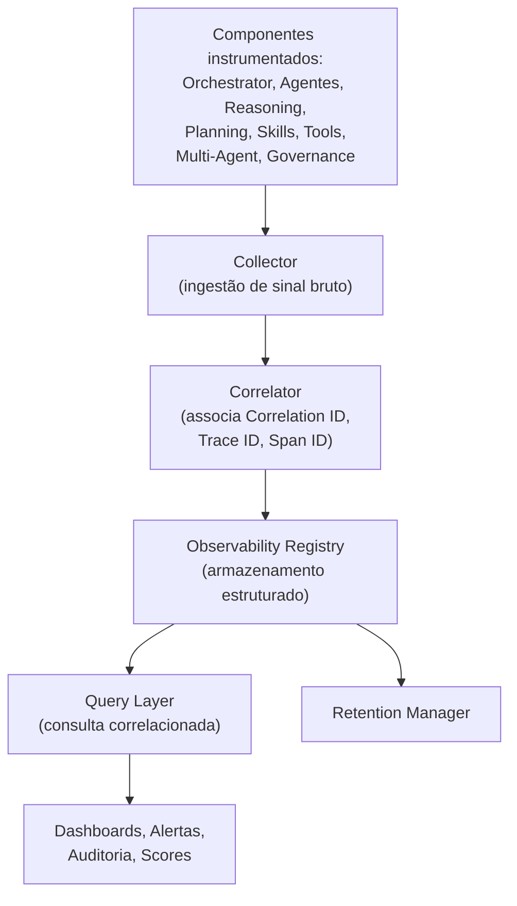
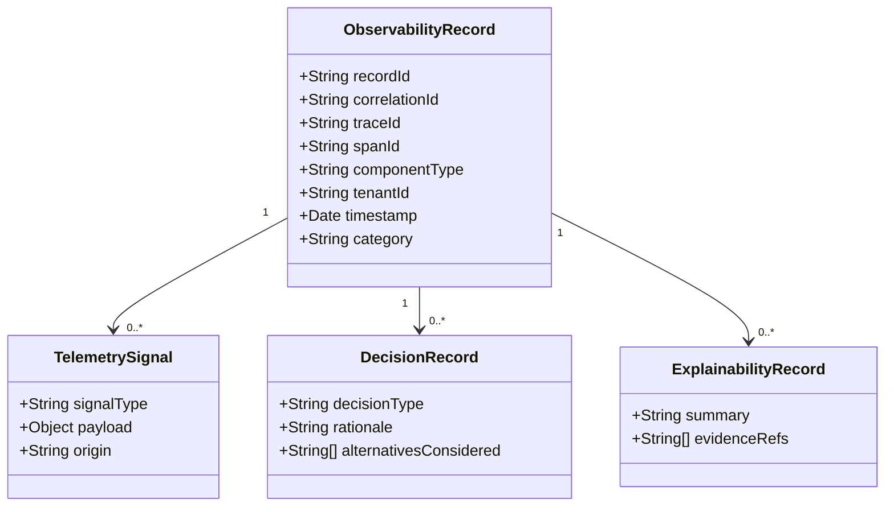
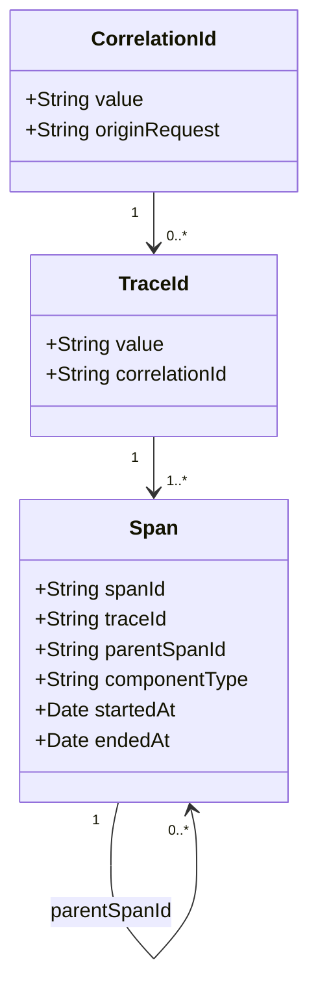
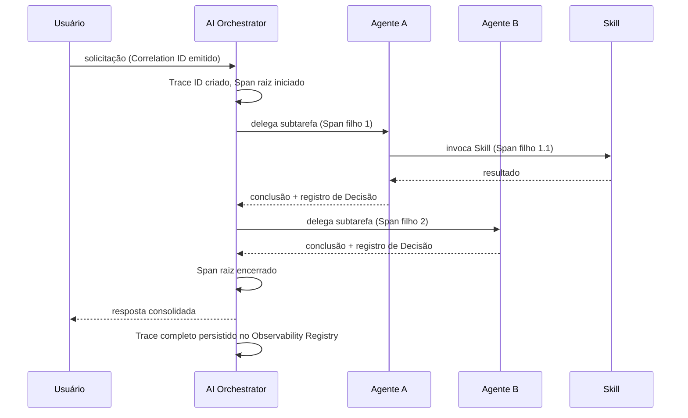
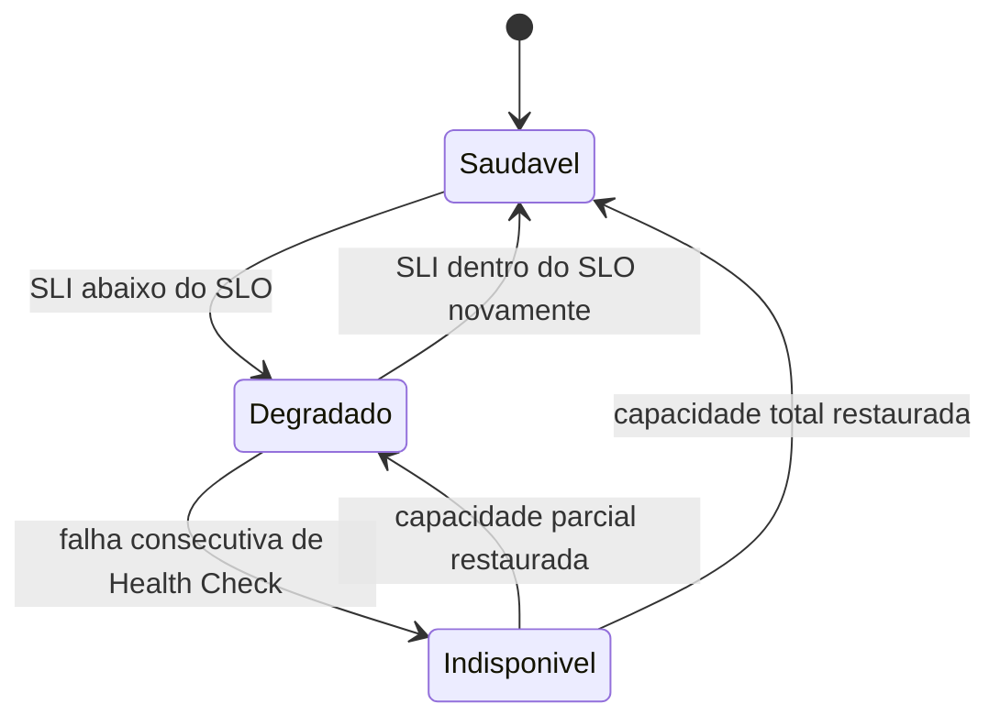
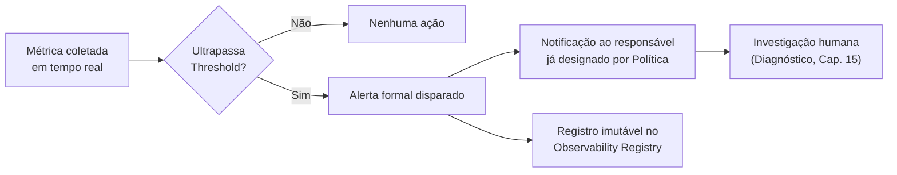
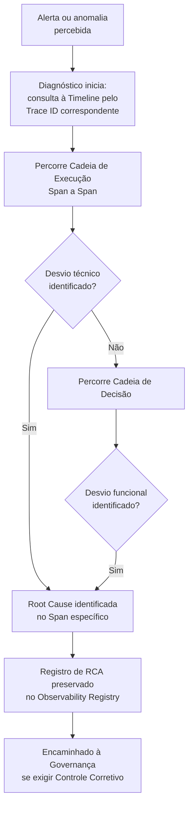

# AI Observability

**Adaptive Business Platform · AI Handbook · Documento Técnico Oficial**

---

## 1. Introdução

Este documento é a autoridade máxima e definitiva sobre a Observabilidade da Inteligência Artificial da Adaptive Business Platform. Ele não substitui nenhum documento já publicado — não redefine a filosofia já estabelecida em `AI_MANIFESTO.md`, não redefine a estrutura de doze camadas já estabelecida em `AI_ARCHITECTURE.md`, não redefine a coordenação já detalhada em `AI_ORCHESTRATOR.md`, não redefine o framework de Agente já estabelecido em `AGENT_FRAMEWORK.md`, não redefine o Sistema Operacional de Contexto já estabelecido em `CONTEXT_FRAMEWORK.md`, não redefine a gestão de Memória já estabelecida em `MEMORY_OS.md`, não redefine o motor de raciocínio já estabelecido em `REASONING_ENGINE.md`, não redefine o motor de planejamento já estabelecido em `PLANNING_ENGINE.md`, não redefine o runtime de Skill já estabelecido em `SKILL_RUNTIME.md`, não redefine o runtime de Ferramenta já estabelecido em `TOOL_RUNTIME.md`, não redefine a colaboração entre Agentes já estabelecida em `MULTI_AGENT_SYSTEM.md`, e não redefine a disciplina de Governança já estabelecida em `AI_GOVERNANCE.md`. Também não altera nenhuma decisão arquitetural já registrada em qualquer um dos vinte e seis documentos do Architecture Handbook, cujos mecanismos de observabilidade já publicados este documento apenas consome, nunca duplica.

O que este documento adiciona é o detalhamento completo de uma responsabilidade que, até aqui, permaneceu repetida de forma consistente, porém fragmentada, em cada um dos documentos anteriores. `AI_ORCHESTRATOR.md`, Capítulo 16, `AGENT_FRAMEWORK.md`, Capítulo 16, `CONTEXT_FRAMEWORK.md`, Capítulo 18, e `AI_GOVERNANCE.md`, Capítulo 21, já descrevem, cada um isoladamente, a mesma estrutura de cinco dimensões — Métricas, Auditoria, Tracing, Decisões e Explicabilidade — aplicada ao seu próprio componente. `AI_GOVERNANCE.md`, Capítulo 21, foi ainda mais explícito: declarou que "este documento não define nenhuma interface técnica de coleta, armazenamento ou visualização de Observabilidade — essa responsabilidade pertence integralmente a um futuro documento dedicado, provavelmente denominado `AI_OBSERVABILITY.md`". Este é esse documento — a consolidação, sob uma única autoridade técnica, do sistema que efetivamente coleta, correlaciona, preserva e disponibiliza o sinal que cada um dos onze componentes anteriores já promete produzir.

A necessidade deste documento neste ponto específico da sequência é estrutural, não incidental. Com doze documentos já publicados, a plataforma já possui filosofia, arquitetura, coordenação, unidade de Agente, Contexto, Memória, Raciocínio, Planejamento, Skill, Ferramenta, Colaboração Multi-Agente e Governança integralmente estabelecidos — mas nenhum desses documentos define, de forma centralizada e tecnicamente coerente, como o sinal disperso que cada um promete produzir é efetivamente correlacionado em uma única cadeia reconstruível, como ele é armazenado, por quanto tempo, e através de qual estrutura um Engenheiro, um Auditor ou a própria Governança o consulta. Sem esse componente, a Observabilidade permaneceria uma promessa repetida onze vezes, nunca uma capacidade real e unificada.

A relação com `AI_MANIFESTO.md` permanece de subordinação direta: toda telemetria aqui descrita existe para sustentar os princípios Reasoning Is Auditable e Every Suggestion Is Explainable já fixados em seu Capítulo 3, nunca para introduzir uma finalidade de coleta de dado alheia a esses princípios fundadores. A relação com `AI_ARCHITECTURE.md` permanece de reaproveitamento estrutural — nenhuma nova camada arquitetural é introduzida; a Observabilidade atravessa transversalmente as doze camadas já descritas, exatamente como a Execution Policy Layer já as atravessa. A relação com `AI_ORCHESTRATOR.md`, `AGENT_FRAMEWORK.md`, `CONTEXT_FRAMEWORK.md`, `MEMORY_OS.md`, `REASONING_ENGINE.md`, `PLANNING_ENGINE.md`, `SKILL_RUNTIME.md`, `TOOL_RUNTIME.md` e `MULTI_AGENT_SYSTEM.md` permanece uniforme: cada um desses componentes já declarou, em seu próprio capítulo de Observabilidade, quais Métricas, qual Auditoria, qual Tracing, quais Decisões e qual Explicabilidade produz — este documento formaliza a infraestrutura conceitual única que recebe, correlaciona e preserva exatamente esse sinal, sem jamais alterar o que cada componente já decidiu observar sobre si mesmo. A relação com `AI_GOVERNANCE.md` é de complementaridade direta: a Governança declara quais dados devem existir e sob qual disciplina de Política; a Observabilidade implementa a capacidade técnica de coletá-los, correlacioná-los e apresentá-los — nenhum dos dois documentos assume a responsabilidade do outro.

A relação com o Architecture Handbook é de consumo explícito, nunca de duplicação. `NON_FUNCTIONAL_REQUIREMENTS.md`, Capítulo 9, já define, para toda a plataforma, Logs, Metrics, Tracing, Correlation ID, Distributed Trace, Dashboards, Alertas, KPIs, SLIs e SLOs — este documento reutiliza integralmente esse vocabulário e essa infraestrutura conceitual, estendendo-a com a dimensão específica que apenas um componente de Inteligência Artificial produz: a cadeia de raciocínio e de decisão que precede uma sugestão, nunca presente em uma requisição técnica tradicional.

Este é o décimo terceiro documento do AI Handbook. Ele torna tecnicamente concreta a promessa de rastreabilidade e auditabilidade que sustenta, desde `AI_MANIFESTO.md`, todo o restante desta série.

---

## 2. Missão da Observabilidade

A missão da Observabilidade é tornar todo comportamento da camada de Inteligência Artificial desta plataforma visível, mensurável, auditável e explicável — sem jamais executar uma ação, tomar uma decisão, ou alterar um fluxo em curso.

Observabilidade não decide. Observabilidade não corrige. Observabilidade não previne. Ela observa, mede, registra e disponibiliza informação para que outro componente — um Engenheiro investigando um incidente, a Governança avaliando conformidade, ou um Executivo consultando desempenho — possa decidir, corrigir ou prevenir com base em evidência completa e reconstruível.

```
                    MISSÃO DA OBSERVABILIDADE (síntese)
   ┌───────────────────────────────────────────────────────────┐
   │  Tudo              ──►  observável                                 │
   │  Toda decisão        ──►  reconstruível                                    │
   │  Toda execução        ──►  rastreável                                      │
   │  Toda métrica         ──►  com origem identificável                            │
   │  Toda evidência       ──►  preservada                                          │
   └───────────────────────────────────────────────────────────┘
```

Três resultados concretos justificam a existência formal desta missão. Primeiro, reconstrução total: qualquer decisão já tomada por qualquer componente desta camada — por que este Agente e não outro, por que esta Skill e não outra, por que esta Política se aplicou e não outra — deve ser reconstruível exclusivamente a partir dos registros já produzidos por este sistema, sem exigir suposição, sem exigir memória humana, e sem exigir acesso a sistema não instrumentado. Segundo, confiança operacional: um incidente, uma degradação de desempenho, ou uma anomalia de custo deve ser identificável antes de se tornar um problema percebido pelo Usuário final. Terceiro, sustentação de toda disciplina normativa já declarada por `AI_GOVERNANCE.md`: nenhuma Política é auditável, nenhuma Auditoria é completa, e nenhum Governance Score é calculável sem a infraestrutura de coleta e correlação que este documento formaliza.

A Observabilidade, portanto, nunca compete pelo mesmo espaço de responsabilidade de nenhum componente anterior. O Orchestrator coordena, o Agente executa, a Governança normatiza, e a Observabilidade observa — a cada um desses quatro papéis corresponde uma responsabilidade exclusiva e não sobreposta, e esta separação de quatro partes é a extensão natural da separação de três partes já fixada em `AI_GOVERNANCE.md`, Capítulo 2.

A missão da Observabilidade se estende, ainda, a um quarto resultado, tão essencial quanto os três já descritos: continuidade de conhecimento organizacional. Quando um incidente é investigado meses após sua ocorrência, quando uma Empresa cliente solicita evidência de conformidade referente a um período já encerrado, ou quando um novo Engenheiro precisa compreender o comportamento histórico de um Agente que nunca operou, a Observabilidade garante que essa reconstrução dependa exclusivamente do Observability Registry já preservado — nunca do conhecimento tácito de quem presenciou o evento original.

---

## 3. Filosofia e Princípios Fundamentais

A Observabilidade desta plataforma se apoia sobre um conjunto fechado de princípios nomeados, cada um deles uma extensão operacional de um princípio já fixado em documento anterior, nunca uma filosofia nova e desconectada.

**Everything Is Observable.** Nenhum componente de Inteligência Artificial entra em produção sem que sua Observabilidade mínima obrigatória, descrita no Capítulo 6, já esteja ativa — extensão direta da regra GOV-15 já fixada em `AI_MANIFESTO.md`, Capítulo 11, e formalizada em `AI_GOVERNANCE.md`, Capítulo 6.

**Every Decision Is Reconstructible.** Toda decisão de qualquer componente — Orchestrator, Agente, Reasoning Engine, Planning Engine, ou Governança — é reconstruível integralmente a partir de registro já preservado, nunca a partir de inferência ou suposição posterior.

**Every Execution Is Traceable.** Toda execução, mesmo quando distribuída entre múltiplos Agentes e múltiplas Skills, permanece conectada de ponta a ponta por um único identificador rastreável, conforme detalhado no Capítulo 8.

**Every Metric Has an Origin.** Nenhuma Métrica é aceita sem que sua origem — o componente, o evento e o momento exatos que a produziram — seja explicitamente identificável.

**Every Piece of Evidence Is Preserved.** Nenhum registro de Observabilidade é descartado antes de cumprir sua Retenção mínima obrigatória, conforme detalhado no Capítulo 19.

**Observability Never Interferes.** Reafirmação direta da restrição central deste documento: nenhuma leitura de Observabilidade produz efeito colateral sobre o estado de negócio ou sobre o fluxo de execução em curso, mesmo quando essa leitura acontece em tempo real durante o processamento de uma solicitação.

**Observability Only Collects, Organizes and Serves.** A Observabilidade nunca gera dado de negócio original — ela apenas coleta o sinal já produzido por outro componente, o organiza sob estrutura correlacionável, e o disponibiliza para consulta.

**No Signal Without Correlation.** Nenhum Log, nenhuma Métrica e nenhum Trace de Inteligência Artificial existe de forma isolada — todo sinal carrega, no mínimo, o Correlation ID já emitido na origem da solicitação, conforme já central a `NON_FUNCTIONAL_REQUIREMENTS.md`, Capítulo 9.

**Technical Signal and Functional Signal Are Distinct.** Reafirmação formal da distinção entre Auditoria Técnica e Auditoria Funcional, detalhada no Capítulo 11 — desempenho de infraestrutura e substância de decisão de negócio nunca são fundidos em um único registro genérico.

**Explainability Is a First-Class Signal.** A cadeia de raciocínio que sustenta uma sugestão de IA não é um subproduto acessório da Observabilidade — ela é um sinal de primeira classe, coletado, preservado e correlacionado com o mesmo rigor de qualquer Métrica técnica.

**Cost Is Observable Like Everything Else.** Reafirmação da regra GOV-08 já fixada em `AI_MANIFESTO.md`, Capítulo 11: todo consumo de capacidade de IA é medido e atribuído com o mesmo rigor de qualquer outro sinal observável.

**Alerts Notify, They Never Act.** Um Alerta disparado por esta Observabilidade nunca aciona automaticamente uma ação corretiva sobre o estado de negócio — ele apenas notifica um responsável humano ou um processo já governado por Política formal.

**Observability Data Is Read-Only by Nature.** Todo dado de Observabilidade, uma vez registrado, é imutável — a única operação permitida sobre ele além de sua criação é a leitura, nunca a edição ou a exclusão antecipada de sua Retenção mínima.

**Tenant Isolation Is Absolute.** Reafirmação do princípio já fixado em `AI_HUB.md`, ADR-008, e reforçado em cada documento subsequente: nenhum registro de Observabilidade cruza a fronteira entre Empresas distintas.

**Human Oversight Is Preserved.** Reafirmação direta do princípio central de `AI_MANIFESTO.md`, Capítulo 3: a Observabilidade sustenta a supervisão humana, nunca a substitui por um painel de métrica que dispense o julgamento humano sobre ação de impacto real.

Estes quinze princípios, tomados em conjunto com as cinco dimensões de Observabilidade já repetidas em cada documento anterior, formam a base filosófica completa sobre a qual todo mecanismo descrito nos capítulos seguintes é construído.

---

## 4. Responsabilidades e Limites

A Observabilidade é responsável por coletar, correlacionar, armazenar, preservar e disponibilizar todo sinal técnico e funcional produzido por qualquer componente da camada de Inteligência Artificial — Logs, Métricas, Traces, registros de Decisão e registros de Explicabilidade. Ela não é responsável por, e nunca assume, a coordenação de solicitação, a execução de Capability, o raciocínio de um Agente, o planejamento de uma tarefa complexa, a definição ou a aplicação de Política, ou qualquer outra responsabilidade já exclusiva de um dos doze documentos anteriores.

```
                    O QUE A OBSERVABILIDADE FAZ, O QUE ELA NUNCA FAZ
   ┌───────────────────────────────────────────────────────────┐
   │  Faz:                                Nunca faz:                             │
   │    Coleta sinal                        Executa Command                          │
   │    Correlaciona execução                 Toma decisão de negócio                     │
   │    Preserva evidência                  Aplica Política                               │
   │    Mede e atribui custo                Altera fluxo em curso                         │
   │    Explica decisão já tomada             Substitui confirmação humana                     │
   │    Notifica via Alerta                 Corrige automaticamente um desvio                  │
   └───────────────────────────────────────────────────────────┘
```

O limite mais importante desta camada é negativo e absoluto: a Observabilidade nunca produz efeito colateral. Nenhuma leitura, nenhuma agregação e nenhum cálculo de Score executado por este sistema altera, mesmo minimamente, o comportamento do componente observado — um Agente processa de forma idêntica estando ou não sob observação ativa, garantia que distingue esta camada de qualquer mecanismo de controle ou de intervenção.

Um segundo limite delimita a fronteira com `AI_GOVERNANCE.md`: a Observabilidade nunca decide se um comportamento está em conformidade — ela apenas fornece o dado que sustenta essa decisão. A determinação de conformidade, a aprovação de exceção, e a aplicação de controle permanecem exclusivas do Governance Operating System já descrito naquele documento.

Um terceiro limite delimita a fronteira com o Architecture Handbook: a Observabilidade de IA nunca substitui nem duplica a infraestrutura de Observabilidade técnica tradicional já central a `NON_FUNCTIONAL_REQUIREMENTS.md`, Capítulo 9 — ela estende essa infraestrutura com a dimensão específica de raciocínio e decisão de Inteligência Artificial, consumindo a mesma base de Correlation ID, nunca criando uma segunda infraestrutura paralela e desconectada.

Um quarto limite, de natureza temporal, distingue esta camada de qualquer mecanismo preventivo: a Observabilidade opera predominantemente após o fato, ou no máximo de forma concorrente e assíncrona à execução em curso — ela nunca opera antes do fato, como faz um Controle Preventivo já formalizado em `AI_GOVERNANCE.md`, Capítulo 17. Um Alerta pode ser disparado enquanto uma execução ainda está em curso, mas o Alerta em si nunca antecipa nem impede a conclusão dessa execução.

## 5. Observability Operating System

O Observability Operating System, ou OOS, é o sistema arquitetural único e completo responsável por coletar, correlacionar, armazenar, preservar e servir todo sinal de Observabilidade produzido por qualquer componente de Inteligência Artificial desta plataforma. Assim como o Context Operating System é a autoridade única sobre Contexto e o Governance Operating System é a autoridade única sobre Política, o OOS é a autoridade única sobre sinal observável — nenhum componente produz ou consome telemetria de IA fora deste sistema.



O OOS é composto por cinco componentes internos, cada um com responsabilidade única e não sobreposta: o **Collector**, responsável por receber o sinal bruto emitido por cada componente já instrumentado; o **Correlator**, responsável por associar cada sinal recebido ao seu Correlation ID, Trace ID e Span ID correspondentes, conforme detalhado no Capítulo 8; o **Observability Registry**, fonte única de todo sinal já correlacionado e armazenado, detalhado no Capítulo 6; a **Query Layer**, responsável por servir consulta correlacionada a Dashboards, Alertas, Auditoria e Scores, sem jamais produzir efeito colateral sobre o dado consultado; e o **Retention Manager**, responsável por aplicar a política de retenção já declarada em Metadata, detalhada no Capítulo 19.

```
              POSIÇÃO DO OOS NA ARQUITETURA (visão consolidada)
   ┌───────────────────────────────────────────────────────────┐
   │  Orchestrator, Agentes, Skills, Tools, Governança                       │
   │       │  emitem sinal                                                    │
   │       ▼                                                         │
   │  Observability Operating System (OOS)                                     │
   │       │  correlaciona e preserva em                                        │
   │       ▼                                                         │
   │  Observability Registry (fonte única de sinal)                                 │
   └───────────────────────────────────────────────────────────┘
```

O OOS opera como camada estritamente passiva de coleta e serviço — ele nunca intercepta uma solicitação em curso, nunca atrasa uma execução além do tempo assíncrono estritamente necessário para emissão de sinal, e nunca bloqueia uma ação aguardando confirmação de que seu registro foi concluído. Disponibilidade do OOS é desejável, mas sua indisponibilidade temporária nunca impede a execução de uma ação já autorizada por Política — apenas atrasa a disponibilidade do sinal correspondente para consulta posterior, uma degradação aceitável e formalmente distinta da degradação de um controle preventivo já descrito em `AI_GOVERNANCE.md`, Capítulo 17.

O OOS é, por natureza, multi-tenant desde sua concepção — nenhuma instância de Collector, Correlator ou Registry é dedicada a uma única Empresa cliente; a separação entre Empresas acontece exclusivamente através do `tenantId` já presente em toda Metadata obrigatória, nunca através de infraestrutura fisicamente segregada, exatamente como já central ao restante da plataforma sob `SAAS_ARCHITECTURE.md`. Esta escolha preserva Tenant Isolation com o mesmo rigor de qualquer outro dado da plataforma, sem exigir uma exceção arquitetural específica para o dado de Observabilidade.

---

## 6. Observability Registry e Metadata

O Observability Registry é o repositório único e estruturado de todo sinal de Observabilidade já correlacionado — Logs, Métricas, Traces, registros de Decisão e registros de Explicabilidade — produzido por qualquer componente de Inteligência Artificial desta plataforma. Nenhum sinal é considerado parte da Observabilidade oficial da plataforma antes de estar armazenado neste repositório único.



Todo registro do Observability Registry carrega Metadata formal e obrigatória, composta por, no mínimo: **correlationId** (herdado da solicitação original, conforme `NON_FUNCTIONAL_REQUIREMENTS.md`, Capítulo 9); **traceId** e **spanId** (identificação de execução distribuída, conforme o Capítulo 8); **componentType** (qual dos onze componentes anteriores produziu o sinal); **tenantId** (Empresa à qual o registro pertence, sob Tenant Isolation absoluta); **timestamp** (momento exato de emissão); e **category** (Log, Métrica, Trace, Decisão ou Explicabilidade).

```
              METADATA OBRIGATÓRIA DE TODO REGISTRO
   ┌───────────────────────────────────────────────────────────┐
   │  recordId          identificador único e imutável                    │
   │  correlationId      herdado da solicitação original                           │
   │  traceId / spanId    identificação de execução distribuída                        │
   │  componentType      Orchestrator | Agente | Reasoning | Planning |            │
   │                   Skill | Tool | Multi-Agent | Governance                           │
   │  tenantId          Empresa proprietária, isolamento absoluto                       │
   │  category          Log | Métrica | Trace | Decisão | Explicabilidade                 │
   └───────────────────────────────────────────────────────────┘
```

A Observabilidade mínima obrigatória de um componente antes de sua liberação em produção — extensão direta da regra GOV-15 já fixada em `AI_MANIFESTO.md`, Capítulo 11 — exige, no mínimo, um registro de cada uma das cinco categorias listadas acima produzido durante sua verificação de Simulation ou Dry Run, conforme já definidas em `AI_ARCHITECTURE.md`, Capítulo 10. A ausência de qualquer uma dessas categorias é, por definição, uma não conformidade estrutural sob `AI_GOVERNANCE.md`, Capítulo 15.

---

## 7. Telemetria — Logs, Eventos e Métricas

Telemetria, neste documento, é o termo consolidado para todo sinal técnico bruto emitido por um componente de Inteligência Artificial durante seu processamento — Logs, Eventos e Métricas, nos mesmos termos formais já definidos em `NON_FUNCTIONAL_REQUIREMENTS.md`, Capítulo 9, estendidos aqui exclusivamente com a origem específica de IA que os produz.

Logs de Inteligência Artificial seguem o mesmo formato estruturado já exigido transversalmente pela plataforma, registrando toda invocação relevante — início e fim de processamento de um Agente, invocação de uma Skill, chamada a uma Tool, avaliação de uma Política — sempre associados ao Correlation ID da solicitação de origem.

Eventos de Inteligência Artificial são o registro formal de toda mudança de estado interna relevante ao processamento de IA — conclusão de uma etapa do Reasoning Engine, transição de estágio de um plano no Planning Engine, ou transição de Lifecycle de uma Política — nunca confundidos com o Evento de domínio já catalogado em `EVENT_CATALOG.md`, cuja emissão permanece de responsabilidade exclusiva do Business Hub correspondente.

Métricas de Inteligência Artificial quantificam o comportamento de cada componente ao longo do tempo — volume de invocação, latência de processamento, taxa de sucesso, taxa de escalação humana, e consumo de recurso — sustentando tanto Alerta automatizado quanto análise de tendência, exatamente como já central a `NON_FUNCTIONAL_REQUIREMENTS.md`, Capítulo 9, agora atribuídas especificamente a Orchestrator, Agente, Skill, Tool ou Governança como origem.

```
              TELEMETRIA DE IA (visão consolidada)
   ┌───────────────────────────────────────────────────────────┐
   │  Logs      registro textual estruturado de toda invocação          │
   │  Eventos    mudança de estado interna de processamento de IA               │
   │  Métricas   volume, latência, taxa de sucesso, consumo de recurso              │
   └───────────────────────────────────────────────────────────┘
```

Nenhuma Telemetria de Inteligência Artificial duplica dado de negócio já persistido por um Business Hub. Um Log de invocação de Agente pode referenciar o identificador de um Lead consultado, mas nunca replica o conteúdo completo daquela Entidade — a Observabilidade referencia, nunca copia, o Read Model já pertencente ao domínio, preservando Ownership integralmente conforme `DOMAIN_OWNERSHIP_MATRIX.md`.

A emissão de Telemetria é sempre assíncrona em relação ao processamento que a origina — um componente nunca aguarda a confirmação de que seu Log, seu Evento ou sua Métrica foi recebido pelo Collector antes de prosseguir seu próprio processamento, garantindo que a instrumentação nunca introduza latência perceptível sobre a execução real, reforço direto do limite temporal já fixado no Capítulo 4.

---

## 8. Traces, Correlation IDs, Trace IDs e Span IDs

Correlation ID, já definido em `NON_FUNCTIONAL_REQUIREMENTS.md`, Capítulo 9, é o identificador único que acompanha uma solicitação através de toda sua cadeia de processamento, mesmo quando essa cadeia atravessa múltiplos módulos distintos. Este documento não redefine esse conceito — ele o herda como a raiz de toda correlação de Inteligência Artificial.

Trace ID é o identificador específico de uma cadeia completa de processamento de Inteligência Artificial dentro do escopo de um Correlation ID — sempre subordinado a ele, nunca uma cadeia de identificação paralela e desconectada. Uma única solicitação de Usuário, identificada por um Correlation ID, pode originar um Trace ID quando envolve processamento de IA; uma solicitação puramente técnica tradicional, sem envolvimento de IA, nunca produz Trace ID.

Span ID é o identificador de uma unidade individual de processamento dentro de um Trace — a invocação de um único Agente, a execução de uma única Skill, ou a avaliação de uma única Política. Um Trace de execução distribuída, envolvendo múltiplos Agentes coordenados pelo Orchestrator, é composto por múltiplos Spans, cada um com início, fim e relação de parentesco explícita com o Span que o originou.



```
              HIERARQUIA DE IDENTIFICAÇÃO (visão consolidada)
   ┌───────────────────────────────────────────────────────────┐
   │  Correlation ID    raiz — toda a solicitação, técnica ou de IA               │
   │    └─ Trace ID      cadeia de processamento de IA específica                     │
   │        └─ Span ID    unidade individual — um Agente, uma Skill,                     │
   │                    uma Tool, uma avaliação de Política                                 │
   └───────────────────────────────────────────────────────────┘
```

Todo Span carrega, no mínimo, seu componente de origem, seu momento de início e fim, e o identificador do Span pai que o originou, quando aplicável — permitindo reconstruir não apenas o que aconteceu, mas a árvore completa de delegação que produziu um resultado final, exatamente como já central à Observabilidade individual de `AI_ORCHESTRATOR.md`, Capítulo 16, e `AGENT_FRAMEWORK.md`, Capítulo 16, agora formalizada sob uma estrutura de identificação única e consistente.

---

## 9. Distributed Tracing, Cadeia de Execução e Cadeia de Decisão

Distributed Tracing é a capacidade de reconstruir, a partir de um único Trace ID, a cadeia completa de Spans produzida por uma execução que atravessou múltiplos componentes — o Orchestrator, um ou mais Agentes, uma ou mais Skills, e uma ou mais Tools — mesmo quando esses componentes processaram de forma paralela ou assíncrona.

A Cadeia Completa de Execução é a dimensão técnica dessa reconstrução: o que foi executado, por qual componente, em qual ordem, com qual latência individual, e com qual resultado técnico — sucesso, falha, ou escalação. A Cadeia Completa de Decisão é a dimensão complementar e distinta: por que cada etapa daquela execução foi escolhida entre alternativas disponíveis — por que este Agente e não outro, por que esta Skill e não outra, por que esta Política se aplicou. Estas duas cadeias nunca são fundidas em um único registro — a primeira responde "o que aconteceu"; a segunda responde "por que aconteceu", extensão direta da distinção já central a `AI_ORCHESTRATOR.md`, Capítulo 16.



```
              CADEIA DE EXECUÇÃO vs. CADEIA DE DECISÃO
   ┌───────────────────────────────────────────────────────────┐
   │  Cadeia de Execução:              Cadeia de Decisão:                    │
   │    o que foi executado              por que foi escolhido                     │
   │    por qual componente              entre quais alternativas                     │
   │    em qual ordem                    com qual justificativa                       │
   │    com qual latência                referenciando qual Política                     │
   │    com qual resultado técnico         ou qual Reasoning                                 │
   └───────────────────────────────────────────────────────────┘
```

Um Trace de execução distribuída envolvendo múltiplos Agentes coordenados, conforme já central a `MULTI_AGENT_SYSTEM.md`, nunca perde a relação de parentesco entre Spans — mesmo quando dois Agentes processam em paralelo, sua origem comum no mesmo Span do Orchestrator permanece explícita, garantindo que a reconstrução da colaboração multi-agente respeite integralmente o princípio Agents Never Coordinate Themselves, já que toda ramificação do Trace se origina exclusivamente do Span do Orchestrator, nunca de uma comunicação direta entre Agentes.

Um Trace Parcial ocorre quando um ou mais Spans de uma cadeia de execução não são encerrados dentro de um intervalo esperado — por timeout de um componente, por falha não recuperável, ou por indisponibilidade momentânea do próprio OOS. Um Trace Parcial nunca é descartado nem completado por inferência: ele permanece armazenado exatamente como recebido, marcado explicitamente como incompleto, preservando toda evidência já disponível para Diagnóstico, ao mesmo tempo em que sinaliza com honestidade os limites do que pôde ser reconstruído.

---

## 10. Timeline e Reconstrução

Timeline é a apresentação cronológica e consolidada de todos os Spans, Logs, Eventos, Decisões e registros de Explicabilidade associados a um único Trace ID, ordenados por momento de ocorrência, formando a narrativa completa e sequencial de uma execução do início ao fim.

Reconstrução é o processo formal de consulta ao Observability Registry que produz, a partir de um Correlation ID, um Trace ID, ou um Span ID específico, a Timeline correspondente — sem exigir acesso a nenhum sistema além do Observability Registry, e sem exigir suposição sobre o que provavelmente aconteceu.

```
              TIMELINE DE UMA EXECUÇÃO (exemplo consolidado)
   ┌───────────────────────────────────────────────────────────┐
   │  t+0ms    Solicitação recebida, Correlation ID emitido              │
   │  t+12ms   Trace ID criado, Intent Analysis concluída                    │
   │  t+45ms   Context OS entrega Contexto construído                            │
   │  t+80ms   Agente A iniciado (Span 1)                                            │
   │  t+210ms  Skill invocada por Agente A (Span 1.1)                                     │
   │  t+340ms  Agente A conclui, Decisão registrada                                          │
   │  t+355ms  Policy Evaluation aplicada (Human Approval exigido)                                │
   │  t+9800ms Confirmação humana recebida                                                       │
   │  t+9850ms Execution concluída, Trace encerrado                                                  │
   └───────────────────────────────────────────────────────────┘
```

Toda Reconstrução é uma operação estritamente de leitura, nunca produzindo efeito colateral sobre o Trace consultado, e é ela própria sujeita a verificação de Permission junto ao Identity Hub — reconstruir a execução de uma Empresa é, como já formalizado em `AI_GOVERNANCE.md`, Capítulo 18, uma ação que exige escopo de acesso explícito.

Reconstrução de Execução e Reconstrução de Decisão compartilham a mesma Timeline como fonte, mas servem propósitos de consulta distintos — a primeira é consultada predominantemente por um Engenheiro durante Diagnóstico técnico, descrito no Capítulo 15; a segunda é consultada predominantemente por um Auditor ou pela própria Governança durante investigação de conformidade, descrita no Capítulo 11. Ambas, no entanto, permanecem igualmente disponíveis a qualquer Usuário com Permission suficiente, independentemente de seu propósito de consulta específico.

---

## 11. Auditoria Técnica e Auditoria Funcional

Auditoria Técnica é o registro e a consulta de todo sinal relacionado ao desempenho e à integridade de infraestrutura de um componente de Inteligência Artificial — latência, taxa de erro, disponibilidade, consumo de recurso — sustentando investigação de degradação técnica e de incidente de disponibilidade.

Auditoria Funcional é o registro e a consulta de todo sinal relacionado à substância de uma decisão de negócio produzida por um componente de Inteligência Artificial — qual Capability foi selecionada, qual Agente foi delegado, qual Política se aplicou, qual Skill foi invocada, e qual justificativa sustentou cada escolha — sustentando investigação de conformidade e de qualidade de decisão.

```
              AUDITORIA TÉCNICA vs. AUDITORIA FUNCIONAL
   ┌───────────────────────────────────────────────────────────┐
   │  Auditoria Técnica:                Auditoria Funcional:                 │
   │    latência, erro, disponibilidade    qual Capability foi selecionada          │
   │    consumo de recurso                 qual Política se aplicou                    │
   │    saúde de infraestrutura            qual justificativa sustentou a                │
   │                                     decisão                                              │
   │    investigada por Engenharia         investigada por Governança e Auditor                    │
   └───────────────────────────────────────────────────────────┘
```

Estas duas categorias nunca são fundidas em um único registro genérico, extensão direta do princípio Technical Signal and Functional Signal Are Distinct já fixado no Capítulo 3 — um registro de Auditoria Técnica pode indicar que uma avaliação de Política levou duzentos milissegundos; um registro de Auditoria Funcional, correlacionado ao mesmo Span através do mesmo Trace ID, indica qual Política foi avaliada e qual resultado produziu. Ambos os registros permanecem consultáveis conjuntamente, através da mesma Timeline, mas nunca são armazenados como um único tipo indiferenciado de evidência.

O Audit Trail já formalizado em `AI_GOVERNANCE.md`, Capítulo 18, é sustentado, em sua totalidade, pela Auditoria Funcional aqui descrita — a Governança define o que deve ser auditado e por quanto tempo; este documento implementa a coleta, a correlação e a consulta técnica desse registro. Nenhuma nova responsabilidade de auditoria é introduzida por este documento além da já declarada por aquele.

Considere um exemplo concreto de articulação entre as duas categorias: um Auditor investigando por que uma proposta comercial de alto valor foi enviada sob Human Approval consulta, primeiro, a Auditoria Funcional correlacionada ao Trace ID daquela solicitação, identificando a Política de Impacto Financeiro que exigiu a aprovação, conforme já formalizado em `AI_GOVERNANCE.md`, Capítulo 16; em seguida, se necessário investigar por que a confirmação humana levou tempo incomum para ser registrada, consulta a Auditoria Técnica do mesmo Trace, identificando latência específica de cada Span envolvido. Ambas as consultas operam sobre o mesmo Trace ID, mas nunca sobre o mesmo tipo de registro.

---

## 12. Health Checks, Disponibilidade, Latência e Throughput

Health Check é a verificação periódica e automatizada de que um componente de Inteligência Artificial — um Agente, um Orchestrator, ou o próprio OOS — permanece operacional e capaz de processar solicitação, produzindo um Status simples e consultável a qualquer momento, sem depender de uma solicitação real em curso.

Status é o resultado consolidado do Health Check mais recente de um componente, expresso em um de três estados possíveis: **Saudável**, operando dentro de todo parâmetro esperado; **Degradado**, operando com desempenho ou taxa de sucesso abaixo do esperado, mas ainda funcional; e **Indisponível**, incapaz de processar solicitação.



Toda transição de Status é, ela própria, um registro de Observabilidade — nunca um estado meramente instantâneo e descartável. Uma transição de Saudável para Degradado, ou de Degradado para Indisponível, é preservada com o mesmo rigor de qualquer outro sinal, sustentando reconstrução posterior de exatamente quando um componente começou a se degradar, não apenas o momento em que essa degradação foi percebida por um Alerta.

Disponibilidade é a proporção de tempo em que um componente permanece em Status Saudável ou Degradado, nunca Indisponível, medida sobre um período consolidado — mensal, por padrão, conforme já central a `NON_FUNCTIONAL_REQUIREMENTS.md`, Capítulo 9.

Latência é o tempo decorrido entre o início e o fim de processamento de um Span específico, medida individualmente por componente e agregada em percentis — P50, P95, P99 — permitindo distinguir desempenho típico de desempenho de cauda longa.

Throughput é o volume de solicitação processada por um componente em uma janela de tempo específica, sustentando tanto análise de capacidade quanto identificação de padrão de uso anômalo.

```
              SAÚDE OPERACIONAL (visão consolidada)
   ┌───────────────────────────────────────────────────────────┐
   │  Health Check   ──►  verificação periódica automatizada            │
   │  Status        ──►  Saudável | Degradado | Indisponível                    │
   │  Disponibilidade ──►  proporção de tempo fora de Indisponível                    │
   │  Latência       ──►  P50, P95, P99 por Span e por componente                    │
   │  Throughput     ──►  volume processado por janela de tempo                          │
   └───────────────────────────────────────────────────────────┘
```

Nenhum Health Check produz efeito sobre o componente verificado além da verificação em si — ele nunca reinicia, nunca reconfigura, e nunca suspende um componente automaticamente; essa ação corretiva, quando necessária, permanece exclusiva de um Controle Corretivo já formalizado em `AI_GOVERNANCE.md`, Capítulo 17, disparado por um responsável humano ou por um processo já governado por Política explícita.

---

## 13. Error Rate, Success Rate, SLA, SLO, SLI e KPIs

Error Rate é a proporção de execução de um componente que resulta em falha técnica não recuperável, medida por componente e por Capability. Success Rate é sua contraparte complementar — a proporção de execução concluída com resultado técnico e funcional esperado, incluindo tanto execução automática quanto execução aprovada por Human Approval.

SLI — Service Level Indicator — é a métrica específica que quantifica a qualidade de um serviço de Inteligência Artificial, nos mesmos termos formais já definidos em `NON_FUNCTIONAL_REQUIREMENTS.md`, Capítulo 9, aplicada agora a Latência, Disponibilidade, Error Rate e Success Rate de cada componente de IA individualmente. SLO — Service Level Objective — é o alvo de qualidade definido para cada SLI, calibrado de forma proporcional à natureza de cada Capability, seguindo o mesmo princípio já fixado em `BUSINESS_HUB_ARCHITECTURE.md`, ADR-012. SLA — Service Level Agreement — é o compromisso contratual derivado de um conjunto de SLOs, calibrável por Empresa cliente através do Business Profile Engine, dentro dos limites já permitidos por esta arquitetura — este documento não define nenhum SLA específico, apenas a estrutura formal que permite sua calibração.

```
              SLI, SLO E SLA (relação formal)
   ┌───────────────────────────────────────────────────────────┐
   │  SLI   métrica observada (ex.: Latência P99 de um Agente)          │
   │    ▼                                                               │
   │  SLO   alvo definido para essa métrica (ex.: P99 < 800ms)                │
   │    ▼                                                               │
   │  SLA   compromisso contratual derivado do SLO, calibrável                │
   │       por Empresa cliente                                                     │
   └───────────────────────────────────────────────────────────┘
```

KPIs de Observabilidade técnica — Error Rate, Latência P99, Disponibilidade mensal, taxa de escalação humana — são acompanhados de forma consolidada por componente e por Empresa, complementares aos KPIs de negócio já expostos pelo Analytics Hub, nunca substituindo-os. Nenhum KPI de Observabilidade de IA é confundido com um indicador de negócio — um KPI de Observabilidade mede o comportamento da camada de Inteligência Artificial; um KPI de negócio, já pertencente ao Analytics Hub, mede o resultado da operação da Empresa cliente.

Violação de SLO é tratada com a mesma disciplina formal já exigida de qualquer Incidente em `NON_FUNCTIONAL_REQUIREMENTS.md`, Capítulo 9 — registrada, investigada através do Diagnóstico já descrito no Capítulo 15, e encerrada apenas quando sua causa raiz é identificada e, quando aplicável, encaminhada à Governança como insumo para nova Política Preventiva. Uma violação de SLO recorrente sobre o mesmo componente é, ela própria, um sinal formal de que o SLO vigente pode estar mal calibrado para a natureza real daquela Capability, encaminhado à revisão periódica já central a `BUSINESS_HUB_ARCHITECTURE.md`, ADR-012.

---

## 14. Alertas, Thresholds e Dashboards

Alerta é a notificação formal disparada quando uma Métrica de Inteligência Artificial ultrapassa um Threshold configurado, permitindo intervenção humana antes que uma degradação se torne um incidente percebido pelo Usuário final. Threshold é o limite numérico ou categórico que, uma vez ultrapassado, dispara o Alerta correspondente — sempre configurável por componente, por Capability e por Empresa, dentro dos limites já permitidos pela arquitetura.



Todo Alerta é, ele próprio, um registro de Observabilidade, preservado com o mesmo rigor de qualquer outro sinal — permitindo reconstruir, posteriormente, qual condição disparou qual notificação, quando, e qual foi a resposta humana correspondente. Reafirmação direta do princípio Alerts Notify, They Never Act já fixado no Capítulo 3: nenhum Alerta aciona automaticamente uma ação corretiva sobre o estado de negócio.

Dashboards consolidam Métricas, Traces e registros de Auditoria em superfície de leitura acessível a Engenheiro, Auditor e Executivo, sempre servidos como Read Model já otimizado, exatamente como já central a `NON_FUNCTIONAL_REQUIREMENTS.md`, Capítulo 9. Este documento não define nenhuma tecnologia específica de visualização — apenas a estrutura conceitual de dado que sustenta qualquer Dashboard futuro: Métricas agregadas por componente e por Empresa, Timelines consultáveis por Trace ID, e Scores consolidados descritos no Capítulo 20.

```
              CATEGORIAS DE DASHBOARD (visão conceitual)
   ┌───────────────────────────────────────────────────────────┐
   │  Operacional      Status, Disponibilidade, Latência em tempo real          │
   │  Auditoria       Trilha de Decisão e Conformidade, consultável por                 │
   │                Trace ID                                                          │
   │  Custo          Token Usage e Resource Usage por Empresa e por módulo               │
   │  Governança       Governance Quality Score, Governance Maturity Score,                    │
   │                consumindo dado já preservado por esta Observabilidade                        │
   └───────────────────────────────────────────────────────────┘
```

---

## 15. Diagnóstico, Root Cause Analysis, Performance e Capacity Planning

Diagnóstico é o processo estruturado de investigação de um comportamento anômalo — um Alerta disparado, uma degradação percebida, ou uma solicitação específica de investigação — utilizando exclusivamente a Timeline e os registros já preservados pelo Observability Registry, nunca exigindo reconstrução manual a partir de sistema não instrumentado.

Root Cause Analysis, ou RCA, é a extensão formal do Diagnóstico que percorre a Cadeia de Execução e a Cadeia de Decisão de ponta a ponta até identificar a causa raiz de um comportamento anômalo — nunca apenas seu sintoma mais recente. Uma degradação de Latência percebida no Orchestrator, por exemplo, pode ter sua causa raiz identificada, através do Distributed Tracing já descrito no Capítulo 9, em uma Tool externa específica invocada por um único Agente em uma etapa distante da cadeia completa.



Análise de Performance é o processo contínuo, não necessariamente disparado por um incidente, de avaliação de tendência de Latência, Throughput e Error Rate ao longo do tempo, por componente e por Capability, identificando degradação gradual antes que ela ultrapasse um Threshold e dispare Alerta formal.

Capacity Planning é a extensão da Análise de Performance voltada à projeção de necessidade futura de capacidade — de processamento, de invocação de Tool externa, ou de consumo de token — a partir de tendência de Throughput já observada, sustentando decisão de investimento em infraestrutura sem depender de estimativa não fundamentada em dado real.

Nenhum Diagnóstico, nenhuma RCA e nenhuma Análise de Performance produz, por si só, uma ação corretiva — seu resultado é sempre um registro consultável e, quando aplicável, um insumo formal encaminhado à Governança para avaliação de necessidade de nova Política Preventiva, conforme o ciclo de controle já fixado em `AI_GOVERNANCE.md`, Capítulo 17.

---

## 16. Telemetria de Agentes, Skills, Tools, Orchestrator e Multi-Agent

Cada um dos componentes já descritos nos documentos anteriores produz Telemetria com características específicas à sua responsabilidade, sempre estruturada sob as mesmas cinco dimensões — Métricas, Auditoria, Tracing, Decisões e Explicabilidade — e sempre armazenada sob a mesma Metadata formal já descrita no Capítulo 6.

**Telemetria do Orchestrator** inclui volume de solicitação, latência de cada etapa do pipeline de decisão já descrito em `AI_ORCHESTRATOR.md`, Capítulo 6, taxa de sucesso de Agent Delegation, e taxa de acionamento de Human Approval por Capability — exatamente como já declarado em `AI_ORCHESTRATOR.md`, Capítulo 16, agora coletado, correlacionado e preservado por este sistema.

**Telemetria de Agentes** inclui volume de invocação, latência de processamento interno, taxa de conclusão bem-sucedida, e taxa de escalação humana por Agente individual — exatamente como já declarado em `AGENT_FRAMEWORK.md`, Capítulo 16.

**Telemetria de Skills** inclui volume de invocação, latência de execução, taxa de sucesso e taxa de erro por Skill individual, correlacionada ao Span do Agente que a invocou, sustentando a comparação de desempenho entre Skills de propósito equivalente.

**Telemetria de Tools** inclui volume de invocação, latência de resposta do provedor externo, taxa de erro, e consumo de recurso associado, sempre correlacionada à Provider Layer já central a `AI_HUB.md`, permitindo distinguir degradação interna de degradação de um provedor externo específico.

**Telemetria Multi-Agent** inclui, além da Telemetria individual de cada Agente envolvido, o sinal específico à colaboração mediada pelo Orchestrator — tempo total de uma cadeia de delegação envolvendo múltiplos Agentes, taxa de sucesso de colaboração comparada à taxa de sucesso de execução isolada, e o grafo completo de parentesco de Span já descrito no Capítulo 8, sustentando reconstrução integral de qualquer colaboração passada.

```
              TELEMETRIA POR COMPONENTE (síntese)
   ┌───────────────────────────────────────────────────────────┐
   │  Orchestrator   pipeline de decisão, delegação, Human Approval             │
   │  Agente        invocação, processamento interno, escalação                    │
   │  Skill         invocação, execução, sucesso e erro                            │
   │  Tool          invocação externa, latência de provedor, erro                       │
   │  Multi-Agent     colaboração, grafo de Span, comparação de desempenho                   │
   └───────────────────────────────────────────────────────────┘
```

Nenhuma Telemetria específica de componente é definida por este documento além do que cada documento de origem já declarou — este capítulo apenas consolida, sob a mesma infraestrutura de coleta e correlação, o sinal que `AI_ORCHESTRATOR.md`, `AGENT_FRAMEWORK.md`, `SKILL_RUNTIME.md`, `TOOL_RUNTIME.md` e `MULTI_AGENT_SYSTEM.md` já prometem produzir individualmente.

O Observability Coverage Checklist, consumido diretamente pelo Coverage Score já formalizado no Capítulo 20, verifica que cada um dos onze componentes anteriores emite, no mínimo, sinal correspondente às cinco dimensões já repetidas ao longo desta série:

```
              COVERAGE CHECKLIST (cinco dimensões por componente)
   ┌───────────────────────────────────────────────────────────┐
   │  Componente         Mét. Aud. Trac. Dec. Expl.                   │
   │  AI Orchestrator       ✓    ✓    ✓    ✓    ✓                          │
   │  Agent Framework       ✓    ✓    ✓    ✓    ✓                          │
   │  Context OS          ✓    ✓    ✓    ✓    —                          │
   │  Memory OS           ✓    ✓    —    —    —                          │
   │  Reasoning Engine       ✓    ✓    ✓    ✓    ✓                          │
   │  Planning Engine        ✓    ✓    ✓    ✓    ✓                          │
   │  Skill Runtime         ✓    ✓    ✓    —    —                          │
   │  Tool Runtime          ✓    ✓    ✓    —    —                          │
   │  Multi-Agent System      ✓    ✓    ✓    ✓    —                          │
   │  AI Governance         ✓    ✓    ✓    ✓    ✓                          │
   └───────────────────────────────────────────────────────────┘
```

A ausência de uma dimensão em um componente específico — a coluna de Decisões inaplicável a Skill e a Tool, por exemplo, cuja natureza é de execução determinística e não de escolha entre alternativas — não é, por si só, uma lacuna de Coverage; é uma característica estrutural já esperada daquele componente. O Coverage Checklist distingue formalmente ausência esperada de ausência não conforme, evitando que este documento penalize um componente por não produzir um sinal que sua própria natureza, já descrita no documento de origem, nunca prometeu produzir.

---

## 17. Custos, Token Usage e Resource Usage

Todo consumo de capacidade de Inteligência Artificial é medido e atribuído a uma Empresa, a um módulo e a uma solicitação específica, reafirmação direta da regra GOV-08 já fixada em `AI_MANIFESTO.md`, Capítulo 11, e da aplicação do princípio já fixado em `AI_HUB.md`, ADR-007.

Token Usage é a medida específica de consumo associada a toda interação com um provedor de modelo de linguagem, coletada por invocação individual e agregada por Agente, por Skill, por Empresa e por período — sustentando tanto controle de custo quanto identificação de padrão de uso anômalo que possa indicar necessidade de reclassificação de risco, conforme já central a `AI_GOVERNANCE.md`, Capítulo 16.

Resource Usage é a medida complementar de consumo de recurso computacional não associado diretamente a um provedor de modelo — processamento do Orchestrator, armazenamento do Observability Registry, e invocação de Tool externa — igualmente atribuída por Empresa e por módulo.

```
              MEDIÇÃO DE CUSTO (visão consolidada)
   ┌───────────────────────────────────────────────────────────┐
   │  Token Usage      consumo por interação com provedor de modelo           │
   │  Resource Usage    consumo de processamento, armazenamento e Tool                 │
   │  Atribuição       sempre por Empresa, por módulo e por solicitação                    │
   │  Agregação        por Agente, por Skill, por período configurável                     │
   └───────────────────────────────────────────────────────────┘
```

Custo, neste documento, é sempre um sinal observável, nunca um mecanismo de controle — a Observabilidade mede e disponibiliza o consumo; qualquer limite, qualquer bloqueio ou qualquer ação de contenção de custo é uma Política formal, definida e aplicada exclusivamente por `AI_GOVERNANCE.md`, nunca por este documento. Um Alerta de custo disparado por Threshold ultrapassado, conforme o Capítulo 14, notifica o responsável já designado; ele nunca suspende automaticamente uma Capability, decisão que permanece exclusiva de um Controle já governado.

Anomalia de custo é identificada pela mesma Análise de Performance já descrita no Capítulo 15, aplicada agora a Token Usage e a Resource Usage ao longo do tempo — um crescimento súbito e desproporcional de consumo por uma única Empresa, por um único Agente, ou por uma única Skill é tratado como sinal de investigação, correlacionado ao Trace ID de origem para determinar se decorre de aumento legítimo de volume de negócio ou de comportamento não previsto de uma Capability específica. Esta investigação é sempre um Diagnóstico, nunca uma ação automática de contenção.

---

## 18. Explainability e Auditabilidade

Explainability, nesta camada, é a capacidade formal de reconstruir, em linguagem acessível e referenciando evidência específica, por que uma sugestão de Inteligência Artificial foi produzida — extensão direta do princípio Every Suggestion Is Explainable já central a `AI_MANIFESTO.md`, Capítulo 3, e já repetido individualmente em cada um dos documentos anteriores.

Um registro de Explicabilidade, armazenado no Observability Registry, contém, no mínimo, um resumo em linguagem natural da conclusão produzida, e referências explícitas — `evidenceRefs`, conforme o esquema já descrito no Capítulo 6 — a cada Span, cada registro de Decisão, e cada Contexto que sustentaram aquela conclusão, permitindo que qualquer sugestão seja questionada e verificada por um Usuário sem conhecimento técnico de implementação.

Auditabilidade é a propriedade formal e transversal de que toda decisão desta plataforma é reconstruível até seu Contexto de origem, sua justificativa e sua confirmação humana, quando aplicável — já central a `AI_ARCHITECTURE.md`, Capítulo 2, e agora tecnicamente sustentada, de ponta a ponta, pela infraestrutura de correlação e preservação que este documento formaliza.

```
              EXPLAINABILITY E AUDITABILIDADE (síntese)
   ┌───────────────────────────────────────────────────────────┐
   │  Toda sugestão       ──►  acompanhada de resumo em linguagem                  │
   │                        acessível                                              │
   │  Todo resumo         ──►  referencia evidência específica e                       │
   │                        consultável                                                 │
   │  Toda evidência       ──►  rastreável até seu Trace ID de origem                    │
   │  Toda decisão         ──►  reconstruível sem conhecimento tácito                    │
   └───────────────────────────────────────────────────────────┘
```

A distinção entre Explainability e Auditabilidade é de audiência, não de mecanismo: Explainability é voltada ao Usuário que recebeu uma sugestão específica e deseja compreendê-la; Auditabilidade é voltada ao Auditor, ao Executivo ou à Governança que investiga um conjunto de decisões ao longo do tempo. Ambas compartilham exatamente a mesma fonte de dado — o Observability Registry — nunca duas infraestruturas de evidência distintas.

Nenhum registro de Explicabilidade é gerado por reconstrução aproximada ou por resumo produzido após o fato — ele é sempre produzido no mesmo momento em que a conclusão original é formulada, pelo próprio componente que a formulou, exatamente como já central ao Reasoning Engine em `REASONING_ENGINE.md`. A Observabilidade nunca infere retroativamente uma justificativa que o componente de origem não tenha explicitamente produzido — quando esse registro está ausente, a lacuna em si é sinalizada como uma não conformidade de Coverage, conforme o Capítulo 20, nunca preenchida por aproximação.

---

## 19. Segurança, Privacidade e Data Retention

Segurança, no escopo deste documento, significa que todo registro do Observability Registry é protegido pelos mesmos controles de Autenticação e Autorização já centrais ao Identity Hub, e que o próprio OOS nunca se torna, ele mesmo, um vetor de exposição de dado sensível que o componente observado já protegia adequadamente.

Privacidade é preservada através da aplicação absoluta de Tenant Isolation a todo registro de Observabilidade — nenhuma Empresa cliente acessa, mesmo de forma agregada ou anonimizada, a Telemetria, o Trace ou o registro de Decisão de outra Empresa, reforço direto de `AI_HUB.md`, ADR-008. Adicionalmente, todo registro de Explicabilidade que referencie dado de negócio sensível herda, sem exceção, a classificação de sensibilidade já estabelecida pela arquitetura de dado subjacente e já formalizada pelo atributo Sensitivity em `CONTEXT_FRAMEWORK.md`.

Data Retention de todo registro de Observabilidade segue a mesma disciplina já central a `NON_FUNCTIONAL_REQUIREMENTS.md`, Capítulo 10, nunca inferior ao período mínimo ali exigido, e calibrável por Empresa cliente através de Política formal já registrada sob `AI_GOVERNANCE.md`, Capítulo 8 — este documento implementa a aplicação técnica dessa Política, nunca define seu prazo por conta própria.

```
              RETENÇÃO DE DADO DE OBSERVABILIDADE (visão consolidada)
   ┌───────────────────────────────────────────────────────────┐
   │  Auditoria Funcional relacionada a Política Estrutural       indefinida            │
   │  Auditoria Técnica e Telemetria operacional               calibrável por                │
   │                                                       Empresa, nunca                        │
   │                                                       inferior ao mínimo                        │
   │                                                       legal aplicável                             │
   │  Registro próximo da expiração                        arquivado, nunca                        │
   │                                                       excluído sem                                 │
   │                                                       verificação prévia                              │
   └───────────────────────────────────────────────────────────┘
```

Nenhum registro de Observabilidade é removido por expurgo automático sem que sua Retenção mínima obrigatória já tenha sido integralmente cumprida — a mesma disciplina de Backup e verificação de Restore já central a `NON_FUNCTIONAL_REQUIREMENTS.md`, Capítulo 9, aplica-se integralmente a todo dado preservado por este sistema.

---

## 20. Observability Quality Score e Coverage Score

Observability Coverage Score é o indicador formal e agregado que expressa a completude da instrumentação de toda a camada de Inteligência Artificial — a proporção de Capability, Agente, Skill e Tool que já produz o conjunto mínimo obrigatório de Telemetria descrito no Capítulo 6, sobre o total de componentes registrados.

Observability Quality Score é o indicador complementar que expressa a qualidade estrutural do sinal já coletado — considerando integridade de correlação (proporção de registro com Correlation ID, Trace ID e Span ID completos), latência de disponibilização (tempo entre a emissão de um sinal e sua disponibilidade para consulta), e completude de Explicabilidade (proporção de Decisão acompanhada de registro de Explicabilidade correspondente).

```
              OBSERVABILITY SCORES (visão consolidada)
   ┌───────────────────────────────────────────────────────────┐
   │  Coverage Score    proporção de componente já instrumentado                │
   │                  com o mínimo obrigatório                                        │
   │  Quality Score     integridade de correlação, latência de                    │
   │                  disponibilização, completude de Explicabilidade                          │
   └───────────────────────────────────────────────────────────┘
```

Ambos os indicadores são consumidos diretamente pela Governança como insumo do Governance Quality Score e do Governance Maturity Score já formalizados em `AI_GOVERNANCE.md`, Capítulo 21 — a relação entre os dois pares de indicadores é de dependência direta e unidirecional: a Governança nunca calcula seus próprios Scores sem consumir os Scores de Observabilidade aqui descritos, e a Observabilidade nunca calcula Score de conformidade, responsabilidade exclusiva da Governança.

Nenhum dos dois Scores é calculado em tempo real durante uma avaliação individual — ambos são recalculados periodicamente, a partir do Observability Registry já consolidado, e expostos através dos Dashboards já descritos no Capítulo 14, nunca através de instrumentação adicional além da já coletada por este sistema.

Um Coverage Score baixo, isoladamente, nunca impede a operação de uma Capability já em produção — ele é, no entanto, um sinal formal encaminhado à Governança, que decide, sob sua própria disciplina normativa, se essa lacuna configura não conformidade estrutural suficiente para exigir suspensão, conforme já central a `AI_GOVERNANCE.md`, Capítulo 15. A Observabilidade identifica a lacuna; a Governança decide sua consequência.

---

## 21. Integrações

**Com o AI Orchestrator.** Todo Span do pipeline de decisão do Orchestrator, já descrito em `AI_ORCHESTRATOR.md`, Capítulo 6, é emitido a este sistema, sustentando reconstrução completa de qualquer coordenação passada sem alterar, em nenhuma medida, o comportamento do Orchestrator observado.

**Com o Agent Framework.** Toda invocação, todo processamento interno e toda conclusão de um Agente, já central a `AGENT_FRAMEWORK.md`, Capítulo 16, é correlacionada sob o mesmo Trace ID de sua solicitação de origem, sustentando a comparação de desempenho entre Agentes já antecipada naquele documento.

**Com o Context OS.** Este documento nunca constrói Contexto — ele apenas preserva o registro de qual Contexto específico fundamentou uma conclusão, já produzido pelo Context Builder conforme `CONTEXT_FRAMEWORK.md`, Capítulo 18, sustentando a Explicabilidade descrita no Capítulo 18 deste documento.

**Com o Memory OS.** Telemetria de acesso a Memória — persistente, compartilhada ou organizacional — é coletada e correlacionada, respeitando integralmente o isolamento absoluto já exigido por `MEMORY_OS.md`, nunca replicando o conteúdo da Memória observada.

**Com o Reasoning Engine.** Cada etapa do Reasoning Engine já descrita em `REASONING_ENGINE.md` — Análise, Síntese, Inferência, Validação — produz seu próprio sinal observável, correlacionado ao Span do Agente correspondente, sustentando a reconstrução integral da Cadeia de Decisão descrita no Capítulo 9.

**Com o Planning Engine.** Toda etapa de um plano decomposto por `PLANNING_ENGINE.md` é correlacionada individualmente, permitindo reconstruir não apenas o plano completo, mas o desempenho e a decisão específica de cada etapa isolada.

**Com o Skill Runtime.** Toda invocação de Skill, já central a `SKILL_RUNTIME.md`, produz Telemetria correlacionada ao Span do Agente invocador, sustentando a Telemetria de Skills descrita no Capítulo 16.

**Com o Tool Runtime.** Toda invocação de Tool externa, já central a `TOOL_RUNTIME.md`, produz Telemetria correlacionada, incluindo latência do provedor externo, sustentando a distinção entre degradação interna e degradação de terceiro já descrita no Capítulo 16.

**Com o Multi-Agent System.** Toda colaboração entre Agentes, sempre mediada pelo Orchestrator conforme `MULTI_AGENT_SYSTEM.md`, produz o grafo completo de parentesco de Span já descrito no Capítulo 9, sustentando reconstrução integral de qualquer colaboração passada.

**Com a AI Governance.** A relação é bidirecional e formalmente distinta: a Governança declara quais dados devem existir, sob qual Política de retenção e qual disciplina de auditoria, conforme `AI_GOVERNANCE.md`, Capítulo 22; este documento implementa a coleta, a correlação, o armazenamento e a consulta técnica desses dados, e devolve à Governança os Observability Scores que sustentam seus próprios Governance Scores, conforme o Capítulo 20 deste documento.

**Com o Architecture Handbook.** Este documento consome, sem jamais duplicar, a infraestrutura de Observabilidade já publicada por `NON_FUNCTIONAL_REQUIREMENTS.md`, Capítulo 9 — Logs, Metrics, Tracing, Correlation ID, Distributed Trace, Dashboards, Alertas, KPIs, SLIs e SLOs — e por `EVENT_CATALOG.md`, Capítulo 12, quanto à correlação entre sinal técnico e Evento de negócio.

```
              MATRIZ DE INTEGRAÇÃO (o que cada componente emite
              versus o que a Observabilidade preserva)
   ┌───────────────────────────────────────────────────────────┐
   │  Componente            Emite                                     │
   │  AI Orchestrator         Spans do pipeline de decisão                  │
   │  Agent Framework         invocação, processamento, conclusão                     │
   │  Context OS             referência ao Contexto que fundamentou uma                 │
   │                       conclusão                                                    │
   │  Memory OS              telemetria de acesso, nunca conteúdo                            │
   │  Reasoning Engine         cada etapa de Análise, Síntese, Inferência,                    │
   │                       Validação                                                        │
   │  Planning Engine         cada etapa de um plano decomposto                            │
   │  Skill Runtime           telemetria de invocação de Skill                              │
   │  Tool Runtime            telemetria de invocação de Tool externa                          │
   │  Multi-Agent System        grafo de colaboração entre Agentes                              │
   │  AI Governance           declara o que deve existir; consome Scores                       │
   └───────────────────────────────────────────────────────────┘
```

Em nenhuma dessas integrações a Observabilidade assume responsabilidade de implementação técnica do componente integrado — sua contribuição é sempre a mesma, independentemente da origem do sinal: coletar, correlacionar, preservar e servir, nunca decidir, executar ou alterar o que observa, reforço direto do limite já fixado no Capítulo 4.

---

## 22. Fluxos Arquiteturais

```
   REGISTRO DE EVENTO, MÉTRICA E TRACE
   ┌───────────────────────────────────────────────────────────┐
   │  Componente instrumentado emite sinal bruto ──► Collector          │
   │  recebe ──► Correlator associa Correlation ID, Trace ID e              │
   │  Span ID ──► Observability Registry persiste de forma                      │
   │  imutável ──► disponível à Query Layer                                             │
   └───────────────────────────────────────────────────────────┘
```

```
   EXECUÇÃO COMPLETA E EXECUÇÃO DISTRIBUÍDA
   ┌───────────────────────────────────────────────────────────┐
   │  Solicitação recebida ──► Correlation ID emitido ──► Trace ID          │
   │  criado ──► Span raiz iniciado ──► delegação a múltiplos                   │
   │  Agentes cria Spans filhos ──► cada Span encerrado                                 │
   │  individualmente ──► Span raiz encerrado ao final ──► Trace                            │
   │  completo persistido                                                                   │
   └───────────────────────────────────────────────────────────┘
```

```
   RECONSTRUÇÃO DE EXECUÇÃO E RECONSTRUÇÃO DE DECISÃO
   ┌───────────────────────────────────────────────────────────┐
   │  Consulta por Correlation ID, Trace ID ou Span ID ──►               │
   │  verificação de Permission junto ao Identity Hub ──►                     │
   │  Query Layer monta Timeline consolidada ──► Cadeia de                          │
   │  Execução e Cadeia de Decisão apresentadas separadamente                               │
   └───────────────────────────────────────────────────────────┘
```

```
   INVESTIGAÇÃO DE INCIDENTE E ROOT CAUSE ANALYSIS
   ┌───────────────────────────────────────────────────────────┐
   │  Alerta ou anomalia percebida ──► Diagnóstico consulta a           │
   │  Timeline ──► percorre Cadeia de Execução e Cadeia de                      │
   │  Decisão ──► causa raiz identificada em Span específico ──►                    │
   │  registro de RCA preservado ──► encaminhado à Governança se                            │
   │  exigir Controle Corretivo                                                             │
   └───────────────────────────────────────────────────────────┘
```

```
   ALERTA
   ┌───────────────────────────────────────────────────────────┐
   │  Métrica coletada em tempo real ──► comparada a Threshold          │
   │  configurado ──► ultrapassado ──► Alerta disparado ──►                     │
   │  notificação ao responsável já designado por Política ──►                      │
   │  registro imutável preservado                                                          │
   └───────────────────────────────────────────────────────────┘
```

```
   DIAGNÓSTICO E ANÁLISE DE PERFORMANCE
   ┌───────────────────────────────────────────────────────────┐
   │  Tendência de Latência, Throughput e Error Rate monitorada          │
   │  continuamente ──► degradação gradual identificada antes de                │
   │  ultrapassar Threshold ──► Capacity Planning projeta                               │
   │  necessidade futura ──► insumo encaminhado à decisão humana                            │
   │  de investimento                                                                       │
   └───────────────────────────────────────────────────────────┘
```

```
   AUDITORIA
   ┌───────────────────────────────────────────────────────────┐
   │  Solicitação de auditoria, técnica ou funcional ──►                │
   │  verificação de Permission ──► consulta ao Observability                   │
   │  Registry por escopo e período ──► evidência completa                              │
   │  apresentada, referenciando Trace ID e Política aplicável                              │
   └───────────────────────────────────────────────────────────┘
```

```
   RETENÇÃO
   ┌───────────────────────────────────────────────────────────┐
   │  Registro criado ──► Retention Manager aplica prazo               │
   │  declarado em Metadata ──► próximo da expiração, registro                  │
   │  elegível a Arquivamento ──► prazo mínimo legal ou                                 │
   │  estrutural cumprido ──► elegível a expurgo formal                                     │
   └───────────────────────────────────────────────────────────┘
```

---

## 23. Architecture Decision Records

**ADR-001 — A Observabilidade nunca modifica comportamento de execução; ela opera estritamente como consumidora de sinal, nunca como produtora de efeito sobre o estado de negócio.** Contexto: preservar a separação absoluta entre observação e execução já central à missão deste documento, Capítulo 2.

**ADR-002 — Este documento reutiliza integralmente Logs, Metrics, Tracing, Correlation ID e Distributed Trace já definidos em `NON_FUNCTIONAL_REQUIREMENTS.md`, Capítulo 9, sem introduzir taxonomia técnica paralela.** Contexto: evitar duplicidade de mecanismo entre a Observabilidade de plataforma já existente e a Observabilidade de IA aqui formalizada.

**ADR-003 — Todo Trace ID de Inteligência Artificial é subordinado ao Correlation ID já emitido na origem da solicitação, nunca uma cadeia de identificação desconectada.** Contexto: garantir correlação completa entre sinal técnico tradicional e sinal específico de IA, conforme o Capítulo 8.

**ADR-004 — Toda decisão de Orchestrator, Agente ou Governança é reconstruível exclusivamente a partir de registro já preservado por este sistema, sem exigir inferência retroativa.** Contexto: aplicação direta do princípio Every Decision Is Reconstructible já fixado no Capítulo 3.

**ADR-005 — Cadeia de Execução e Cadeia de Decisão são registradas como dimensões formalmente distintas e complementares, nunca fundidas em um único registro genérico.** Contexto: preservar a capacidade de responder separadamente "o que aconteceu" e "por que aconteceu", conforme o Capítulo 9.

**ADR-006 — Auditoria Técnica e Auditoria Funcional são categorias formalmente distintas, com audiência e propósito de consulta diferentes.** Contexto: aplicação direta do princípio Technical Signal and Functional Signal Are Distinct já fixado no Capítulo 3.

**ADR-007 — Nenhum dado de negócio (Entidade) é armazenado por este sistema além do necessário para correlação técnica; a Observabilidade referencia, nunca duplica, o Read Model já pertencente ao domínio.** Contexto: preservar Ownership já definido em `DOMAIN_OWNERSHIP_MATRIX.md`, evitando um repositório paralelo de dado de negócio.

**ADR-008 — Token Usage e Resource Usage são medidos e atribuídos por Empresa, por módulo e por solicitação.** Contexto: reforço direto de `AI_HUB.md`, ADR-007, e da regra GOV-08 já fixada em `AI_MANIFESTO.md`, Capítulo 11.

**ADR-009 — Tenant Isolation é aplicado de forma absoluta a todo registro de Observabilidade, sem exceção concedível.** Contexto: reforço do princípio já fixado em `AI_HUB.md`, ADR-008, e reafirmado em cada documento subsequente.

**ADR-010 — Observability Quality Score e Observability Coverage Score consomem exclusivamente sinal já coletado por este sistema, nunca introduzindo uma nova fonte independente de avaliação.** Contexto: preservar a relação de dependência direta com o Governance Quality Score e o Governance Maturity Score já formalizados em `AI_GOVERNANCE.md`, Capítulo 21.

**ADR-011 — A Retenção de todo dado de Observabilidade segue a disciplina já estabelecida em `NON_FUNCTIONAL_REQUIREMENTS.md`, Capítulo 10, calibrável por Empresa através de Política formal registrada sob `AI_GOVERNANCE.md`.** Contexto: evitar que este documento defina prazo de retenção por conta própria, desconectado da disciplina normativa já central à Governança.

**ADR-012 — Um Alerta de Observabilidade nunca dispara automaticamente uma ação corretiva sobre o estado de negócio; ele apenas notifica.** Contexto: aplicação direta do princípio Alerts Notify, They Never Act já fixado no Capítulo 3, preservando Human Oversight.

**ADR-013 — Toda Skill, Tool e Agente é instrumentado com o conjunto mínimo obrigatório de Telemetria antes de sua liberação em produção; a ausência dessa instrumentação é, por definição, uma não conformidade estrutural.** Contexto: extensão direta da regra GOV-15 já fixada em `AI_MANIFESTO.md`, Capítulo 11, e da disciplina de não conformidade já formalizada em `AI_GOVERNANCE.md`, Capítulo 15.

**ADR-014 — Este documento não define nenhuma tecnologia específica de coleta, armazenamento ou visualização de Observabilidade.** Contexto: preservar a neutralidade tecnológica já central a `AI_MANIFESTO.md`, Capítulo 9, delegando escolha de implementação a decisão técnica posterior, calibrável por Empresa cliente.

**ADR-015 — Este documento não redefine Reasoning, Planning, Skill, Tool, Governança, Execução, Colaboração, Context OS ou Memory OS.** Contexto: preservar escopo estritamente dedicado à observação, delegando toda especificação de comportamento a seu documento de origem correspondente.

---

## 24. Glossário

**Observabilidade de IA** — a disciplina técnica completa, formalizada por este documento, responsável por coletar, correlacionar, preservar e disponibilizar todo sinal produzido por qualquer componente de Inteligência Artificial desta plataforma, sem jamais executar ação ou alterar fluxo.

**Observability Operating System (OOS)** — o sistema arquitetural único e completo responsável por coletar, correlacionar, armazenar, preservar e servir todo sinal de Observabilidade de IA desta plataforma.

**Observability Registry** — o repositório único e estruturado de todo sinal de Observabilidade já correlacionado, incluindo Logs, Métricas, Traces, registros de Decisão e registros de Explicabilidade.

**Collector, Correlator, Retention Manager** — os três componentes internos do OOS responsáveis, respectivamente, por receber sinal bruto, associá-lo a Correlation ID, Trace ID e Span ID, e aplicar a Política de retenção declarada em Metadata.

**Correlation ID** — identificador único, já definido em `NON_FUNCTIONAL_REQUIREMENTS.md`, que acompanha uma solicitação através de toda sua cadeia de processamento, técnica ou de IA.

**Trace ID** — identificador de uma cadeia completa de processamento de Inteligência Artificial, sempre subordinado a um Correlation ID.

**Span ID** — identificador de uma unidade individual de processamento dentro de um Trace, com relação de parentesco explícita a seu Span de origem.

**Distributed Tracing** — a capacidade de reconstruir, a partir de um Trace ID, a cadeia completa de Spans produzida por uma execução distribuída entre múltiplos componentes.

**Cadeia de Execução** — o registro técnico do que foi executado, por qual componente, em qual ordem e com qual resultado.

**Cadeia de Decisão** — o registro funcional de por que cada etapa de uma execução foi escolhida entre alternativas disponíveis.

**Timeline** — a apresentação cronológica e consolidada de todo sinal associado a um Trace ID específico.

**Auditoria Técnica** — o registro e a consulta de sinal relacionado ao desempenho e à integridade de infraestrutura de um componente.

**Auditoria Funcional** — o registro e a consulta de sinal relacionado à substância de uma decisão de negócio produzida por um componente.

**Health Check** — a verificação periódica e automatizada de que um componente permanece operacional.

**SLI, SLO, SLA** — respectivamente a métrica observada, o alvo de qualidade definido para essa métrica, e o compromisso contratual derivado desse alvo.

**Threshold** — o limite que, uma vez ultrapassado por uma Métrica, dispara um Alerta formal.

**Root Cause Analysis (RCA)** — a extensão formal do Diagnóstico que percorre a Cadeia de Execução e a Cadeia de Decisão até identificar a causa raiz de um comportamento anômalo.

**Capacity Planning** — a projeção de necessidade futura de capacidade a partir de tendência de Throughput já observada.

**Token Usage, Resource Usage** — as duas medidas complementares de consumo de capacidade de Inteligência Artificial, atribuídas por Empresa, por módulo e por solicitação.

**Explainability** — a capacidade formal de reconstruir, em linguagem acessível, por que uma sugestão de Inteligência Artificial foi produzida.

**Auditabilidade** — a propriedade transversal de que toda decisão desta plataforma é reconstruível até seu Contexto de origem, sua justificativa e sua confirmação humana.

**Observability Coverage Score** — o indicador formal e agregado que expressa a completude da instrumentação de toda a camada de Inteligência Artificial.

**Observability Quality Score** — o indicador formal e agregado que expressa a qualidade estrutural do sinal já coletado por este sistema.

---

## 25. Conclusão

Este documento declara oficialmente que `AI_OBSERVABILITY.md` torna-se a autoridade máxima sobre a Observabilidade da Inteligência Artificial da Adaptive Business Platform. Todo componente da camada de Inteligência Artificial — o AI Orchestrator, todo Agente já construído sob `AGENT_FRAMEWORK.md`, todo Contexto governado por `CONTEXT_FRAMEWORK.md`, toda Memória gerida por `MEMORY_OS.md`, todo raciocínio formalizado por `REASONING_ENGINE.md`, todo plano decomposto por `PLANNING_ENGINE.md`, toda Skill executada sob `SKILL_RUNTIME.md`, toda Tool invocada sob `TOOL_RUNTIME.md`, toda colaboração mediada por `MULTI_AGENT_SYSTEM.md`, toda Política definida sob `AI_GOVERNANCE.md`, e todo documento técnico futuro deste AI Handbook — deverá emitir seu sinal exclusivamente através deste sistema: seu Observability Registry, sua hierarquia de Correlation ID, Trace ID e Span ID, sua distinção formal entre Cadeia de Execução e Cadeia de Decisão, e sua disciplina de Retenção.

A hierarquia documental desta série permanece precisa e definitiva: `AI_MANIFESTO.md` define a filosofia — por que a Inteligência Artificial existe e quais limites ela nunca cruza. `AI_ARCHITECTURE.md` define a estrutura — como essa filosofia se organiza em doze camadas verificáveis. `AI_ORCHESTRATOR.md` define a coordenação — como o componente central dessa estrutura opera internamente. `AGENT_FRAMEWORK.md` define a unidade inteligente — o Agente, sua composição interna e seu ciclo de vida completo. `CONTEXT_FRAMEWORK.md` define o Sistema Operacional de Contexto. `MEMORY_OS.md` define como memória efêmera, persistente, compartilhada e organizacional é formalmente gerida e isolada por Empresa. `REASONING_ENGINE.md` define como todo Agente formaliza e explica sua cadeia de raciocínio. `PLANNING_ENGINE.md` define como uma solicitação complexa é decomposta em etapas executáveis. `SKILL_RUNTIME.md` define como toda Skill é registrada, versionada e executada com segurança. `TOOL_RUNTIME.md` define como toda Tool é invocada, isolada e auditada. `MULTI_AGENT_SYSTEM.md` define como múltiplos Agentes colaboram exclusivamente através do Orchestrator. `AI_GOVERNANCE.md` define a disciplina — como toda Política, toda autorização, toda exceção e toda auditoria desta camada é formalmente registrada, versionada, aplicada e revisada. `AI_OBSERVABILITY.md`, este documento, define a evidência — como todo sinal técnico e funcional produzido por cada um desses componentes é coletado, correlacionado, preservado e disponibilizado, sem jamais executar ação, tomar decisão, ou alterar fluxo em nome deles. E o Architecture Handbook, consolidado por vinte e seis documentos já concluídos, permanece soberano sobre toda a plataforma — nenhum registro de Observabilidade, por mais completo que se torne, jamais assume Ownership de negócio, jamais contorna a arquitetura de domínio já consolidada, e jamais substitui o raciocínio humano ou a Regra de negócio que ele apenas evidencia e nunca decide em seu lugar.

Com a publicação deste décimo terceiro documento do AI Handbook, a plataforma já dispõe de filosofia, estrutura, coordenação, unidade fundamental de raciocínio, Contexto, Memória, Raciocínio, Planejamento, Skill, Ferramenta, Colaboração Multi-Agente, Governança e Observabilidade integralmente estabelecidos — a base evidencial completa sobre a qual o décimo quarto e último documento deste AI Handbook, dedicado à Implementação e provavelmente denominado `AI_IMPLEMENTATION.md`, será construído, consolidando em um único documento final a orientação prática de como cada um dos treze documentos já publicados se materializa em código real, sem jamais precisar redefinir a filosofia, a estrutura, a coordenação, a governança ou a evidência que esta série já estabeleceu de forma definitiva.
